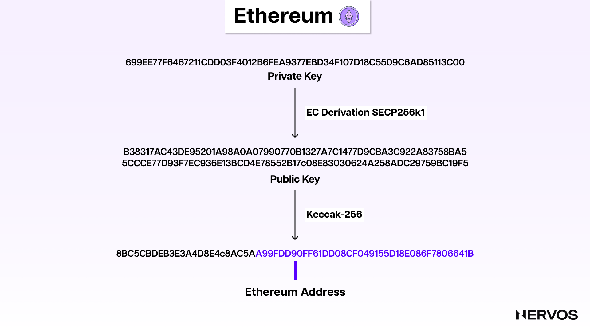
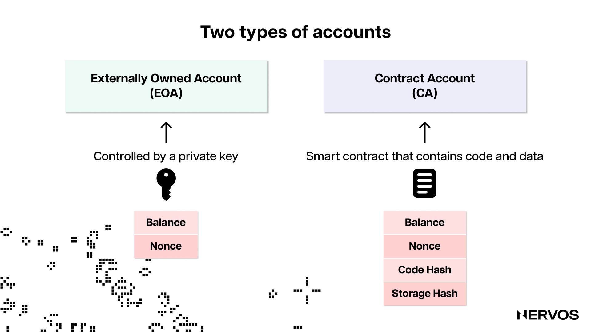
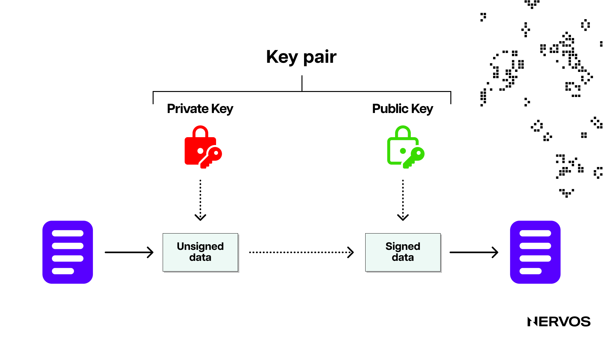
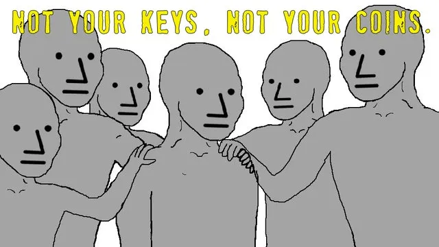
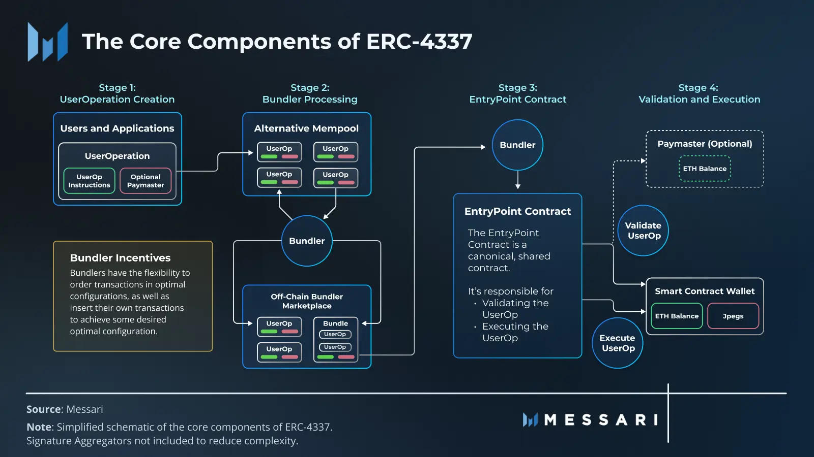
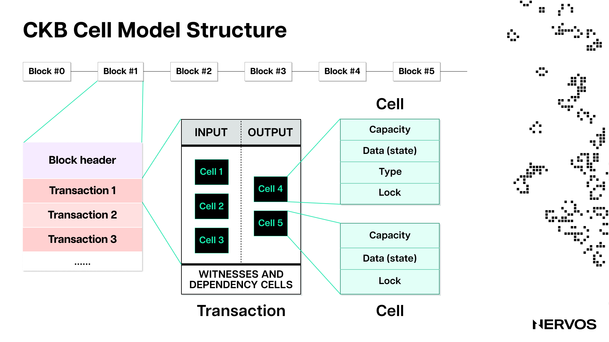

In the 14 years since the inception of Bitcoin, blockchain development shifted through multiple stages, each reflecting the evolving needs and challenges faced by the industry at the respective times. Initially, blockchain development was primarily focused on evolving consensus algorithms to optimize the security and decentralization of distributed networks. This era birthed numerous Layer 1 networks with either completely novel or only slightly tweaked consensus mechanisms, architectures, and value propositions.

Next came the era of scaling, where blockchain projects focused on increasing their transaction throughput and data availability capacities through various on-chain and off-chain scaling solutions, including sharding, state channels, rollups, and sidechains. With numerous successful solutions hitting the market over the last two years, research interest in the field has already peaked and instead is slowly shifting toward another equally important unresolved issue: user experience.

Namely, the critical development concerning this issue pertains to a process called “account abstraction,” which represents a way for developers to envelop Web3 accounts with the same familiar UX standards typical of Web2 accounts. And while onboarding the next billion users to Web3 is contingent on this process, account abstraction still remains largely misunderstood and underappreciated.

## What is Account Abstraction?

The idea of account abstraction is to generalize and change the logic of blockchain accounts in order to improve the user experience and make managing blockchain accounts and custodying crypto assets easier and safer.

Understanding account abstraction necessitates understanding the respective concepts of "abstraction" and blockchain "accounts.” In computer science, abstraction refers to the process of removing or generalizing physical, spatial, or temporal details to focus attention on details of greater importance. In simpler terms, abstraction means creating a simplified representation of underlying processes or data to hide their complexities. An excellent example of abstraction is the evolution of programming languages from 'machine' to 'assembly' to 'high-level' languages, where each subsequent language abstracts away the complexities of the previous ones, allowing developers to focus on details of greater importance. Instead of coding in ones and zeros directly on hardware, developers today code in advanced, high-level programming languages that abstract away all the bits and bytes underneath. To the point, programmers today can build elaborate computer applications without understanding exactly how their low-level machine instructions are processed by CPUs, which is what abstraction is all about.

Concerning the concept of "blockchain accounts," on the other, it’s worth clearing up the common misconception that blockchain accounts are the same as blockchain addresses. Namely, an account is an on-chain identity that persists across applications on a blockchain and only exists within the context of that blockchain. On the other hand, a blockchain address (which refers to an account) is an identity created through a distinct cryptographic recipe. For example, an Ethereum address is derived by taking a [private key](https://en.wikipedia.org/wiki/Public-key_cryptography), doing an [elliptic curve](https://en.wikipedia.org/wiki/Elliptic-curve_cryptography) derivation using the [Secp256k1](https://en.bitcoin.it/wiki/Secp256k1) standard to get a public key, then hashing that public key using the [Keccak-256](https://en.wikipedia.org/wiki/SHA-3) hash function, and then taking the last 20 bytes of the hash output to get the address. Using that same address on multiple EVM-equivalent blockchains means using different accounts.

The most crucial point here is that accounts in account-based blockchains are more permanent entities that, from users’ point of view, function very much like Web2 accounts, where users typically have one account for each Web2 service or application they use. For example, users have one account to watch Netflix instead of creating new ones whenever they need to log in to the service. However, unlike Web2 accounts, which are typically accessed via email sign-ins or recoverable passwords, blockchain accounts are controlled through private keys, which can’t be recovered when lost.

## Understanding Ethereum Accounts

To understand the problem with blockchain accounts that many account-based blockchain projects today are trying to solve, it’s first necessary to understand how blockchain accounts work in greater detail.

There are two types of accounts in account-based blockchains like Ethereum: externally owned accounts (EOAs) and contract accounts (CAs). 

EOAs are user accounts that can initiate transactions and what users simply refer to as “accounts.” They have three properties: (i) a balance representing the amount of cryptocurrency available to the account and necessary to pay transaction fees, (ii) a nonce to ensure that every transaction is unique or legitimate, and (iii) an address to uniquely identify the account on the network.

Initiating transactions from EOAs obviously requires some authorization because otherwise, anyone would be able to spend the cryptocurrency held in any EOA. Initiating transactions from an EOA or establishing "ownership" over them is done via a cryptographic object called a "signer." The signer represents a cryptographic keypair consisting of two keys: a private key and a public key.

The private key is a secret, randomly generated hexadecimal string (a 256-bit-long number) representing a unique identifier for securing and controlling EOAs. On account-based blockchains like Ethereum, only EOAs can initiate transactions, and doing so requires a signature with a private key. In Web2 terms, the private key is like the password granting users access to applications like bank accounts, where every time they want to make a wire transfer, they need to "sign" transactions using their password. On Ethereum, the private key is never exposed to the network during the signing process, as the signature is generated using cryptographic techniques that don’t reveal the key itself. Like with any other password, it's imperative for blockchain users to keep the private key secret, as it is the only thing separating them from access to the cryptocurrency in their account.

On the other hand, a public key in Ethereum is a 512-bit-long number derived from the private key using elliptic curve cryptography, specifically, the Secp256k1 curve (an Ethereum address is the last 20 bytes of the Keccak-256 hash output of this public key). The public key is used to verify the authenticity of transactions signed with the corresponding private key. When a user initiates a transaction, they sign it with their private key, and the Ethereum network is then able to verify their signature using their public key. Unlike the private key, which—as the name suggests—must be kept private, the public key can be shared openly.

When a user initiates a transaction using their Ethereum account, they sign the transaction using their unique private key, the EVM receives the transaction and verifies their signature using their public key, verifies that the transaction nonce matches the account nonce, executes the transaction, and automatically deducts the transaction fee from the user’s account balance.

## The Problem With Blockchain Accounts

The main issue with blockchain accounts, or at least with how they’re currently architected on account-based blockchains like Ethereum, is that the signer or the object authorized to initiate transactions or spend cryptocurrencies is inextricably coupled with the account—the object holding the cryptocurrencies. In other words, the signer and the externally owned account on Ethereum are essentially the same thing.

That means that losing a private key equals losing an account, which results in a terrible user experience. Hundreds of millions of dollars in cryptocurrency are lost or stolen every year due to the loss or theft of private keys. Managing the private keys, which are stored in crypto wallets, typically means remembering 12, 18, or 24-word-long “[mnemonic](https://en.bitcoin.it/wiki/Seed_phrase)” or “seed” phrases, which represent a human-readable representation of the initial entropy used to generate a private key or a series of private keys in [hierarchical deterministic](https://en.bitcoin.it/wiki/Deterministic_wallet#Type_2:_Hierarchical_deterministic_wallet) (HD) wallets. Mnemonic phrases are an attempt to provide a “user-friendly” way to back up and restore wallets while maintaining the security and privacy of private keys. However, the unfortunate reality is that if users forget their crypto wallet password (which encrypts keys on their device) and haven’t safely stored their mnemonic phrase, they’ll never be able to recover the same wallet or blockchain account.

The second major issue with accounts on Ethereum (and most account-based blockchains, for that matter) is that the cryptographic logic of how the accounts are constructed and work is hard-coded in the EVM. That means that the only way to create a private key, derive a public key, and initiate and validate transactions is by using the hard-coded cryptographic primitives, i.e., the aforementioned [ECDSA](https://en.wikipedia.org/wiki/Elliptic_Curve_Digital_Signature_Algorithm) cryptographic signature scheme on the specific Secp256k1 elliptic curve and the Keccak-256 hash function. This makes EOAs incompatible with native multi-signature schemes and social recovery methods.

## Account Abstraction as the Solution

The core idea behind account abstraction is to decouple the relationship between the signer (keypair) and the account, to make the latter more flexible and the former easier to manage. 

On Ethereum, account abstraction has recently been implemented via [ERC-4337](https://eips.ethereum.org/EIPS/eip-4337), an Ethereum standard that seeks to achieve application-level account abstraction without any hard forks or consensus-layer changes. The idea behind this standard is to move beyond EOAs and allow for the creation of smart contract wallets that can determine their own logic for validating and executing transactions.

Using contract accounts instead of EOAs as user accounts means that crypto wallets can now define their own transaction verification and execution logic, meaning they’re no longer bound to the hard-coded logic of the EVM and can use different cryptographic primitives, including different signature schemes, elliptic curves, and signing protocols. This change alone brings massive user experience benefits to Ethereum accounts, including:

* **Social recovery:** Because smart contract wallets are controlled by smart contracts with their own logic instead of a single private key, they can include a recovery mechanism involving multiple "guardians" or "recovery contacts" the wallet owner trusts. For example, backup keys can be added to a wallet so that when the owner uses their main private key, they can replace it with a new secure key with permission from the trusted guardians holding the backup keys. Beyond transaction verification, smart contract wallets can implement their own custom transaction execution protocols. For example, the wallet may contain rules that allow low-value transactions to be verified by a single signature, whereas higher-value transactions require the approval of multiple signers. 
* **Dead man's switch:** The flexibility of smart contract wallets also allows for the installment of a so-called dead man's switch, which is essentially a rule or a feature that allows for automatic ownership transfers in cases where the original owner of the wallet has died or is no longer capable of accessing their funds. For example, the wallet could contain a rule stating that if the original owner hasn't accessed the account using the main private key in over a year, another pre-approved key would become active and allow its trusted holder access to the account and funds within.
* **Quantum-resistant signatures:** As already hinted, smart contract wallets can use any cryptographic signature primitives beyond those hard-coded in the EVM. That means they can upgrade their logic to support quantum-resistant signature schemes once quantum computers compromise the existing ECDSA mechanisms.
* **Custom access and spending conditions:** Another interesting feature enabled by account abstraction or smart contract wallets is the creation of all kinds of custom access and spending conditions. For example, users may use a single smart contract account as both a hot and a cold wallet, where low-value transactions can be signed seamlessly from a mobile wallet application, whereas high-value transactions require a signature from a different private key stored in "cold storage" or a hardware wallet device like a Ledger. Beyond that, users could create commercial or company accounts that assign different roles with custom accessibility conditions to different key holders. For example, the company's legal team could be allowed to perform on-chain votes with the company or DAO's tokens without having permission to spend them, or the payroll team could be permitted to send payroll to employees on specific whitelisted addresses with pre-set spending limits and time constraints.
* **Gas abstraction:** Unlike EOAs, which must hold ETH to pay transaction fees on Ethereum, account abstraction allows smart contract wallets to pay for gas in any [ERC-20](https://ethereum.org/en/developers/docs/standards/tokens/erc-20/) token. Moreover, applications could offer to pay their users’ transaction fees, meaning users could simply create an account and start using Ethereum applications without ever purchasing ETH.
* **Transaction bundling:** Account abstraction will allow transaction bundling for speed and efficiency. Currently, a simple token swap on a decentralized exchange necessitates at least two transactions, one to approve the swap or authorize the spending of individual tokens before the swap and another actually to execute the swap. With account abstraction, this process can be streamlined by bundling multiple transactions into one transaction that requires only one action or signature from users. Moreover, this bundled transaction can accurately approve the exact value of tokens needed for each transaction and subsequently revoke those approvals upon completion, thereby bolstering security.

That being said, the account abstraction upgrades most recently enabled by ERC-4337 allow only for application-level abstraction, meaning that the smart contract wallets remain second-class citizens. In other words, at the protocol level, the only type of account that can initiate transactions on Ethereum remains the native EOA, with ERC-4337 only providing an alternative, duct tape-type solution to smart contract wallet providers. 

Smart contract wallets still need to leverage various tricks and custom infrastructure, including off-chain relayers, alternative mempools, and new third-party entities like bundlers and paymasters to emulate account abstraction properly. All of this means that the underlying logic behind the EVM has remained the same, with EOAs staying first-class citizens and support for “account abstracted” smart contract wallets and decentralized applications remaining only optional.

It’s worth highlighting that smart contract wallets such as [Gnosis Safe](https://safe.global/) and [Argent](https://www.argent.xyz/) have existed on Ethereum for years, offering users the convenience of social recovery and metatransactions that allow for the offloading of gas payments to others. On Ethereum, ERC-4337 defines standards that allow for smart contract wallet transactions to be sent in a decentralized way and offers permissionless contract wallet invocation. However, the overhead of interacting with ERC-4337 wallets is unfortunately high due to the system’s design, and some in the Ethereum community have speculated that developers may continue to build their own smart wallet implementations, disregarding the new standard. 

Resultantly, it can be argued that account abstraction is definitionally something that must be implemented at the protocol level. In Ethereum’s case, this would resolve the requirement to deploy a smart contract per wallet (which leads to state bloat) and open the door to true account abstraction, in which transactions can be initiated from different kinds of policies, such as the state transition of a zk-SNARK.

Luckily, other blockchains, like Nervos’ Layer 1, called Common Knowledge Base, have implemented account abstraction at the protocol level from the get-go.

## Common Knowledge Base: Account Abstraction All the Way Down

While Ethereum is currently pursuing account abstraction through the ERC-4377 implementation, which serves only as an application-level disguise, and other Layer 2 networks like StarkNet and zkSync plan to "enshrine" the same model at a deeper protocol level, it's worth noting that this way of pursuing account abstraction does not achieve the highest level of abstraction possible.

As things currently stand, the most abstract blockchain in the industry is Nervos' Layer 1, Common Knowledge Base. Namely, Common Knowledge Bases achieves proper protocol-level account abstraction by primarily leveraging two things: (i) an abstract accounting model called the Cell model, which is a generalized version of the UTXO model with powerful programming capabilities, and (ii) a completely abstract virtual machine, called CKB-VM.

The CKB-VM is utterly abstract because it has zero precompiles built into it, meaning it can support all cryptographic primitives by default. As opposed to other virtual machines like Ethereum’s EVM, the default hash function and signature scheme on CKB are not baked into the virtual machine but run in the same environment as smart contracts created by application developers. On Ethereum, these cryptographic primitives are precompiled in the consensus layer, meaning that if anyone wants to change them, i.e., replace the Keccak-256 hash algorithm to derive Ethereum addresses using other algorithms, then the only way is to submit an Ethereum Improvement Proposal (EIP) and hope the proposal will eventually be considered and implemented via a hard fork. Naturally, and for good reasons, hard forking Ethereum is a contentious and exhaustive process that can often take years to materialize, rendering the potential use of unsupported cryptographic primitives practically unfeasible.

Beyond the CKB-VM, the Cell model is also abstract, with no internal structure enforced on the data stored in cells and a layout entirely left to developers. The Cell model is inherently abstract as it’s essentially a generalized version of the UTXO model. UTXO-based blockchains are asset-oriented instead of identity-oriented, representing and tracking cryptocurrency transfers as unspent outputs from past transactions rather than changes in account balances. In other words, in UTXO-based blockchains, there is no explicit concept of an account. Instead, "accounts" are simply abstractions created by crypto wallets (off-chain keypair management software) that track unspent transaction outputs or UTXOs.

That being said, UTXO-based blockchains can support different types of locking scripts (like P2PKH, P2SH, and P2WPKH) that define how the outputs can be spent. In this context, one can think of "account abstraction" as a way to create more flexible and customizable locking scripts, enabling advanced use cases and improved security features when spending or managing UTXOs. 

And this is precisely what Common Knowledge Base has allowed. Application developers can install various signature and hashing algorithms, like ECDSA, Secp256k1, Keccak256, Shnorr, and others as if they were plug-ins without requiring hard forks. For example, a developer could deploy the Keccak256 hash algorithm of Ethereum in a cell and implement a cryptographic library that supports the same algorithm on the Common Knowledge Base blockchain. The Common Knowledge Base blockchain can then verify the Ethereum signature format and execute the transaction.

The same thing applies to the signature algorithms of any other blockchain. For example, the Common Knowledge base is compatible with Bitcoin’s accounting system, meaning that it can verify a signature signed using a Bitcoin private key, allowing users to transact and hold different assets on the Common Knowledge base blockchain using their Bitcoin wallet. This is what proper account abstraction looks like; the account (the object holding the assets) on Common Knowledge Base can be managed using a signer from any blockchain ecosystem.

## Final Thoughts

While Ethereum's ERC-4377 undoubtedly provides significant benefits in terms of user experience by enabling features like social recovery, dead man's switch, quantum-resistant signatures, custom access and spending conditions, gas abstraction, and transaction bundling. However, this abstraction method still leaves smart contract wallets as second-class citizens in Ethereum's ecosystem.

In contrast, Nervos' Layer 1, the Common Knowledge Base, demonstrates what true protocol-level account abstraction looks like. With its abstract accounting model, the Cell model, and the completely abstract CKB-VM, Nervos' Common Knowledge Base allows for superior account abstraction that supports all cryptographic primitives as plug-ins without requiring hard forks. This level of abstraction enables seamless integration with different ecosystems, allowing users to manage assets on the Common Knowledge Base using signers from any blockchain.

Ultimately, the Common Knowledge Base stands as a powerful example of the potential of account abstraction in the blockchain industry. By embracing this level of abstraction, Common Knowledge Base not only demonstrates the ability to foster a more secure, user-friendly, and interoperable environment for cryptocurrency users, but it also highlights the future direction of blockchain technology as it continues to evolve and mature.
