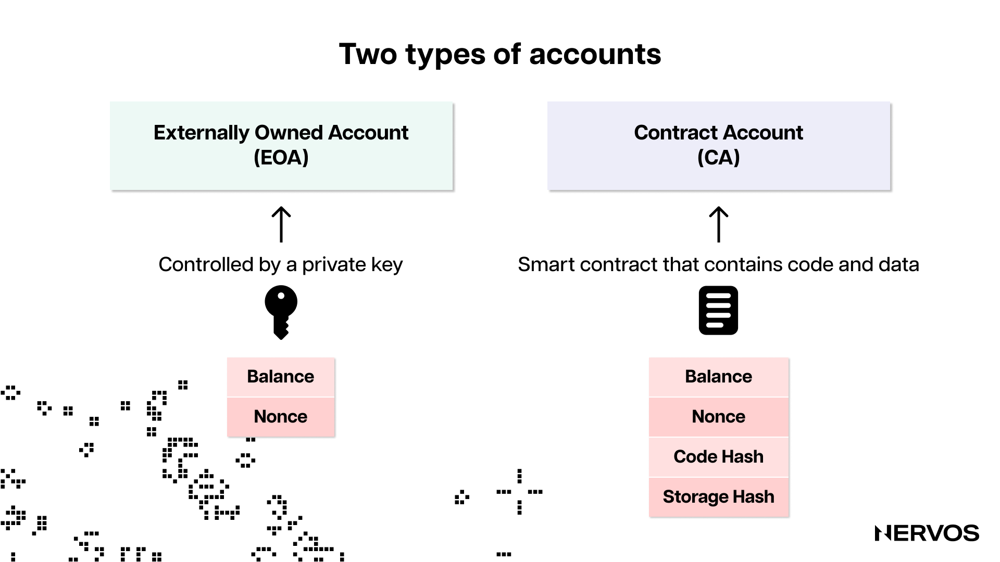
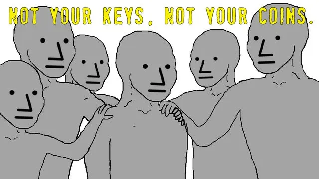
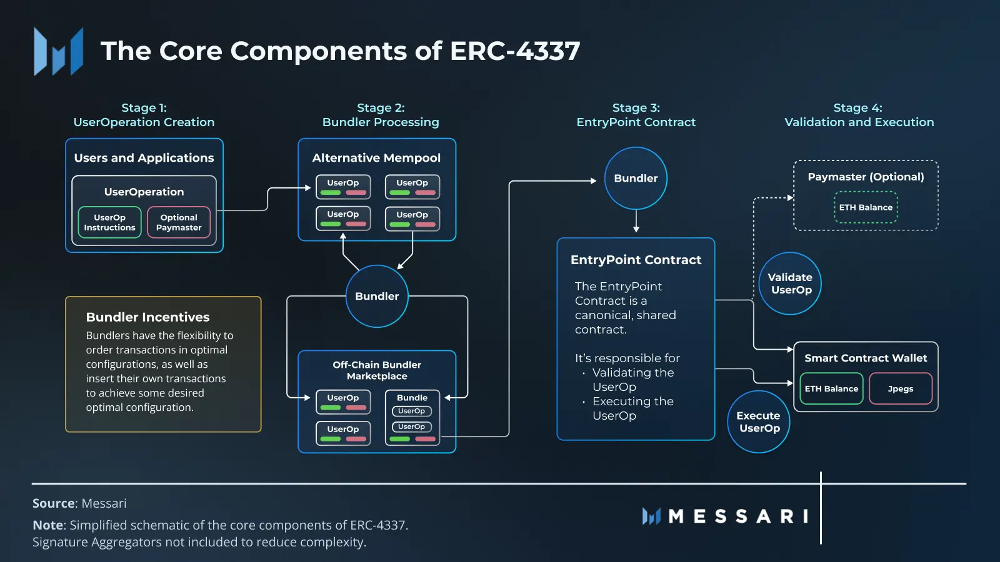
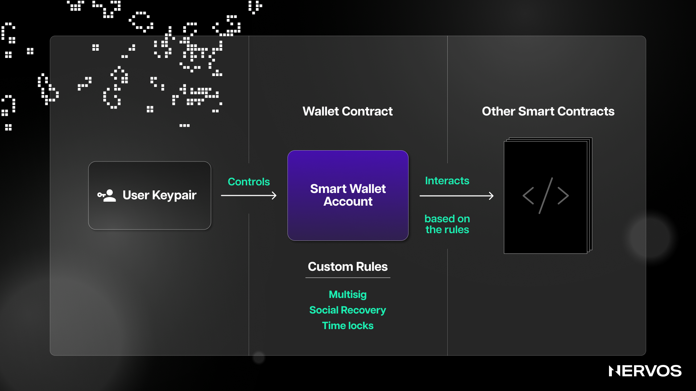

En los 14 años transcurridos desde el nacimiento de Bitcoin, el desarrollo en blockchain ha pasado por múltiples etapas, cada una de las cuales refleja las necesidades y los desafíos en evolución que enfrenta la industria en cada momento. Inicialmente, el desarrollo de blockchain se centró principalmente en la evolución de algoritmos de consenso para optimizar la seguridad y la descentralización de las redes distribuidas. Esta era dio lugar a numerosas redes de Capa 1 con mecanismos de consenso, arquitecturas y propuestas de valor completamente nuevos o solo ligeramente modificados.

Luego vino la era de la escalabilidad, donde los proyectos de blockchain se enfocaron en aumentar el rendimiento de sus transacciones y las capacidades de disponibilidad de datos a través de varias soluciones de escalado dentro y fuera de la cadena, que incluyen fragmentación, canales de estado, rollups y cadenas laterales. Con numerosas soluciones exitosas que llegaron al mercado en los últimos dos años, el interés de la investigación en el campo ya ha alcanzado su punto máximo y, en cambio, se está desplazando lentamente hacia otro problema sin resolver igualmente importante: la experiencia del usuario.

Es decir, el desarrollo crítico con respecto a este problema se relaciona con un proceso llamado "abstracción de cuenta", que representa una forma para que los desarrolladores envuelvan las cuentas Web3 con los mismos estándares de experiencia de usuario típicos de las cuentas Web2. Y aunque la incorporación de los próximos mil millones de usuarios a Web3 depende de este proceso, la abstracción de cuentas sigue siendo en gran medida incomprendida y subestimada.

## ¿Qué es la Abstracción de Cuenta?

La idea de la abstracción de cuentas es generalizar y cambiar la lógica de las cuentas de blockchain para mejorar la experiencia del usuario y hacer que la administración de cuentas y la custodia de criptoactivos sea más fácil y segura.

Comprender la abstracción de cuentas requiere comprender los conceptos respectivos de "abstracción" y "cuentas". En informática, la abstracción se refiere al proceso de eliminar o generalizar detalles físicos, espaciales o temporales para centrar la atención en detalles de mayor importancia. En términos más simples, la abstracción significa crear una representación simplificada de procesos o datos subyacentes para ocultar sus complejidades. un excelente ejemplo de abstracción es la evolución de los lenguajes de programación de 'máquina' a 'ensamblador' hasta lenguajes de 'alto nivel', donde cada lenguaje subsiguiente abstrae las complejidades de los anteriores, lo que permite a los desarrolladores centrarse en detalles de mayor importancia. En lugar de codificar unos y ceros directamente en el hardware, los desarrolladores de hoy codifican en lenguajes de programación avanzados de alto nivel que abstraen todos los bits y bytes subyacentes. De hecho, los programadores de hoy pueden construir aplicaciones informáticas elaboradas sin comprender exactamente cómo las CPU procesan sus instrucciones de máquina de bajo nivel, que es de lo que se trata la abstracción.

Por otro lado, con respecto al concepto de "cuentas" en blockchain vale la pena aclarar el concepto erróneo y común de que las cuentas de cadena de bloques son lo mismo que las direcciones de cadena de bloques. Es decir, una cuenta es una identidad en cadena que persiste entre aplicaciones en una cadena de bloques y solo existe dentro del contexto de esa cadena de bloques. Por otro lado, una dirección de cadena de bloques (que se refiere a una cuenta) es una identidad creada a través de una fórmula criptográfica distinta. Por ejemplo, una dirección de Ethereum se deriva tomando una [clave privada](https://en.wikipedia.org/wiki/Public-key_cryptography), haciendo una derivación de [curva elíptica](https://en.wikipedia.org/wiki/Elliptic-curve_cryptography) usando el estándar [Secp256k1](https://en.bitcoin.it/wiki/Secp256k1) para obtener una clave pública, luego codificando esa clave pública usando la función hash [Keccak-256](https://en.wikipedia.org/wiki/SHA-3), y luego tomando los últimos 20 bytes de la salida hash para obtener la dirección. Usar esa misma dirección en múltiples cadenas de bloques equivalentes a EVM significa usar diferentes cuentas.

El punto más importante aquí es que las cuentas en cadenas de bloques basadas en el modelo de cuenta son entidades más permanentes que, desde el punto de vista de los usuarios, funcionan de manera muy similar a las cuentas Web2, donde los usuarios suelen tener una cuenta para cada servicio o aplicación Web2 que utilizan. Por ejemplo, los usuarios tienen una cuenta para ver Netflix en lugar de crear cuentas nuevas cada vez que necesitan iniciar sesión en el servicio. Sin embargo, a diferencia de las cuentas Web2, a las que normalmente se accede a través de inicios de sesión de correo electrónico o contraseñas recuperables, las cuentas de blockchain se controlan a través de claves privadas, que no se pueden recuperar cuando se pierden.

## Comprendiendo las Cuentas de Ethereum

Para comprender el problema con las cuentas que muchos proyectos de cadenas de bloques basadas en el modelo de cuenta están tratando de resolver hoy en día, primero es necesario comprender cómo funcionan con mayor detalle.

Hay dos tipos de cuentas en las cadenas de bloques basadas en el modelo de cuenta como Ethereum: cuentas de propiedad externa (EOA) y cuentas de contrato (CA).

Las EOA son cuentas de usuario que pueden iniciar transacciones y a lo que los usuarios simplemente se refieren como "cuentas". Tienen tres propiedades: (i) un saldo que representa la cantidad de criptomonedas disponibles en la cuenta y necesaria para pagar las tarifas de transacción, (ii) un nonce para garantizar que cada transacción sea única o legítima, y (iii) una dirección para identificar de manera única la cuenta en la red.

Obviamente, iniciar transacciones desde una cuenta EOA requiere alguna autorización porque, de lo contrario, cualquiera podría gastar las criptomonedas que se encuentran en cualquier EOA. Iniciar transacciones desde una EOA o establecer la "propiedad" sobre ellas se realiza a través de un objeto criptográfico llamado "firmante". El firmante representa un par de claves criptográficas que consta de dos claves: una clave privada y una clave pública.

La clave privada es una cadena hexadecimal secreta generada aleatoriamente (un número de 256 bits) que representa un identificador único para proteger y controlar las EOA. En cadenas de bloques basadas en el modelo de cuenta como Ethereum, solo las EOA pueden iniciar transacciones, y hacerlo requiere una firma con una clave privada. En términos de Web2, la clave privada es como la contraseña que otorga a los usuarios acceso a aplicaciones como cuentas bancarias, donde cada vez que desean realizar una transferencia bancaria, deben "firmar" las transacciones con su contraseña. En Ethereum, la clave privada nunca se expone a la red durante el proceso de firma, ya que la firma se genera utilizando técnicas criptográficas que no revelan la clave en sí. Al igual que con cualquier otra contraseña, es imperativo que los usuarios de blockchain mantengan en secreto la clave privada, ya que es lo único que los separa del acceso a las criptomonedas en su cuenta.

Por otro lado, una clave pública en Ethereum es un número de 512 bits derivado de la clave privada usando criptografía de curva elíptica, específicamente, la curva Secp256k1 (una dirección de Ethereum son los últimos 20 bytes de la salida hash Keccak-256 de esta clave pública). La clave pública se utiliza para verificar la autenticidad de las transacciones firmadas con la clave privada correspondiente. Cuando un usuario inicia una transacción, la firma con su clave privada y la red Ethereum puede verificar su firma con su clave pública. A diferencia de la clave privada, que, como sugiere el nombre, debe mantenerse privada, la clave pública se puede compartir abiertamente.

Cuando un usuario inicia una transacción usando su cuenta Ethereum, firma la transacción usando su clave privada única, la EVM recibe la transacción y verifica su firma usando su clave pública, verifica que el nonce de la transacción coincida con el nonce de la cuenta, ejecuta la transacción y deduce automáticamente la tarifa de transacción del saldo de la cuenta del usuario.

## El Problema con las Cuentas en Blockchain

El problema principal con las cuentas de cadena de bloques, o al menos con la forma en que están diseñadas actualmente en cadenas de bloques basadas en el modelo de cuenta como Ethereum, es que el firmante o el objeto autorizado para iniciar transacciones o gastar criptomonedas está indisolublemente unido a la cuenta, el objeto que contiene las criptomonedas. En otras palabras, el firmante y la cuenta de propiedad externa en Ethereum son esencialmente lo mismo.

Eso significa que perder una clave privada equivale a perder una cuenta, lo que resulta en una experiencia de usuario terrible. Cada año se pierden o roban cientos de millones de dólares en criptomonedas debido a la pérdida o robo de claves privadas. Administrar las claves privadas, que se almacenan en billeteras criptográficas, generalmente significa recordar frases "[mnemónicas](https://en.bitcoin.it/wiki/Seed_phrase)" o "semillas" de 12, 18 o 24 palabras de longitud, que muestra una representación legible por humanos de la entropía inicial utilizada para generar una clave privada o una serie de claves privadas en [carteras deterministas jerárquicas (HD)](https://en.bitcoin.it/wiki/Deterministic_wallet#Type_2:_Hierarchical_deterministic_wallet). Las frases mnemotécnicas son un intento de proporcionar una forma "fácil de usar" para realizar copias de seguridad y restaurar billeteras mientras se mantiene la seguridad y privacidad de las claves privadas. Sin embargo, la desafortunada realidad es que si los usuarios olvidan la contraseña de su billetera criptográfica (que encripta las claves en su dispositivo) y no han almacenado de manera segura su frase mnemotécnica, nunca podrán recuperar la misma billetera o cuenta de blockchain.

El segundo problema importante con las cuentas en Ethereum (y la mayoría de las cadenas de bloques basadas en cuentas) es que la lógica criptográfica de cómo se construyen y funcionan las cuentas está codificada en la EVM. Eso significa que la única forma de crear una clave privada, derivar una clave pública e iniciar y validar transacciones es mediante el uso de primitivas criptográficas codificadas, es decir, el esquema de firma criptográfica [ECDSA](https://en.wikipedia.org/wiki/Elliptic_Curve_Digital_Signature_Algorithm) mencionado anteriormente en la curva elíptica específica Secp256k1 y la función hash Keccak-256. Esto hace que las EOA sean incompatibles con los esquemas nativos de firmas múltiples y los métodos de recuperación social.

## Abstracción de Cuenta como Solución

La idea central detrás de la abstracción de cuenta es desvincular la relación entre el firmante (par de llaves) y la cuenta, para que esta última sea más flexible y la primera más fácil de administrar.

En Ethereum, la abstracción de cuentas se implementó recientemente a través de [ERC-4337](https://eips.ethereum.org/EIPS/eip-4337), un estándar de Ethereum que busca lograr la abstracción de cuentas a nivel de aplicación sin bifurcaciones duras ni cambios en la capa de consenso. La idea detrás de este estándar es ir más allá de las EOA y permitir la creación de billeteras de contratos inteligentes que puedan determinar su propia lógica para validar y ejecutar transacciones.

El uso de cuentas de contrato en lugar de EOA como cuentas de usuario significa que las billeteras criptográficas ahora pueden definir su propia lógica de ejecución y verificación de transacciones, lo que significa que ya no están vinculadas a la lógica codificada de la EVM y pueden usar diferentes primitivas criptográficas, incluidas diferentes esquemas de firma, curvas elípticas y protocolos de firma. Este cambio por sí solo trae beneficios masivos de experiencia de usuario a las cuentas de Ethereum, que incluyen:

* **Recuperación social:** debido a que las billeteras de contratos inteligentes están controladas por contratos inteligentes con su propia lógica en lugar de una única clave privada, pueden incluir un mecanismo de recuperación que involucra múltiples "guardianes" o "contactos de recuperación" en los que confía el propietario de la billetera. Por ejemplo, las claves de respaldo se pueden agregar a una billetera para que cuando el propietario use su clave privada principal, pueda reemplazarla con una nueva clave segura con el permiso de los guardianes de confianza que poseen las claves de respaldo. Más allá de la verificación de transacciones, las billeteras de contratos inteligentes pueden implementar sus propios protocolos personalizados de ejecución de transacciones. Por ejemplo, la billetera puede contener reglas que permiten que las transacciones de bajo valor se verifiquen con una sola firma, mientras que las transacciones de mayor valor requieren la aprobación de varios firmantes.
* **Interruptor del hombre muerto:** la flexibilidad de las billeteras de contrato inteligente también permite la instalación del llamado interruptor del hombre muerto, que es esencialmente una regla o una función que permite transferencias automáticas de propiedad en los casos en que el propietario original de la billetera ha muerto o ya no es capaz de acceder a sus fondos. Por ejemplo, la billetera podría contener una regla que establezca que si el propietario original no ha accedido a la cuenta usando la clave privada principal durante más de un año, otra clave preaprobada se activaría y permitiría a su titular de confianza acceder a la cuenta y sus fondos.
* **Firmas resistentes a la computación cuántica:** como ya se indicó, las billeteras de contratos inteligentes pueden usar cualquier primitiva de firma criptográfica más allá de las codificadas en la EVM. Eso significa que pueden actualizar su lógica para admitir esquemas de firma resistentes a la computación cuántica una vez que las computadoras cuánticas comprometan los mecanismos ECDSA existentes.
* **Condiciones personalizadas de acceso y gasto:** otra característica interesante habilitada por la abstracción de cuentas o billeteras de contrato inteligente es la creación de todo tipo de condiciones personalizadas de acceso y gasto. Por ejemplo, los usuarios pueden usar una sola cuenta de contrato inteligente como billetera caliente y fría, donde las transacciones de bajo valor se pueden firmar sin problemas desde una aplicación de billetera móvil, mientras que las transacciones de alto valor requieren una firma de una clave privada diferente almacenada en un "almacenamiento en frío" o un dispositivo de billetera hardware como un Ledger. Más allá de eso, los usuarios pueden crear cuentas comerciales o de empresa que asignan diferentes roles con condiciones de accesibilidad personalizadas a diferentes poseedores de claves. Por ejemplo, se podría permitir que el equipo legal de la empresa realice votaciones en cadena los tokens de la DAO o empresa sin tener permiso para gastarlos, o se podría permitir que el equipo de nómina envíe la nómina a los empleados en direcciones específicas incluidas en una lista blanca con un limites de gasto preestablecidos y limitaciones de tiempo.
* **Abstracción de gas:** a diferencia de las EOA, que deben tener ETH para pagar las tarifas de transacción en Ethereum, la abstracción de cuenta permite que las carteras de contratos inteligentes paguen el gas en cualquier token [ERC-20](https://ethereum.org/en/developers/docs/standards/tokens/erc-20/). Además, las aplicaciones podrían ofrecer pagar las tarifas de transacción de sus usuarios, lo que significa que los usuarios podrían simplemente crear una cuenta y comenzar a usar las aplicaciones de Ethereum sin tener que comprar ETH.
* **Agrupación de transacciones:** la abstracción de cuentas permitirá la agrupación de transacciones para mayor velocidad y eficiencia. Actualmente, un simple intercambio de tokens en un intercambio descentralizado requiere al menos dos transacciones, una para aprobar el intercambio o autorizar el gasto de tokens individuales antes del intercambio y otra para ejecutar el intercambio. Con la abstracción de cuentas, este proceso se puede agilizar al agrupar múltiples transacciones en una transacción que requiere solo una acción o firma de los usuarios. Además, esta transacción agrupada puede aprobar con precisión el valor exacto de los tokens necesarios para cada transacción y, posteriormente, revocar esas aprobaciones al finalizar, lo que refuerza la seguridad.

Dicho esto, las actualizaciones de abstracción de cuentas habilitadas más recientemente por ERC-4337 solo permiten la abstracción a nivel de aplicación, lo que significa que las billeteras de contratos inteligentes siguen siendo ciudadanos de segunda clase. En otras palabras, a nivel de protocolo, el único tipo de cuenta que puede iniciar transacciones en Ethereum sigue siendo la EOA nativa, y ERC-4337 solo brinda una solución alternativa cual cinta adhesiva para los proveedores de billeteras de contratos inteligentes.

Las billeteras de contratos inteligentes aún necesitan aprovechar varios trucos e infraestructura personalizada, incluidos repetidores fuera de la cadena, mempools alternativos y nuevas entidades de terceros como empaquetadores y pagadores para emular la abstracción de la cuenta correctamente. Todo esto significa que la lógica subyacente detrás de EVM se ha mantenido igual, con EOA siendo ciudadanos de primera clase y el soporte para billeteras de contratos inteligentes "con abstracción de cuenta" y aplicaciones descentralizadas sigue siendo solo opcional.

Vale la pena destacar que las billeteras de contratos inteligentes como [Gnosis Safe](https://safe.global/) y [Argent](https://www.argent.xyz/) han existido en Ethereum durante años, ofreciendo a los usuarios la conveniencia de la recuperación social y las metatransacciones que permiten la descarga de pagos de gas a otros. En Ethereum, ERC-4337 define estándares que permiten que las transacciones de billetera de contrato inteligente se envíen de manera descentralizada y ofrece una invocación de billetera de contrato sin permiso. Sin embargo, la sobrecarga de interactuar con las billeteras ERC-4337 es desafortunadamente alta debido al diseño del sistema, y algunos en la comunidad Ethereum han especulado que los desarrolladores pueden continuar creando sus propias implementaciones de billetera inteligente, sin tener en cuenta el nuevo estándar.

En consecuencia, se puede argumentar que la abstracción de cuentas es, por definición, algo que debe implementarse a nivel de protocolo. En el caso de Ethereum, esto resolvería el requisito de implementar un contrato inteligente por billetera (lo que conduce a un exceso de estado) y abriría la puerta a una verdadera abstracción de cuenta, en la que las transacciones pueden iniciarse a partir de diferentes tipos de políticas, como la transición de estado de un zk-SNARK.

Afortunadamente, otras cadenas de bloques, como la Capa 1 de Nervos, llamada Common Knowledge Base, han implementado la abstracción de cuentas a nivel de protocolo desde el principio.

## Common Knowledge Base: Abstracción de Cuentas Total

Si bien Ethereum actualmente busca la abstracción de cuentas a través de la implementación ERC-4377, que solo sirve como un disfraz a nivel de aplicación, y otras redes de Capa 2 como StarkNet y zkSync planean "consagrar" el mismo modelo en un nivel de protocolo más profundo, vale la pena señalar que esta forma de perseguir la abstracción de cuentas no alcanza el mayor nivel de abstracción posible.

Tal como están las cosas actualmente, la cadena de bloques más abstracta en la industria es la Capa 1 de Nervos. Es decir, Common Knowledge Base logra una abstracción adecuada de la cuenta a nivel de protocolo aprovechando principalmente dos cosas: (i) un modelo de contabilidad abstracto llamado modelo Cell, que es una versión generalizada del modelo UTXO con potentes capacidades de programación, y ( ii) un modelo de máquina completamente virtual abstracta, llamado CKB-VM.

CKB-VM es completamente abstracto porque no tiene precompilaciones integradas, lo que significa que puede admitir todas las primitivas criptográficas de forma predeterminada. A diferencia de otras máquinas virtuales como EVM de Ethereum, la función hash definida y el esquema de firma en CKB no se integran en la máquina virtual, sino que se ejecutan en el mismo entorno que los contratos inteligentes creados por los desarrolladores de aplicaciones. En Ethereum, estas primitivas criptográficas están precompiladas en la capa de consenso, lo que significa que si alguien quiere cambiarlas, es decir, reemplazar el algoritmo hash Keccak-256 para derivar direcciones de Ethereum usando otros algoritmos, entonces la única forma es enviar una Propuesta de mejora de Ethereum (EIP) y esperar que la propuesta eventualmente sea considerada e implementada a través de una bifurcación dura. Naturalmente, y por buenas razones, la bifurcación dura de Ethereum es un proceso polémico y exhaustivo que a menudo puede tardar años en materializarse, lo que hace que el uso potencial de primitivas criptográficas sin soporte sea prácticamente inviable.

Más allá de CKB-VM, el modelo Cell también es abstracto, sin una estructura interna aplicada a los datos almacenados en las celdas y un diseño totalmente dejado a los desarrolladores. El modelo Cell es inherentemente abstracto, ya que es esecialmente una versión generalizada del modelo UTXO. Las cadenas de bloques basadas en UTXO están orientadas a los activos en lugar de a la identidad, y representan y rastrean las transferencias de criptomonedas como salidas no gastadas de transacciones pasadas en lugar de cambios en los saldos de las cuentas. En otras palabras, en las cadenas de bloques basadas en UTXO, no existe un concepto explícito de cuenta. En cambio, las "cuentas" son simplemente abstracciones creadas por billeteras criptográficas (software de administración de pares de claves fuera de la cadena) que rastrean las salidas de transacciones no gastadas o UTXO.

Dicho esto, las cadenas de bloques basadas en UTXO pueden admitir diferentes tipos de scripts de bloqueo (como P2PKH, P2SH y P2WPKH) que definen cómo se pueden gastar las salidas. En este contexto, se puede pensar en la "abstracción de cuentas" como una forma de crear secuencias de comandos de bloqueo más flexibles y personalizables, lo que permite casos de uso avanzados y funciones de seguridad mejoradas al gastar o administrar UTXO.

Y esto es precisamente lo que ha permitido Common Knowledge Base. Los desarrolladores de aplicaciones pueden instalar varios algoritmos de firma y hash, como ECDSA, Secp256k1, Keccak256, Shnorr y otros, como si fueran complementos sin necesidad de bifurcaciones duras. Por ejemplo, un desarrollador podría implementar el algoritmo hash Keccak256 de Ethereum en una celda e implementar una biblioteca criptográfica que admita el mismo algoritmo en la cadena de bloques de CKB. Por tanto, la cadena de bloques de Nervos CKB puede verificar el formato de firma de Ethereum y ejecutar la transacción.

Lo mismo se aplica a los algoritmos de firma de cualquier otra cadena de bloques. Por ejemplo, Nervos CKB es compatible con el sistema de contabilidad de Bitcoin, lo que significa que puede verificar una firma firmada con una clave privada de Bitcoin, lo que permite a los usuarios realizar transacciones y mantener diferentes activos en la cadena de bloques de CKB utilizando su billetera de Bitcoin. Así es como se ve la abstracción de cuentas adecuada; la cuenta (el objeto que contiene los activos) en Common Knowledge Base se puede administrar mediante un firmante de cualquier ecosistema de cadena de bloques.

## Pensamientos Finales

Mientras que el ERC-4377 de Ethereum, sin duda, brinda beneficios significativos en términos de experiencia del usuario al habilitar características como la recuperación social, el interruptor del hombre muerto, las firmas resistentes a la computación cuántica, el acceso personalizado y las condiciones de gasto, la abstracción de gas y la agrupación de transacciones. Sin embargo, este método de abstracción aún deja a las billeteras de contratos inteligentes como ciudadanos de segunda clase en el ecosistema de Ethereum.

Por el contrario, la capa 1 de Nervos, Common Knowledge Base, demuestra cómo es la verdadera abstracción de cuentas a nivel de protocolo. Con su modelo de contabilidad, el modelo Cell, y su máquina virtual CKB-VM, ambos completamente abstractos, Nervos CKB permite una abstracción de cuentas superior que admite todas las primitivas criptográficas como complementos sin necesidad de bifurcaciones duras. Este nivel de abstracción permite una integración perfecta con diferentes ecosistemas, lo que permite a los usuarios administrar activos en CKB utilizando firmantes de cualquier cadena de bloques.

En última instancia, Common Knowledge Base se erige como un poderoso ejemplo del potencial de la abstracción de cuentas en la industria de la cadena de bloques. Al adoptar este nivel de abstracción, Common Knowledge Base no solo demuestra la capacidad de fomentar un entorno más seguro, fácil de usar e interoperable para los usuarios de criptomonedas, sino que también destaca la dirección futura de la tecnología blockchain a medida que continúa evolucionando y madurando.
