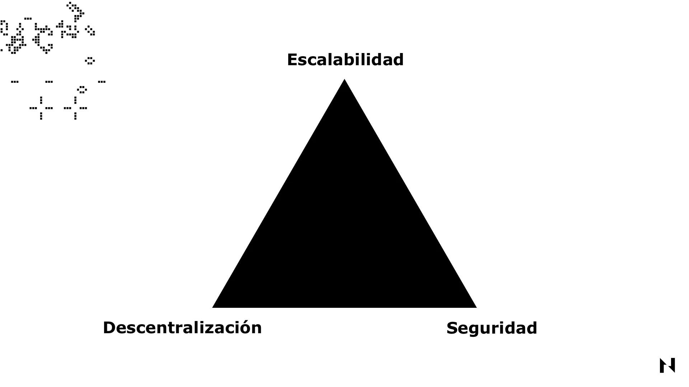
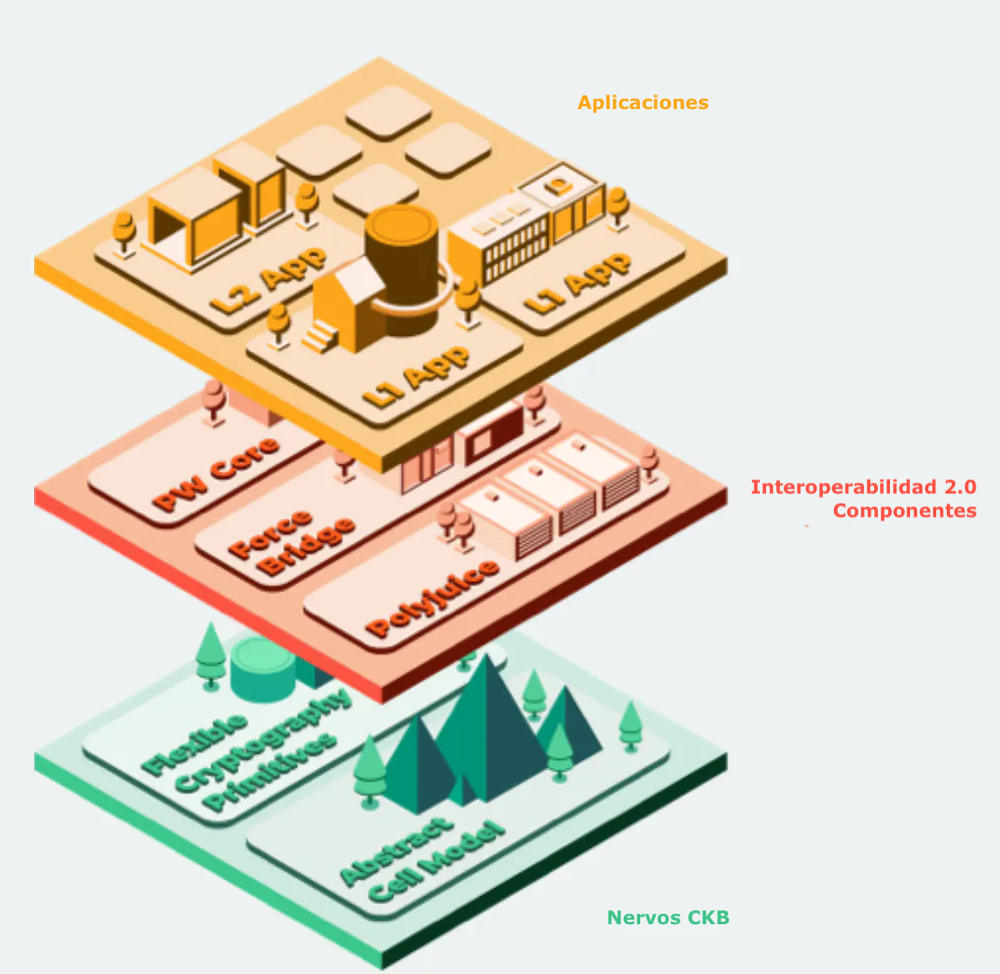

### ¿Qué es el Trilema de la Blockchain?

El Trilema de la Blockchain es una teoría propuesta por el fundador de Ethereum, Vitalik Buterin, que afirma que las redes blockchain no pueden ser seguras, descentralizadas y escalables al mismo tiempo.

Este trilema surge porque aumentar la velocidad y la capacidad de procesamiento de transacciones de una cadena de bloques generalmente requiere más potencia informática y ancho de banda de red, lo que hace que sea más costoso y difícil para operar los nodos. Esto puede conducir a menos nodos en la red, haciéndola más centralizada y potencialmente comprometiendo su seguridad y descentralización.

Por lo tanto, el trilema destaca las compensaciones que enfrentan todas las cadenas de bloques cuando intentan escalar y los desafíos de lograr una cadena de bloques verdaderamente descentralizada y escalable.

## Descentralización en Blockchain

La descentralización es un aspecto crítico de las cadenas de bloques porque garantiza que la red no esté controlada por una sola entidad o grupo de entidades. En una red descentralizada, todos los participantes tienen el mismo poder para validar y verificar las transacciones, lo que hace que la red sea más resistente a los ataques, la captura y la censura.

_La comparación entre la red centralizada (izquierda) y la red descentralizada (derecha)._

Debido a que las cadenas de bloques descentralizadas no tienen puntos únicos de falla, son significativamente más difíciles de atacar y comprometer que los sistemas centralizados. Al eliminar la necesidad de intermediarios o terceros de confianza, las cadenas de bloques sacrifican la eficiencia por la seguridad y otras cualidades como la resistencia a la censura y la ausencia de permisos. En otras palabras, una descentralización suficiente hace que sea imposible que los participantes de la red se confabulen, manipulen o comprometan la cadena de bloques.

## Seguridad en la Blockchain

La seguridad de la blockchain está directa y proporcionalmente ligada a la descentralización. Cuanto más descentralizada es una cadena de bloques, más segura se vuelve.

La seguridad en este contexto se refiere a la capacidad de la cadena de bloques para resistir diferentes tipos de ataques sin experimentar ningún tiempo de inactividad. En las cadenas de bloques de prueba de trabajo, la seguridad generalmente se mide por la tasa de hash acumulada de la red, donde una tasa de hash más alta y distribuida más equitativamente implica una mayor seguridad. Por otro lado, la seguridad de las cadenas de bloques basadas en prueba de participación generalmente se mide (entre otras cosas) por la cantidad apostada acumulada y su distribución.

Por ejemplo, supongamos que un solo minero o un validador controla más de la mitad de la tasa de hash o la cantidad apostada de una red. En ese caso, pueden comprometer la cadena de bloques con relativa facilidad ejecutando un ataque del 51 % o intentando censurar las transacciones.

Otra característica de seguridad esencial de las cadenas de bloques es la criptografía subyacente utilizada para protegerlas. Cada red blockchain utiliza funciones criptográficas para cifrar y proteger los datos. Si las primitivas criptográficas subyacentes o los mecanismos de encriptación son fáciles de romper, también lo será la cadena de bloques. Por ejemplo, Bitcoin depende en gran medida del algoritmo hash SHA256 para su cifrado. Si algún día alguien logra descifrar este algoritmo, ya sea encontrando su clave o forzando el algoritmo mediante una computadora cuántica, entonces la seguridad de Bitcoin será destruida.

## Escalabilidad en Blockchain

La escalabilidad, en el contexto de las cadenas de bloques, se refiere a la capacidad de una red para manejar un volumen creciente de transacciones mientras mantiene tiempos y costos de procesamiento de transacciones razonables. Cuanto más escalable es una cadena de bloques, mejor equipada está para acomodar un mayor rendimiento de transacciones sin comprometer la descentralización o la seguridad.

Existen varios enfoques para escalar cadenas de bloques, cada uno con sus propias compensaciones. Por ejemplo, el escalado en cadena implica aumentar el tamaño del bloque, disminuir el tiempo del bloque o ambos. Los bloques más grandes pueden acomodar más transacciones, mientras que los tiempos de bloque más cortos permiten una confirmación más rápida de las transacciones. Sin embargo, aumentar el tamaño del bloque y disminuir el tiempo del bloque puede dar como resultado una red más centralizada, ya que estos cambios pueden requerir un hardware más potente para validar y propagar los bloques, lo que podría impedir que algunos nodos participen en el proceso de consenso.

Para escalar de manera sensata, las cadenas de bloques deben equilibrar varios factores, incluida la seguridad, la descentralización y el rendimiento. Aumentar la escalabilidad a menudo requiere sacrificar uno de estos aspectos. Por ejemplo, los bloques más grandes pueden aumentar el rendimiento pero conducen a una mayor centralización, ya que menos nodos tienen los recursos para almacenar y procesar toda la cadena de bloques. Esto significa que el escalado en cadena es un enfoque inherentemente limitado, razón por la cual cada vez más cadenas de bloques están adoptando el escalado fuera de cadena a través de arquitecturas en capas.

El escalado fuera de la cadena significa mover algunas transacciones de la cadena de bloques principal a capas secundarias o cadenas laterales. Los ejemplos de soluciones de escalado fuera de la cadena incluyen redes de capa 2 como canales estatales y rollups, y cadenas laterales con su propio mecanismo de consenso y propiedades de seguridad. El escalado fuera de la cadena puede mejorar significativamente el rendimiento de las transacciones, pero puede presentar una complejidad adicional y posibles riesgos de seguridad para el sistema.

Otra solución de escalado menos popular es la fragmentación, que consiste en dividir la cadena de bloques en cadenas paralelas más pequeñas llamadas fragmentos. Cada fragmento procesa un subconjunto de las transacciones totales, lo que aumenta el rendimiento general. La fragmentación puede ser compleja de implementar y puede introducir nuevos vectores de ataque.

## Encontrar soluciones al trilema de la cadena de bloques

Existen diferentes propuestas para resolver el trilema blockchain. Por ejemplo, algunos proyectos más nuevos utilizan versiones modificadas del mecanismo de consenso de prueba de participación, como prueba de participación delegada o prueba de autoridad, donde sacrifican una cierta cantidad de descentralización para mejorar la escalabilidad.

Por ejemplo, en lugar de permitir que un número ilimitado de nodos validen transacciones, limitan la cantidad de nodos a solo 100 o menos. Estos nodos pueden ejecutar hardware mucho más poderoso y costoso, expandiendo el poder de procesamiento de la red, pero también aumentando la dependencia de la red en un pequeño conjunto de validadores que pueden ser atacados y comprometidos más fácilmente.

Otras soluciones populares incluyen las redes de capa 2 mencionadas anteriormente, como canales estatales y rollups. Estas soluciones permiten que las cadenas de bloques descarguen una parte significativa del procesamiento de transacciones en redes separadas construidas sobre ellas. Dado que las redes de Capa 2 dependen completamente de la cadena de bloques de Capa 1 subyacente para su seguridad y descentralización, a menudo se las considera una de las soluciones más prometedoras para resolver el trilema.

Lee la explicación detallada en Capa 1 frente a la Capa 2 [Capa 1 vs. Capa 2](https://www.nervos.org/knowledge-base/layer_1_vs_layer_2) para comprender cómo funcionan ambas.

## Cómo Nervos resolvió el trilema de la cadena de bloques

_Ilustración del modelo multicapa de Nervos_

Nervos utiliza un modelo de cadena de bloques de múltiples capas. La cadena de bloques de capa 1 de Nervos, llamada [Common Knowledge Base](https://medium.com/nervosnetwork/nervos-ckb-in-a-nutshell-7a4ac8f99e0e), utiliza el mecanismo de consenso de prueba de trabajo, que sigue siendo el mecanismo de consenso más probado en batalla en lo que respecta a la descentralización y la seguridad. Mientras tanto, hay dos cadenas de bloques de Capa 2 en Nervos; se llaman AXON y [Godwoken](https://godwoken.com), donde AXON es una cadena lateral y Godwoken es un Optimistic Rollup. Tanto AXON como Godwoken utilizan Common Knowledge Base para su seguridad y descentralización.

Mediante el uso de un modelo multicapa como este, la idea es mejorar la escalabilidad en el ecosistema de Nervos sin dejar de mantener un buen nivel de seguridad y descentralización de blockchain.

Lee más sobre [cómo el modelo multicapa de Nervos está diseñado desde cero para resolver el trilema de blockchain](https://medium.com/@AlejandroR.bit/c%C3%B3mo-ir-m%C3%A1s-all%C3%A1-del-trilema-de-blockchain-por-jan-xie-7ea72d11d016)**.**
