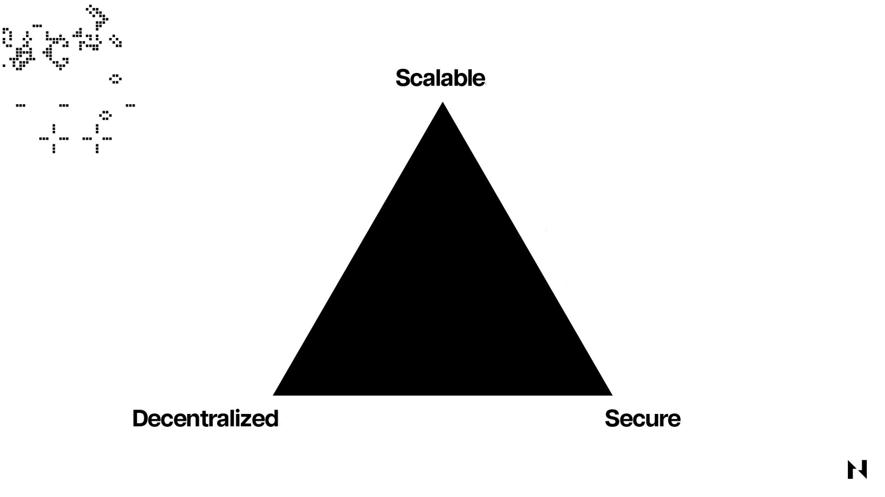
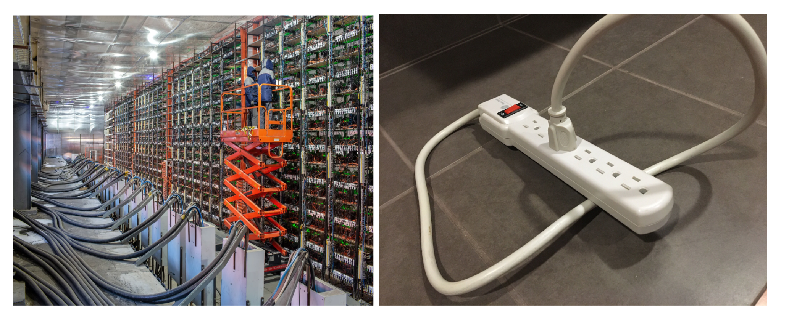
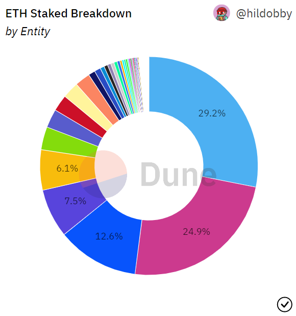
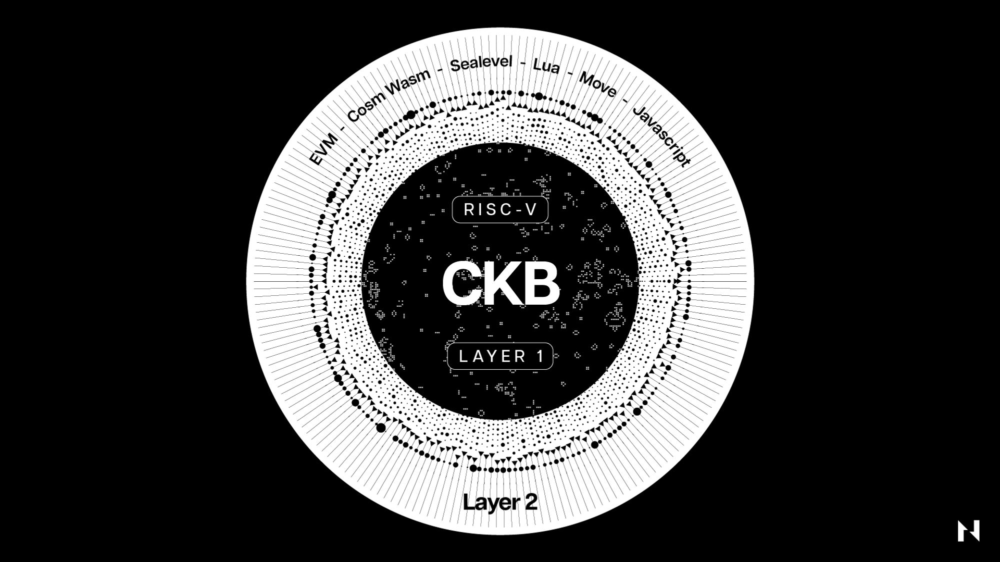
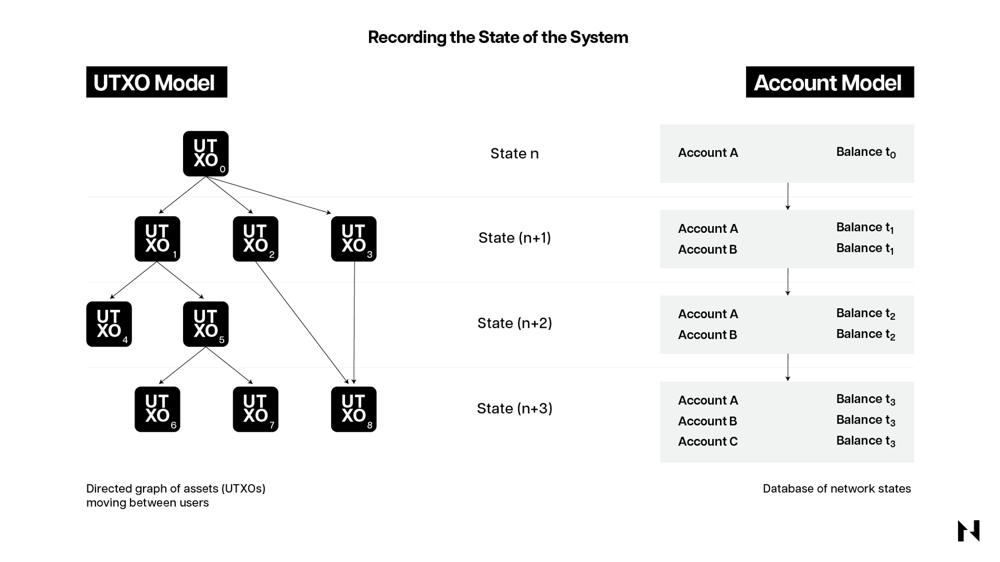
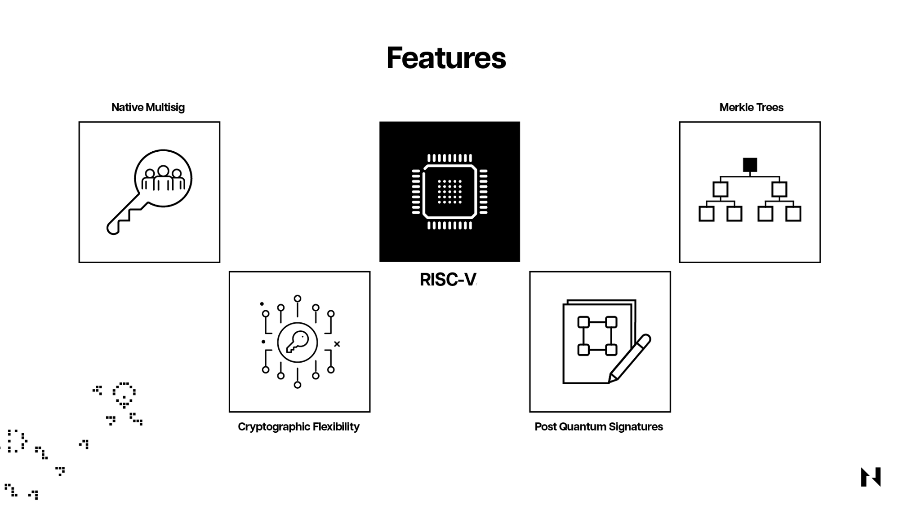
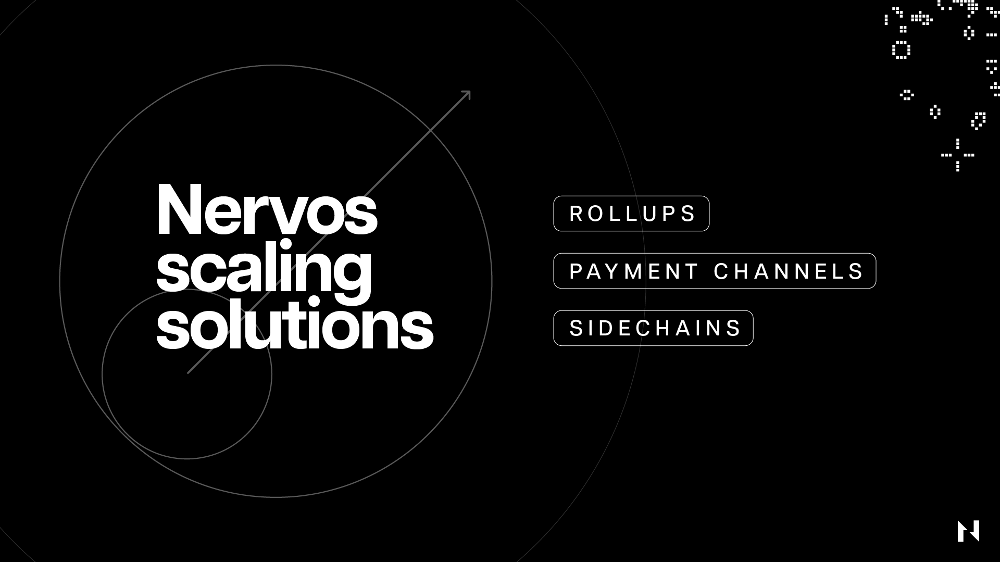
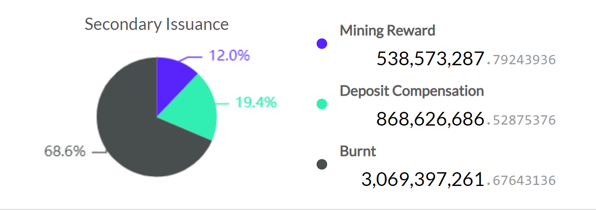

This article seeks to be the be-all and end-all resource for the underlying architecture and value proposition of the Nervos network.

Nervos is a modular blockchain network built from the ground up to ensure outstanding security, decentralization, flexibility, and interoperability on the base layer and unparalleled scalability on the upper layers. 

The Nervos Layer 1, called the Common Knowledge Base (CKB), leverages Proof-of-Work for consensus, a novel generalized UTXO model for accounting, and a RISC-V instruction set-based virtual machine for transaction and smart contract execution. It supports all current and prospective cryptographic primitives, making it possible to build all types of diverse Layer 2 networks on top of it.

## Modular vs. Monolithic Blockchains

To understand Nervos’ design and value proposition, it’s first worth looking at the key problem all blockchains inherently face and the two design approaches they typically pursue to solve it.

The three main tasks blockchains perform include:

1. Executing transactions, which refers to how nodes process pending transactions and progress the state of the blockchain. This process occurs in a so-called “execution environment,” which typically includes a virtual computer like [Ethereum’s Virtual Machine](https://ethereum.org/en/developers/docs/evm/) (EVM) or Nervos’ CKB-VM.
2. Guaranteeing data availability, which means making all transaction-related data available to all nodes in the blockchain network. This is crucial because it allows all network participants to independently verify transactions and compute the blockchain’s state without needing to trust each other.
3. Achieving consensus on the true state of the blockchain, which is necessary because blockchains fundamentally represent widely distributed databases that must be synchronized, independently verified, and trusted by all database holders. If network participants can’t agree on the correct state of the database in real time, then the blockchain is effectively useless.

In trying to execute these tasks, blockchains run into a problem commonly known as the Scalability Trilemma, which states that they can’t be secure, scalable, and decentralized all at the same time. This is because blockchain scaling is inversely correlated with the hardware and bandwidth requirements for running nodes. Achieving higher transaction throughput and data availability requires more expensive hardware, which consequently leads to fewer participating nodes and higher centralization.

Resultantly, all blockchains must make architectural tradeoffs when designed and accept sacrifices on one front for gains on the others. For example, high-throughput blockchains like Solana or BNB Chain optimize for scalability but make sacrifices in decentralization—and considering how tied decentralization is to security, one can argue that they make considerable sacrifices there too. On the other hand, first-generation blockchains like Bitcoin are incredibly secure and decentralized but lack sufficient scalability, meaning they can only process a small number of transactions per unit of time.

In a bid to solve this problem, many blockchains recently began pivoting away from the monolithic blockchain design—which implies having transaction execution, consensus, and data availability all happen on the same layer—and towards a more modular design, where one or more of these functions are separated on different layers.

Realizing very early that the only way to scale to global ubiquity without sacrificing security and decentralization is through a layered architecture, Nervos was designed—from the ground up—as a modular blockchain network.

Its base layer, the [CKB](https://github.com/nervosnetwork/rfcs/blob/master/rfcs/0002-ckb/0002-ckb.md), is exceptionally secure, decentralized, flexible, and interoperable, while the different types of Layer 2s that have and can be built on top of it offer virtually unlimited scalability and programmability.

Precisely because Nervos was architectured with the modular framework in mind from the beginning, it carries significant technological advantages over competing blockchains initially designed as monolithic.

Namely, thanks to the base layer’s very generalized and highly-flexible nature, developers are granted much greater freedoms and new capabilities. CKB supports and understands all cryptographic primitives, making it inherently more interoperable with other heterogeneous Layer 1 and Layer 2 networks and even established Internet protocols. 

As a result, developers can easily run different virtual machines, like the EVM, directly inside the CKB-VM or build universal applications accessible by all types of blockchain users, wallets, or even standard authentication protocols, like [Apple passkeys](https://developer.apple.com/passkeys/). This leads to gains in user experience that are unparalleled by any other blockchain, lowering the barrier to entry for newcomers and making it seamless for existing blockchain users to interact with CKB. Moreover, the modular design allows Nervos to easily scale using Layer 2 networks that are anchored to a secure and future-proof Layer 1, which is an approach that has only recently been adopted as the best way to scale blockchain networks in the industry.

To understand how all of this is possible and what it means for users, it’s worth looking at each of Nervos’ core components separately.

## Security and Decentralization

Picking the desired consensus mechanism is one of the first architectural decisions blockchains make when bootstrapping. Consensus mechanisms represent formalized protocols or rules that blockchains utilize to achieve sustained agreement on the correct state of the ledger among participating nodes.

The critical thing to note here is that—while all consensus mechanisms effectively leverage the same “carrot and stick” incentive model—the game-theoretical results they manifest concerning security and decentralization aren’t the same.

In the Proof-of-Work consensus model, miners must acquire specialized hardware and expend vast amounts of electricity to participate in block production. If they’re honest and follow the protocol’s rules, they’re rewarded with newly minted cryptocurrency, which is the “carrot” that incentivizes them to validate transactions and secure the network. If they don’t follow the rules, they’re left with hefty electricity bills and no rewards, which serves as the “stick” disincentivizing them to cheat and disrupt the network.

On the other hand, Proof-of-Stake mechanisms leverage the same logic but implement it differently, leading to different results. Instead of expending an exogenous resource—like electricity in Proof-of-Work’s case—Proof-of-Stake validators stake (and risk losing) the same cryptocurrencies they receive as rewards for validating transactions, leading to a circular security dependency where the protocols are secured by the same assets they produce.

                                                               
_Proof-of-Work vs. Proof-of-Stake_

Proof-of-Stake’s underlying incentive structure inherently leads to greater centralization, negatively affecting the networks’ security and censorship resistance. Proof of this is that, in the five months since Ethereum moved to Proof-of-Stake, roughly [52%](https://dune.com/hildobby/eth2-staking) of the validating power has concentrated in the hands of only four entities: Lido (a decentralized liquid staking protocol), Coinbase, Kraken, and Binance. This is qualitatively different from the centralization of hashing power in mining pools. Mining pools allow individual miners (who can leave the pools whenever they want) to combine their computing power and split the mining rewards. In Ethereum, institutional validators control or custody the ETH delegated to them by individual stakers directly, meaning they can relatively easily be captured or influenced by regulators and forced to comply with rules potentially damaging to the network.

 
_Ethereum staking breakdown (Source: [Dune](https://dune.com/hildobby/eth2-staking))_

Consequently, we have seen [censorship in Ethereum blocks](https://www.mevwatch.info/) to exclude transactions which interact with the OFAC-sanctioned privacy protocol [Tornado Cash](https://www.coincenter.org/how-does-tornado-cash-actually-work/), meaning the networks’ much-desired consensus-layer neutrality has been degraded. To make things worse, the deterministic way in which Proof-of-Stake systems distribute staking rewards is set to grow the top validators’ power even more, leading to even greater network centralization. In Proof-of-Stake systems, the top validators’ power advantage is effectively locked in because no natural market force is challenging it.

On the other hand, Proof-of-Work provides very different operating realities for the mining nodes that secure the network. Miners and mining pools must stay innovative, pursue sound business strategies and continue to invest in infrastructure to remain competitive. Proof work ensures greater security, decentralization, and censorship resistance, and most importantly, it is objectively verifiable. End users can quickly verify the effort expended to generate the chain and know for themselves that they are seeing an accurate history of the blockchain. Blockchains such as Bitcoin or CKB have been painstakingly designed and maintained with end-user verifiability in mind. This hard path to support global transaction volume doesn’t produce the same attention-grabbing headlines, but it does hold close to the spirit of sovereignty and objective truth that Satoshi expressed when they created Bitcoin. 

For these reasons, Nervos opted for the most robust and battle-tested consensus model currently available: Proof-of-Work. Specifically, CKB uses an optimized version of Bitcoin’s Nakamoto Consensus model, called NC-MAX, that improves the already robust mechanism by patching its vulnerability to selfish mining attacks and improves its transaction throughput capabilities. It also leverages a novel hash function, Eaglesong, that ensured CKB had the same [path dependence](https://en.wikipedia.org/wiki/Path_dependence)-derived security as Bitcoin upon bootstrapping. All of this means that CKB can achieve higher security than Bitcoin—assuming the same security budget—while absolutely trumping Proof-of-Stake-based blockchains in terms of decentralization, permissionlessness, and neutrality.

## Flexibility and Interoperability

Beyond decentralization and security, the ideal base layer for an adequately designed modular blockchain must be highly flexible and interoperable. In this context, flexibility implies a highly generalized or “abstract” blockchain architecture that allows developers to build more comprehensive system and application primitives by default or without requiring core protocol updates or hard forks. Interoperability refers to the blockchain’s ability to communicate and connect with other heterogeneous blockchains, Layer 2 networks, or even Web2 systems. These two features combined ensure that the modular blockchain’s Layer 1 remains future-proof, which—due to the challenges of hard forking—is among the most desirable properties any blockchain network can have.

To the point, the Nervos CKB is the most flexible and interoperable blockchain in the space. Because it supports all current and future cryptographic primitives, CKB can serve as a robust foundation that lends security to a diverse set of Layer 2 networks that leverage different consensus mechanisms, programming languages, execution environments, and data availability storage methods. It can also serve as a central hub or a cross-chain bridge, allowing various heterogeneous blockchains to communicate. This unprecedented level of flexibility and interoperability is made possible by Nervos’ unique accounting model and the RISC-V instruction set-based virtual machine.
 

### Accounting: The Cell Model (Generalized UTXO)

Another broad architectural choice blockchains must make right from the beginning is picking the accounting model, which determines how they record and save state.

At their core, blockchains are deterministic state machines or, more broadly, “stateful systems.” This means they’re systems configured to record all events and user interactions on replicated immutable ledgers. The retained information on the ledgers is defined as the “state” of the blockchain. First, users make and broadcast transactions, then miners validate and include them into blocks that are subsequently permanently recorded on the blockchain—this is fundamentally how blockchains record state. Every time a new block is added to the blockchain, its state changes.

The two most popular accounting or bookkeeping models in which blockchains record state are the UTXO (unspent transaction output) model pioneered by Bitcoin and the account model pioneered by Ethereum. The best non-technical explanation of how these models differ is the “cash vs. bank account” analogy.

Namely, UTXOs work similarly to cash, where each UTXO is like a unique paper bill that users can spend only once. Each user in a UTXO-based blockchain keeps track of their balances by adding up the unique “paper bills” in their possession. For example, when Alice wants to give Bob $13, she can hand him two paper bills, one $10 and another $5—each with unique serial numbers—and receive a $2 bill as change, representing a new UTXO. In this model, the users’ balances are abstractions generated by the users’ wallets that keep track of UTXOs across different addresses. 

On the other hand, accounts in the account model work like bank accounts, where money transfers are recorded as debits and credits on different users’ accounts on the bank’s ledger. When Alice wants to send Bob $10, the bank credits or deducts $10 from Alice’s account and debits or adds $10 to Bob’s name in its ledger. The same happens on account-based blockchains—only the ledger that records the balances is distributed among many nodes.

From a functional perspective, both bookkeeping models have their own benefits and drawbacks. The account model is stateful—making it easier to develop smart contracts needing blockchain state information access—but is less scalable. On the other hand, the UTXO model is stateless—making it harder to develop smart contracts that require state information—but supports parallel transaction processing, which grants greater scalability. Furthermore, the account model is computation-based while the UTXO is verification-based, meaning the latter is less resource-intensive, allowing participating nodes to run on much cheaper hardware. 

Nervos is unique in that it uses a novel accounting model, dubbed the Cell model, that leverages the best of the two worlds. It combines the programmability of the account model with the scalability and flexibility of the UTXO model. In simple terms, the cell model is a more generalized or abstract accounting model that instills fewer limits on system and application contract developers. While this paradigm shift admittedly does place an additional burden on developers to build friendly abstractions (often imposed by other chains), the gains in security, flexibility, and interoperability greatly outweigh any arbitrary losses in accessibility.

_“The cell model is abstract where a cell is simply storage without any internal structure, and its layout is completely left to developers.”_

The cell model perfectly complements Nervos’ modular design because it allows the CKB base layer to evolve without requiring disruptive hard forks. Almost all algorithms, cryptographic primitives, and data structures can be implemented on CKB as scripts stored within cells—instead of being hardcoded or baked into the virtual machine like in all other blockchains—making the network more agile and future-proof. Suppose a quantum computer comes out that breaks the cryptography most blockchains rely on today. Then, Nervos is the only blockchain capable of upgrading its basic cryptographic primitives with new quantum-resistant ones without undergoing a hard fork—a contentious process that could take many months or years and wreak havoc on the network.

Additionally, due to how the cell model works in Nervos, all assets—including user-defined tokens and NFTs—are treated as [first-class citizens](https://en.wiktionary.org/wiki/first-class_object#English). This means token contracts only store or define the token’s operating logic, i.e., “the issuance cap is 1,000,000 tokens,” or “the inflation rate is 50 tokens per block.” The asset records that determine users’ balances, i.e., “Alice owns 100 tokens,” are stored in cells controlled directly by the users. This makes assets on Nervos significantly more secure than those on account-based blockchains. In Nervos, even if an attacker manages to break a given token contract, they can’t steal or alter the users’ balances because the tokens, in this case, are controlled by the users directly, and any changes require their explicit permission.

### CKB-VM: A Virtual Machine Built Using the RISC-V Instruction Set

Much of Nervos’ power and flexibility comes from the design of its transaction execution environment: the [CKB-VM](https://github.com/nervosnetwork/rfcs/blob/master/rfcs/0002-ckb/0002-ckb.md#43-vm). While most current smart contract-enabled blockchains utilize more high-level instruction sets like WebAssembly or EVM, the CKB-VM is a virtual machine based on the [RISC-V](https://riscv.org/) computer instruction set, which creates a software stack of the lowest possible level and provides raw instructions directly to CPUs. In other words, Nervos’ virtual machine is built directly on hardware, whereas other virtual machines like the EVM are built on software that sits one level above, inherently limiting their abilities.

The advantages of building a virtual machine on RISC-V are numerous. For one, the low-level nature of CKB-VM leads to unprecedented flexibility, giving application developers much greater options in terms of what they can build on the blockchain. For instance, developers can use all programming languages to build smart contracts on CKB, significantly broadening the developer pool that can be onboarded to the ecosystem and the variety of applications that can be built. Being crypto-agnostic means decentralized application developers on Nervos can use any cryptographic primitives, like as [Schnorr signatures](https://en.wikipedia.org/wiki/Schnorr_signature), [BLS signatures](https://en.wikipedia.org/wiki/BLS_digital_signature), [zkSNARKs](https://z.cash/technology/zksnarks/), and [zkSTARKs](https://starkware.co/stark/), to build their applications without affecting other products in the ecosystem. This also means CKB-VM can run other virtual machines like the EVM with relative ease, thereby boasting much greater interoperability than competing blockchains.

By being built using RISC-V, the CKB-VM also offers a more stable and predictable programming environment and can be significantly more efficient in terms of transaction execution processing than competing virtual machines. Finally, RISC-V is an industry-leading open-source standard that ensures the Nervos CKB can remain agile and future-proof for decades. In theory, chip manufacturers could build specialized RISC-V CPUs for running Nervos nodes that could boost the network's computational power by orders of magnitude. This would be comparable to running blockchains on Apple's latest M2 processors vs. running them on old and outdated Intel or AMD chips.

## Scalability

Nervos’ fundamental value proposition lies in its layered or modular architecture that allows it to scale to millions of transactions per second through many diverse Layer 2 networks without sacrificing security or decentralization. This is because Nervos’ Layer 1, the CKB, is designed primarily for state verification, whereas Layer 2 networks are used for computation or state generation. 

The monolithic architectures used by most Layer 1 projects in the space today—which don’t separate state generation or transaction execution and state verification on different layers—are inherently flawed and lead to technical conflicts arising from the Scalability Trilemma problem.  

This conundrum is best observed in Ethereum, which was originally designed as a monolithic chain that tried to do everything on one layer but, after seven years of planning and development, eventually settled and embraced the modular approach that assumes scaling through many connected layers. 

However, because Ethereum wasn’t designed with this idea in mind from the get-go, it will have to undergo many changes and hard forks—which could take years to finalize—to achieve the same baked-in flexibility and interoperability as Nervos. In contrast, Nervos built an ideally suited, future-proof Layer 1 from the start, allowing it to support and scale through Layer 2 networks without requiring any difficult-to-implement updates or making any technical compromises moving forward.

The Proof-of-Work consensus mechanism gives the CKB base layer unrivaled security, whereas the RISC-V-based virtual machine gives it the necessary stability and flexibility to interoperate with different types of blockchains and Layer 2 networks easily. Appropriately, Layer 2 protocols can leverage CKB’s security to provide the Nervos network with unbounded scalability or throughput with minimal transaction fees. 

Because CKB is designed as a generalized verification machine—not a computation machine—it's perfectly suited to act as a “cryptographic court” verifying off-chain state transitions. As already noted, it is the only blockchain that supports all cryptographic primitives, meaning it can verify the fraud proofs generated by virtually all types of Layer 2 solutions. In less technical terms, the CKB is like a multilingual individual in an environment exclusively populated by monolingual individuals that can speak or understand only one language.

In practice, this means that the CKB can—inherently or without any complex modifications— understand the languages of all other networks and be a central “translator” hub for them. For example, developers can build EVM, Move, or CosmWasm-based Rollups leveraging different consensus mechanisms on top of CKB without issues. Additionally, CKB could serve as a cross-chain bridge allowing all UTXO-based blockchains, including Cardano, ERGO, and Fuel, to interoperate with each other. Institutions can also leverage CKB’s flexibility and security to build their own permissioned and compliant Layer 2 networks on top of it.

[Godwoken](https://www.godwoken.com/) is the first Layer 2 built on the CKB baselayer by Nervos. It’s a 100% EVM-compatible Optimistic Rollup optimized for GameFi. Beyond the direct connection with the [Unity Game Engine](https://unity.com/) SDK and the high level of security it borrows from CKB, Godwoken is unique in that it allows users to interact with it using a non-custodial social login wallet with nothing to download and no mnemonic phrases or private keys to memorize and secure. This unique UX feature, enabled by Nervos’ unabridged cryptography support, effectively equalizes the blockchain user experience with the regular Internet user experience, allowing for much smoother and safer user onboarding.

## A Breakthrough in Tokenomics

The key objective of tokenomics—the science of designing the underlying economics of blockchain systems—is to secure long-term sustainability.

In this context, sustainability refers to the blockchain’s ability to remain online, resilient to attacks, and functional under all circumstances. This requires well-designed economic models which incentivize all network participants, including users, miners, and mere token holders, to contribute to the success and security of the network together.

Because securing blockchains is inherently expensive, namely miners must expend vast amounts of electricity whereas validators must incur opportunity costs by locking up valuable capital, these entities must be adequately compensated for their services. The way this has typically been done so far is by paying miners through block rewards and transaction fees. 

However, blockchains like Bitcoin with hard-capped supply issuance increasingly rely on transaction fees to compensate miners or “pay for security.” i.e., after all of the coins are mined, their network security costs must be entirely paid for with transaction fees. Economically, this leads to a bifurcation where the users that use the blockchains exclusively for payments don’t have a long-term vested interest in their security, whereas those that use them as stores of value—and consequently have prolonged exposure to their security risks—don’t have ways to pay for it. 

In other terms, the users that use blockchains for payments don’t have to hold their native tokens or stay on the networks after their transactions have been settled, meaning they aren’t willing or incentivized to pay for the network’s long-term security. On the other hand, users that hold tokens and benefit the most from the blockchains’ long-term security may be willing to pay for it, but they barely make transactions and pay transaction fees.

This incentive misalignment becomes even more pronounced in smart contract-enabled blockchains that have been forced to optimize for being either transactional or preservational platforms. This is because the two use cases utilize system resources differently: transactions consume instantaneous but renewable computation and bandwidth resources, while preservation requires long-term occupation of the global state. An economic model optimized for one is unlikely to be optimal for the other.

Competitive transactional platforms must prioritize low transaction costs because their users are willing to accept less-optimal security due to their limited-in-time exposure to security risk. On the other hand, competitive preservation platforms must prioritize security—which inherently implies higher transaction costs—because their users have long-term exposure to their security risks.

The issue is that all current Layer 1 blockchains that increasingly serve as preservation platforms employ tokenomic designs that are better optimized for transactional platforms. In contrast, CKB is the only blockchain that leverages a tokenomic design optimized to ensure the long-term preservation of state and value.

### CKB’s Tokenomic Design

Concretely, CKB employs an innovative tokenomic model designed for long-term sustainability that is independent of transaction demand and has sound value-capture properties for all stakeholders. It solves the incentive-misalignment issue prevalent in other blockchains by combining two token supply sources, the base and secondary issuance, with an inflation shelter.

The base issuance has a finite total supply with a Bitcoin-like supply schedule, where the block rewards are halved every four years until reaching zero. All base issuance goes to miners, incentivizing them to keep securing the Nervos network. On the other hand, the secondary issuance is constant and without a supply cap. One of its functions is delivering state rent (a cost to store data on-chain) to miners, guaranteeing the network’s long-term security by making it less dependent on transaction demand.

Simultaneously, the blockchain’s native token, CKB, is not merely used to pay transaction fees but also represents a right to expand the global state, where one CKB equals one byte of space on the blockchain. This means the blockchain’s state is bounded by the token supply, making it a scarce resource. Moreover, the demand for state means demand for CKB tokens, which creates a flywheel effect that ties the blockchain’s security with state demand and aligns the incentives between the CKB holders and the blockchain users or state occupants. 

 
_Combined CKB token [issuance](https://explorer.nervos.org/nervosdao)_

The secondary issuance ensures that state occupants or users that store assets on the blockchain keep paying for the blockchain’s long-term security through the recurring state rent or “inflation tax” given to miners. However, to ensure that protocol doesn’t unjustly tax CKB coins that aren’t used to store state, these coins can be locked into a particular contract, dubbed [NervosDAO](https://dao.ckb.pw/#/), to receive secondary issuance to compensate for the otherwise unfair dilution.

In summary, this tokenomic design ensures that: 

1. CKB miners securing the blockchain are compensated under all circumstances;
2. Users using the blockchain solely for payments pay for its security via transaction fees;
3. Users using it as a store of value and occupy its state pay for security via the “inflation tax” or “state rent” extracted from them via the secondary issuance; and
4. Long-term token holders are protected from unfair token dilution via the NervosDAO contract, which serves as an inflation shelter.

Aligning all stakeholder incentives allows CKB to grow its intrinsic value as a preservation-focused Layer 1 blockchain for a modular network by harnessing its network effects. It also produces a more cohesive ecosystem and makes the system less prone to governance challenges.

## Conclusion

Nervos is a modular blockchain network that is perfectly positioned to service the needs of the future of Web3. It leverages a uniquely designed Layer 1, called Common Knowledge Base (CKB), that is exceptionally secure, decentralized, flexible, and interoperable, providing the ideal base layer for anchoring various types of Layer 2 solutions. Moreover, the CKB employs an innovative tokenomic model optimized for a state preservation-focused platform and provides adequate value capture for all network stakeholders.
