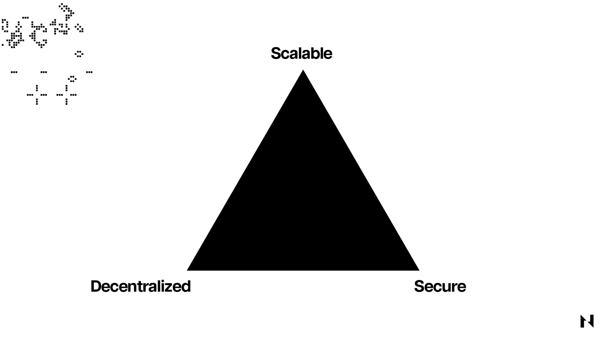
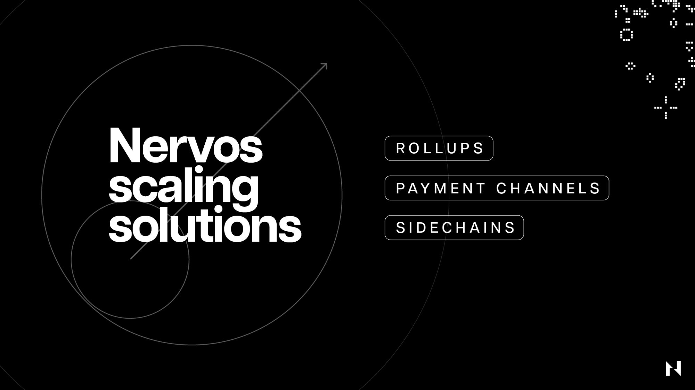

Este artículo busca ser el recurso fundamental y final para la arquitectura subyacente y la propuesta de valor de la red Nervos.

Nervos es una red de cadena de bloques modular construida desde cero para garantizar una seguridad, descentralización, flexibilidad e interoperabilidad excepcionales en la capa base y una escalabilidad sin igual en las capas superiores.

La Capa 1 de Nervos, llamada Common Knowledge Base (CKB), aprovecha la prueba de trabajo para el consenso, un nuevo modelo UTXO generalizado para la contabilidad y una máquina virtual basada en un conjunto de instrucciones RISC-V para la ejecución de transacciones y contratos inteligentes. Es compatible con todas las primitivas criptográficas actuales y futuras, lo que hace posible construir todo tipo de redes diversas de Capa 2 encima de él.

## Cadenas de bloques modulares frente a monolíticas

Para comprender el diseño y la propuesta de valor de Nervos, primero vale la pena analizar el problema clave al que se enfrentan inherentemente todas las cadenas de bloques y los dos enfoques de diseño que se suelen seguir para resolverlo.

Las tres tareas principales que realizan las cadenas de bloques incluyen:

1. Ejecutar transacciones, que se refiere a cómo los nodos procesan las transacciones pendientes y progresan en el estado de la cadena de bloques. Este proceso ocurre en el llamado “entorno de ejecución”, que generalmente incluye una computadora virtual como la Máquina Virtual de Ethereum (EVM) o la CKB-VM de Nervos.
2. Garantizar la disponibilidad de los datos, lo que significa hacer que todos los datos relacionados con las transacciones estén disponibles para todos los nodos de la red blockchain. Esto es crucial porque permite que todos los participantes de la red verifiquen las transacciones de forma independiente y calculen el estado de la cadena de bloques sin necesidad de confiar unos en otros.
3. Lograr un consenso sobre el verdadero estado de la cadena de bloques, lo cual es necesario porque las cadenas de bloques representan fundamentalmente bases de datos ampliamente distribuidas que deben ser sincronizadas, verificadas de forma independiente y confiables para todos los titulares de bases de datos. Si los participantes de la red no pueden ponerse de acuerdo sobre el estado correcto de la base de datos en tiempo real, entonces la cadena de bloques es inútil.

Al tratar de ejecutar estas tareas, las cadenas de bloques se encuentran con un problema comúnmente conocido como el trilema de escalabilidad, que establece que no pueden ser seguras, escalables y descentralizadas al mismo tiempo. Esto se debe a que el escalado de blockchain está inversamente correlacionado con los requisitos de hardware y ancho de banda para los nodos en ejecución. Lograr un mayor rendimiento de transacciones y disponibilidad de datos requiere un hardware más costoso, lo que en consecuencia conduce a menos nodos participantes y una mayor centralización.

En consecuencia, todas las cadenas de bloques deben hacer concesiones arquitectónicas cuando se diseñan y aceptar sacrificios en un frente por ganancias en los demás. Por ejemplo, las cadenas de bloques de alto rendimiento como Solana o BNB Chain optimizan la escalabilidad pero hacen sacrificios en la descentralización, y teniendo en cuenta cuán ligada está la descentralización a la seguridad, se puede argumentar que también hacen sacrificios considerables allí. Por otro lado, las cadenas de bloques de primera generación como Bitcoin son increíblemente seguras y descentralizadas, pero carecen de la escalabilidad suficiente, lo que significa que solo pueden procesar una pequeña cantidad de transacciones por unidad de tiempo.

En un intento por resolver este problema, muchas blockchains recientemente comenzaron a alejarse del diseño monolítico, lo que implica que la ejecución de transacciones, el consenso y la disponibilidad de datos ocurran en la misma capa, y hacia un diseño más modular, donde uno o más de estas funciones están separadas en diferentes capas.

Al darse cuenta muy temprano de que la única forma de escalar a la ubicuidad global sin sacrificar la seguridad y la descentralización es a través de una arquitectura en capas, Nervos fue diseñado, desde cero, como una red de cadena de bloques modular.

Su capa base, [CKB](https://github.com/nervosnetwork/rfcs/blob/master/rfcs/0002-ckb/0002-ckb.md), es excepcionalmente segura, descentralizada, flexible e interoperable, mientras que los diferentes tipos de Capa 2 que tiene y pueden construirse sobre ella ofrecen escalabilidad y programabilidad prácticamente ilimitadas.

Precisamente porque Nervos se diseñó con el marco modular en mente desde el principio, tiene ventajas tecnológicas significativas sobre las cadenas de bloques de la competencia inicialmente diseñadas como monolíticas.

Es decir, gracias a la naturaleza muy generalizada y altamente flexible de la capa base, los desarrolladores obtienen libertades mucho mayores y nuevas capacidades. CKB admite y comprende todas las primitivas criptográficas, lo que lo hace inherentemente más interoperable con otras redes heterogéneas de Capa 1 y Capa 2 e incluso con protocolos de Internet establecidos.

Como resultado, los desarrolladores pueden ejecutar fácilmente diferentes máquinas virtuales, como EVM, directamente dentro de CKB-VM o crear aplicaciones universales accesibles para todo tipo de usuarios de blockchain, billeteras o incluso protocolos de autenticación estándar, como [Apple passkeys](https://developer.apple.com/passkeys/). Esto conduce a ganancias en la experiencia del usuario que no tienen comparación con ninguna otra cadena de bloques, lo que reduce la barrera de entrada para los recién llegados y hace que los usuarios existentes de la cadena de bloques interactúen con CKB sin problemas. Además, el diseño modular le permite a Nervos escalar fácilmente usando redes de Capa 2 que están ancladas a una Capa 1 segura y preparada para el futuro, que es un enfoque que se ha adoptado recientemente como la mejor manera de escalar redes de cadena de bloques en la industria.

Para comprender cómo es posible todo esto y qué significa para los usuarios, vale la pena analizar cada uno de los componentes principales de Nervos por separado.

## Seguridad y Descentralización

Elegir el mecanismo de consenso deseado es una de las primeras decisiones arquitectónicas que toman las cadenas de bloques al empezar. Los mecanismos de consenso representan protocolos o reglas formalizadas que las cadenas de bloques utilizan para lograr un acuerdo sostenido sobre el estado correcto del libro mayor entre los nodos participantes.

Lo más importante a tener en cuenta aquí es que, si bien todos los mecanismos de consenso aprovechan efectivamente el mismo modelo de incentivos de “zanahoria y palo”, los resultados teóricos del juego que manifiestan con respecto a la seguridad y la descentralización no son los mismos.

En el modelo de consenso de prueba de trabajo, los mineros deben adquirir hardware especializado y gastar grandes cantidades de electricidad para participar en la producción de bloques. Si son honestos y siguen las reglas del protocolo, son recompensados con criptomonedas recién acuñadas, que es la “zanahoria” que los incentiva a validar transacciones y asegurar la red. Si no siguen las reglas, se quedan con facturas de electricidad elevadas y sin recompensas, lo que sirve como el “palo” que los desincentiva a hacer trampa e interrumpir la red.

Por otro lado, los mecanismos de prueba de participación aprovechan la misma lógica pero la implementan de manera diferente, lo que lleva a resultados diferentes. En lugar de gastar un recurso exógeno, como la electricidad en el caso de prueba de trabajo, los validadores de prueba de participación apuestan (y corren el riesgo de perder) las mismas criptomonedas que reciben como recompensa por validar transacciones, lo que lleva a una dependencia de seguridad circular donde los protocolos son garantizados por los mismos activos que producen.

                                                               
_Prueba de trabajo frente a prueba de participación_

La estructura de incentivos subyacente de prueba de participación inherentemente conduce a una mayor centralización, lo que afecta negativamente la seguridad de las redes y la resistencia a la censura. Prueba de ello es que, en los cinco meses desde que Ethereum se movió a prueba de participación, aproximadamente el [52%](https://dune.com/hildobby/eth2-staking) del poder de validación se ha concentrado en manos de solo cuatro entidades: Lido (un protocolo de participación líquida descentralizado), Coinbase, Kraken, y Binance. Esto es cualitativamente diferente de la centralización del poder de hash en los pools de minería. Los grupos de minería permiten a los mineros individuales (que pueden abandonar los grupos cuando lo deseen) combinar su poder de cómputo y dividir las recompensas mineras. En Ethereum, los validadores institucionales controlan o custodian el ETH que les delegan directamente los participantes individuales, lo que significa que los reguladores pueden capturarlos o influir con relativa facilidad y obligarlos a cumplir con reglas que pueden dañar la red.

 
_Desglose de participación en Ethereum (Fuente: [Dune](https://dune.com/hildobby/eth2-staking))_

En consecuencia, hemos visto [censura en bloques de Ethereum](https://www.mevwatch.info/) para excluir transacciones que interactúan con el protocolo de privacidad sancionado por la OFAC, [Tornado Cash](https://www.coincenter.org/how-does-tornado-cash-actually-work/), lo que significa que la tan deseada neutralidad de la capa de consenso de las redes se ha degradado. Para empeorar las cosas, la forma determinista en la que los sistemas de prueba de participación distribuyen las recompensas de participación aumentará aún más el poder de los principales validadores, lo que conducirá a una centralización de la red aún mayor. En los sistemas de prueba de participación, la ventaja de poder de los principales validadores está bloqueada de manera efectiva porque ninguna fuerza natural del mercado la desafía.

Por otro lado, la prueba de trabajo proporciona realidades operativas muy diferentes para los nodos de minería que aseguran la red. Los mineros y los grupos mineros deben seguir siendo innovadores, seguir estrategias comerciales sólidas y continuar invirtiendo en infraestructura para seguir siendo competitivos. El trabajo de prueba garantiza una mayor seguridad, descentralización y resistencia a la censura, y lo más importante, es objetivamente verificable. Los usuarios finales pueden verificar rápidamente el esfuerzo realizado para generar la cadena y saber por sí mismos que están viendo un historial preciso de la cadena de bloques. Las cadenas de bloques como Bitcoin o CKB se han diseñado y mantenido minuciosamente teniendo en cuenta la verificabilidad del usuario final. Este camino difícil para respaldar el volumen de transacciones globales no produce los mismos titulares que llaman la atención, pero se mantiene cerca del espíritu de soberanía y verdad objetiva que expresó Satoshi cuando creó Bitcoin.

Por estas razones, Nervos optó por el modelo de consenso más sólido y probado actualmente disponible: prueba de trabajo. Específicamente, CKB utiliza una versión optimizada del modelo de Bitcoin Nakamoto Consensus, llamado NC-MAX, que mejora el mecanismo ya robusto al parchear su vulnerabilidad a los ataques de minería egoísta y mejora sus capacidades de rendimiento de transacciones. También aprovecha una función hash novedosa, Eaglesong, que aseguró que CKB tuviera la misma seguridad derivada de la [dependencia de la ruta](https://en.wikipedia.org/wiki/Path_dependence) ue Bitcoin en el arranque. Todo esto significa que CKB puede lograr una mayor seguridad que Bitcoin, asumiendo el mismo presupuesto de seguridad, mientras supera absolutamente a las cadenas de bloques basadas en prueba de participación en términos de descentralización, ausencia de permisos y neutralidad.

## Flexibilidad e Interoperabilidad

Estas dos características combinadas aseguran que la Capa 1 de la cadena de bloques modular permanezca preparada para el futuro, lo cual, debido a los desafíos de la bifurcación dura, se encuentra entre las propiedades más deseables que puede tener cualquier red de cadena de bloques.

De momento, Nervos CKB es la cadena de bloques más flexible e interoperable del espacio. Debido a que admite todas las primitivas criptográficas actuales y futuras, CKB puede servir como una base sólida que brinda seguridad a un conjunto diverso de redes de Capa 2 que aprovechan diferentes mecanismos de consenso, lenguajes de programación, entornos de ejecución y métodos de almacenamiento de disponibilidad de datos. También puede servir como un eje central o un puente entre cadenas, lo que permite que se comuniquen varias cadenas de bloques heterogéneas. Este nivel sin precedentes de flexibilidad e interoperabilidad es posible gracias al modelo de contabilidad único de Nervos y la máquina virtual basada en el conjunto de instrucciones RISC-V.

### Contabilidad: el modelo Cell (UTXO generalizado)

Otra elección arquitectónica amplia que las cadenas de bloques deben hacer desde el principio es elegir el modelo de contabilidad, que determina cómo registran y guardan el estado.

En esencia, las cadenas de bloques son máquinas de estado deterministas o, más ampliamente, “sistemas con estado”. Esto significa que son sistemas configurados para registrar todos los eventos e interacciones de los usuarios en registros inmutables replicados. La información retenida en los libros mayores se define como el “estado” de la cadena de bloques. Primero, los usuarios realizan y transmiten transacciones, luego los mineros las validan y las incluyen en bloques que luego se registran permanentemente en la cadena de bloques; así es fundamentalmente como registran el estado de las cadenas de bloques. Cada vez que se agrega un nuevo bloque a la cadena de bloques, su estado cambia.

Los dos modelos de contabilidad más populares en los que las cadenas de bloques registran el estado son el modelo UTXO (salida de transacción no gastada) iniciado por Bitcoin y el modelo de cuenta iniciado por Ethereum. La mejor explicación no técnica de cómo difieren estos modelos es la analogía de “efectivo versus cuenta bancaria”.

Es decir, los UTXO funcionan de manera similar al efectivo, donde cada UTXO es como una factura en papel única que los usuarios pueden gastar solo una vez. Cada usuario en una cadena de bloques basada en UTXO realiza un seguimiento de sus saldos sumando las “facturas en papel” únicas que posee. Por ejemplo, cuando Alice quiere darle a Bob $13, puede entregarle dos billetes, uno de $10 y otro de $5, cada uno con números de serie únicos, y recibir un billete de $2 como cambio, que representa una nueva UTXO. En este modelo, los saldos de los usuarios son abstracciones generadas por las billeteras de los usuarios que realizan un seguimiento de los UTXO en diferentes direcciones.

Por otro lado, las cuentas en el modelo de cuenta funcionan como cuentas bancarias, donde las transferencias de dinero se registran como débitos y créditos en las cuentas de diferentes usuarios en el libro mayor del banco. Cuando Alice quiere enviar $10 a Bob, el banco acredita o deduce $10 de la cuenta de Alice y carga o agrega $10 a nombre de Bob en su libro mayor. Lo mismo sucede en las cadenas de bloques basadas en cuentas: solo el libro mayor que registra los saldos se distribuye entre muchos nodos.

Desde una perspectiva funcional, ambos modelos de contabilidad tienen sus propias ventajas e inconvenientes. El modelo de cuenta tiene estado, lo que facilita el desarrollo de contratos inteligentes que necesitan acceso a la información del estado de la cadena de bloques, pero es menos escalable. Por otro lado, el modelo UTXO no tiene estado, lo que dificulta el desarrollo de contratos inteligentes que requieren información de estado, pero admite el procesamiento de transacciones paralelas, lo que otorga una mayor escalabilidad. Además, el modelo de cuenta se basa en el cálculo, mientras que el UTXO se basa en la verificación, lo que significa que este último requiere menos recursos, lo que permite que los nodos participantes se ejecuten en un hardware mucho más económico.

Nervos es único en el sentido de que utiliza un modelo de contabilidad novedoso, denominado modelo Cell, que aprovecha lo mejor de los dos mundos. Combina la programabilidad del modelo de cuenta con la escalabilidad y flexibilidad del modelo UTXO. En términos simples, el modelo Cell es un modelo de contabilidad más generalizado o abstracto que impone menos límites a los desarrolladores de contratos de aplicaciones y sistemas. Si bien este cambio de paradigma impone una carga adicional a los desarrolladores para crear abstracciones amigables (a menudo impuestas por otras cadenas), las ganancias en seguridad, flexibilidad e interoperabilidad superan con creces cualquier pérdida arbitraria en accesibilidad.

_“El modelo Cell es abstracto donde una Cell es simplemente almacenamiento sin ninguna estructura interna, y su diseño se deja completamente a los desarrolladores.”_

El modelo Cell complementa a la perfección el diseño modular de Nervos porque permite que la capa base de CKB evolucione sin requerir bifurcaciones duras disruptivas. Casi todos los algoritmos, primitivos criptográficos y estructuras de datos se pueden implementar en CKB como scripts almacenados dentro de las Cells, en lugar de estar codificados o integrados en la máquina virtual como en todas las demás cadenas de bloques, lo que hace que la red sea más ágil y preparada para el futuro. Supongamos que aparece una computadora cuántica que rompe la criptografía en la que se basan la mayoría de las cadenas de bloques en la actualidad. Entonces, Nervos es la única cadena de bloques capaz de actualizar sus primitivos criptográficos básicos con nuevos resistentes a la cuántica sin pasar por una bifurcación dura, un proceso polémico que podría llevar muchos meses o años y causar estragos en la red.

Además, debido a cómo funciona el modelo Cell en Nervos, todos los activos, incluidos los tokens definidos por el usuario y los NFT, se tratan como [ciudadanos de primera clase](https://en.wiktionary.org/wiki/first-class_object#English). Esto significa que los contratos de tokens solo almacenan o definen la lógica operativa del token, es decir, “el límite de emisión es de 1 000 000 de tokens” o “la tasa de inflación es de 50 tokens por bloque”. Los registros de activos que determinan los saldos de los usuarios, es decir, “Alice posee 100 tokens”, se almacenan en Cells controladas directamente por los usuarios. Esto hace que los activos de Nervos sean significativamente más seguros que los de las cadenas de bloques basadas en cuentas. En Nervos, incluso si un atacante logra romper un contrato de token dado, no puede robar o alterar los saldos de los usuarios porque los tokens, en este caso, están controlados por los usuarios directamente, y cualquier cambio requiere su permiso explícito.

### CKB-VM: una máquina virtual creada con el conjunto de instrucciones RISC-V

Gran parte del poder y la flexibilidad de Nervos proviene del diseño de su entorno de ejecución de transacciones: [CKB-VM](https://github.com/nervosnetwork/rfcs/blob/master/rfcs/0002-ckb/0002-ckb.md#43-vm). Si bien la mayoría de las cadenas de bloques habilitadas para contratos inteligentes actuales utilizan más conjuntos de instrucciones de alto nivel como WebAssembly o EVM, CKB-VM es una máquina virtual basada en el conjunto de instrucciones de computadora [RISC-V](https://riscv.org/) que crea una pila de software del nivel más bajo posible y proporciona instrucciones sin procesar directamente a las CPU. En otras palabras, la máquina virtual de Nervos se basa directamente en el hardware, mientras que otras máquinas virtuales como la EVM se basan en un software que se encuentra un nivel por encima, lo que inherentemente limita sus capacidades.

Las ventajas de construir una máquina virtual en RISC-V son numerosas. Por un lado, la naturaleza de bajo nivel de CKB-VM conduce a una flexibilidad sin precedentes, lo que brinda a los desarrolladores de aplicaciones muchas más opciones en términos de lo que pueden construir en la cadena de bloques. Por ejemplo, los desarrolladores pueden usar todos los lenguajes de programación para crear contratos inteligentes en CKB, lo que amplía significativamente el grupo de desarrolladores que se pueden incorporar al ecosistema y la variedad de aplicaciones que se pueden crear. Ser criptoagnóstico significa que los desarrolladores de aplicaciones descentralizados en Nervos pueden usar cualquier primitiva criptográfica, como [firmas Schnorr](https://en.wikipedia.org/wiki/Schnorr_signature), [Firmas BLS](https://en.wikipedia.org/wiki/BLS_digital_signature), [zkSNARKs](https://z.cash/technology/zksnarks/), y [zkSTARKs](https://starkware.co/stark/), para construir sus aplicaciones sin afectar a otros productos en el ecosistema. Esto también significa que CKB-VM puede ejecutar otras máquinas virtuales como EVM con relativa facilidad, por lo que cuenta con una interoperabilidad mucho mayor que las cadenas de bloques de la competencia.

Al estar construido usando RISC-V, CKB-VM también ofrece un entorno de programación más estable y predecible y puede ser significativamente más eficiente en términos de procesamiento de ejecución de transacciones que las máquinas virtuales de la competencia. Finalmente, RISC-V es un estándar de código abierto líder en la industria que garantiza que Nervos CKB pueda permanecer ágil y preparado para el futuro durante décadas. En teoría, los fabricantes de chips podrían construir CPU RISC-V especializadas para ejecutar nodos Nervos que podrían aumentar la potencia computacional de la red en órdenes de magnitud. Esto sería comparable a ejecutar cadenas de bloques en los últimos procesadores M2 de Apple en comparación con ejecutarlos en chips Intel o AMD antiguos y obsoletos.

## Escalabilidad

La propuesta de valor fundamental de Nervos radica en su arquitectura en capas o modular que le permite escalar a millones de transacciones por segundo a través de muchas redes de Capa 2 diversas sin sacrificar la seguridad o la descentralización. Esto se debe a que la capa 1 de Nervos, CKB, está diseñada principalmente para la verificación de estado, mientras que las redes de Capa 2 se usan para computación o generación de estado.

Las arquitecturas monolíticas utilizadas por la mayoría de los proyectos de Capa 1 en el espacio actual, que no separan la generación de estado o la ejecución de transacciones y la verificación de estado en diferentes capas, son inherentemente defectuosas y conducen a conflictos técnicos que surgen del problema del trilema de escalabilidad.

Este rompecabezas se observa mejor en Ethereum, que originalmente se diseñó como una cadena monolítica que intentaba hacer todo en una sola capa pero, después de siete años de planificación y desarrollo, finalmente se asentó y adoptó el enfoque modular que supone escalar a través de muchas capas conectadas.

Sin embargo, debido a que Ethereum no se diseñó con esta idea en mente desde el principio, tendrá que pasar por muchos cambios y bifurcaciones duras, que podrían tardar años en finalizar, para lograr la misma flexibilidad e interoperabilidad integradas que Nervos.

El mecanismo de consenso de prueba de trabajo brinda a la capa base de CKB una seguridad inigualable, mientras que la máquina virtual basada en RISC-V le brinda la estabilidad y flexibilidad necesarias para interoperar fácilmente con diferentes tipos de cadenas de bloques y redes de capa 2. Apropiadamente, los protocolos de Capa 2 pueden aprovechar la seguridad de CKB para proporcionar a la red Nervos una escalabilidad o un rendimiento sin límites con tarifas de transacción mínimas.

Debido a que CKB está diseñado como una máquina de verificación generalizada, no como una máquina de cómputo, se adapta perfectamente para actuar como un “tribunal criptográfico” que verifica las transiciones de estado fuera de la cadena. Como ya se señaló, es la única cadena de bloques que admite todas las primitivas criptográficas, lo que significa que puede verificar las pruebas de fraude generadas por prácticamente todos los tipos de soluciones de Capa 2. En términos menos técnicos, CKB es como un individuo multilingüe en un entorno poblado exclusivamente por individuos monolingües que pueden hablar o comprender un solo idioma.

En la práctica, esto significa que el CKB puede, de forma inherente o sin modificaciones complejas, comprender los idiomas de todas las demás redes y ser un centro de “traducción” central para ellas. Por ejemplo, los desarrolladores pueden crear rollups basados en EVM, Move o CosmWasm aprovechando diferentes mecanismos de consenso además de CKB sin problemas. Además, CKB podría servir como un puente entre cadenas que permita que todas las cadenas de bloques basadas en UTXO, incluidas Cardano, ERGO y Fuel, interoperen entre sí. Las instituciones también pueden aprovechar la flexibilidad y la seguridad de CKB para construir sus propias redes de Capa 2 autorizadas y compatibles.

[Godwoken](https://www.godwoken.com/) es la primera Capa 2 construida sobre la capa base CKB por Nervos. Es un paquete Optimistic Rollup 100 % compatible con EVM y optimizado para GameFi. Más allá de la conexión directa con [Unity Game Engine](https://unity.com/) SDK y el alto nivel de seguridad que toma prestado de CKB, Godwoken es único en el sentido de que permite a los usuarios interactuar con él utilizando una billetera de inicio de sesión social sin custodia sin nada que descargar y sin frases mnemotécnicas o claves privadas para memorizar y asegurar. Esta característica única de UX, habilitada por el soporte criptográfico completo de Nervos, iguala de manera efectiva la experiencia del usuario de blockchain con la experiencia del usuario normal de Internet, lo que permite una incorporación de usuarios mucho más fluida y segura.

## Un gran avance en economía de tokens

El objetivo clave de la tokenómica, la ciencia del diseño de la economía subyacente de los sistemas de cadena de bloques, es asegurar la sostenibilidad a largo plazo.

En este contexto, la sostenibilidad se refiere a la capacidad de la cadena de bloques para permanecer en línea, resistente a los ataques y funcional en todas las circunstancias. Esto requiere modelos económicos bien diseñados que incentiven a todos los participantes de la red, incluidos los usuarios, mineros y poseedores de tokens, para contribuir juntos al éxito y la seguridad de la red.

Debido a que asegurar las cadenas de bloques es intrínsecamente costoso, es decir, los mineros deben gastar grandes cantidades de electricidad mientras que los validadores deben incurrir en costos de oportunidad al bloquear capital valioso, estas entidades deben recibir una compensación adecuada por sus servicios. La forma en que esto se ha hecho hasta ahora es pagando a los mineros a través de recompensas en bloque y tarifas de transacción.

Sin embargo, las cadenas de bloques como Bitcoin con emisión de suministro con límite máximo dependen cada vez más de las tarifas de transacción para compensar a los mineros o “pagar por la seguridad”. es decir, después de que se extraen todas las monedas, los costos de seguridad de la red deben pagarse en su totalidad con las tarifas de transacción. Económicamente, esto lleva a una división en la que los usuarios que usan las cadenas de bloques exclusivamente para pagos no tienen un interés creado a largo plazo en su seguridad, mientras que aquellos que las usan como reservas de valor y, en consecuencia, tienen una exposición prolongada a sus riesgos de seguridad no tiene formas de pagarlo.

En otros términos, los usuarios que usan cadenas de bloques para pagos no tienen que mantener sus tokens nativos ni permanecer en las redes después de que se hayan liquidado sus transacciones, lo que significa que no están dispuestos ni incentivados a pagar por la seguridad a largo plazo de la red. Por otro lado, los usuarios que tienen tokens y se benefician al máximo de la seguridad a largo plazo de las cadenas de bloques pueden estar dispuestos a pagar por ello, pero apenas realizan transacciones y pagan tarifas de transacción.

Esta desalineación de incentivos se vuelve aún más pronunciada en las cadenas de bloques habilitadas para contratos inteligentes que se han visto obligadas a optimizar para ser plataformas transaccionales o de conservación. Esto se debe a que los dos casos de uso utilizan los recursos del sistema de manera diferente: las transacciones consumen recursos informáticos y de ancho de banda instantáneos pero renovables, mientras que la conservación requiere una ocupación a largo plazo del estado global. Es poco probable que un modelo económico optimizado para uno sea óptimo para el otro.

Las plataformas transaccionales competitivas deben priorizar los costos de transacción bajos porque sus usuarios están dispuestos a aceptar una seguridad menos óptima debido a su exposición limitada en el tiempo al riesgo de seguridad. Por otro lado, las plataformas de preservación de la competencia deben priorizar la seguridad, lo que inherentemente implica mayores costos de transacción, porque sus usuarios están expuestos a largo plazo a sus riesgos de seguridad.

El problema es que todas las cadenas de bloques de Capa 1 actuales que sirven cada vez más como plataformas de preservación emplean diseños tokenómicos que están mejor optimizados para plataformas transaccionales. Por el contrario, CKB es la única cadena de bloques que aprovecha un diseño tokenómico optimizado para garantizar la preservación a largo plazo del estado y el valor. Las cadenas de bloques que sirven cada vez más como plataformas de preservación emplean diseños tokenómicos que están mejor optimizados para las plataformas transaccionales.

### Diseño tokenómico de CKB

Concretamente, CKB emplea un modelo tokenómico innovador diseñado para la sostenibilidad a largo plazo que es independiente de la demanda de transacciones y tiene buenas propiedades de captura de valor para todas las partes interesadas. Resuelve el problema de desalineación de incentivos que prevalece en otras cadenas de bloques al combinar dos fuentes de suministro de tokens, la emisión base y secundaria, con un refugio contra la inflación.

La emisión base tiene un suministro total finito con un cronograma de suministro similar al de Bitcoin, donde las recompensas del bloque se reducen a la mitad cada cuatro años hasta llegar a cero. Toda la emisión base se destina a los mineros, lo que los incentiva a seguir asegurando la red de Nervos. Por otro lado, la emisión secundaria es constante y sin límite de oferta. Una de sus funciones es entregar renta estatal (un costo para almacenar datos en la cadena) a los mineros, garantizando la seguridad a largo plazo de la red al hacerla menos dependiente de la demanda de transacciones.

Al mismo tiempo, el token nativo de la cadena de bloques, CKB, no solo se usa para pagar las tarifas de transacción, sino que también representa un derecho a expandir el estado global, donde un CKB equivale a un byte de espacio en la cadena de bloques. Esto significa que el estado de la cadena de bloques está limitado por el suministro de tokens, lo que lo convierte en un recurso escaso. Además, la demanda de estado significa demanda de tokens CKB, lo que crea un efecto de inercia que vincula la seguridad de la cadena de bloques con la demanda estatal y alinea los incentivos entre los titulares de CKB y los usuarios de la cadena de bloques o los ocupantes del estado.

 
_[Emisión](https://explorer.nervos.org/nervosdao) combinada del token CKB_

La emisión secundaria garantiza que los ocupantes o usuarios estatales que almacenan activos en la cadena de bloques sigan pagando por la seguridad a largo plazo de la cadena de bloques a través de la renta estatal recurrente o el “impuesto inflacionario” otorgado a los mineros. Sin embargo, para garantizar que el protocolo no grava injustamente las monedas CKB que no se utilizan para almacenar el estado, estas monedas pueden bloquearse en un contrato particular, denominado [NervosDAO](https://dao.ckb.pw/#/), para recibir una emisión secundaria para compensar la dilución injusta.

En resumen, este diseño tokenómico asegura que:

1. Los mineros de CKB que aseguran la cadena de bloques son compensados en todas las circunstancias;
2. Los usuarios que usan blockchain únicamente para pagos pagan por su seguridad a través de tarifas de transacción;
3. Los usuarios que lo utilizan como reserva de valor y ocupan su estado pagan por seguridad a través del “impuesto de inflación” o “renta estatal” que se les extrae a través de la emisión secundaria; y
4. Los poseedores de tokens a largo plazo están protegidos contra la dilución injusta de tokens a través del contrato NervosDAO, que sirve como refugio contra la inflación.

La alineación de todos los incentivos de las partes interesadas permite que CKB aumente su valor intrínseco como una cadena de bloques modular de Capa 1 centrada en la preservación al aprovechar sus efectos de red. También produce un ecosistema más cohesivo y hace que el sistema sea menos propenso a los desafíos de gobernanza.

## Conclusión

Nervos es una red blockchain modular que está perfectamente posicionada para atender las necesidades del futuro de Web3. Aprovecha una Capa 1 de diseño único, llamada Common Knowledge Base (CKB), que es excepcionalmente segura, descentralizada, flexible e interoperable, y proporciona la capa base ideal para anclar varios tipos de soluciones de Capa 2. Además, CKB emplea un modelo tokenómico innovador optimizado para una plataforma centrada en la preservación del estado y proporciona una captura de valor adecuada para todas las partes interesadas de la red.
