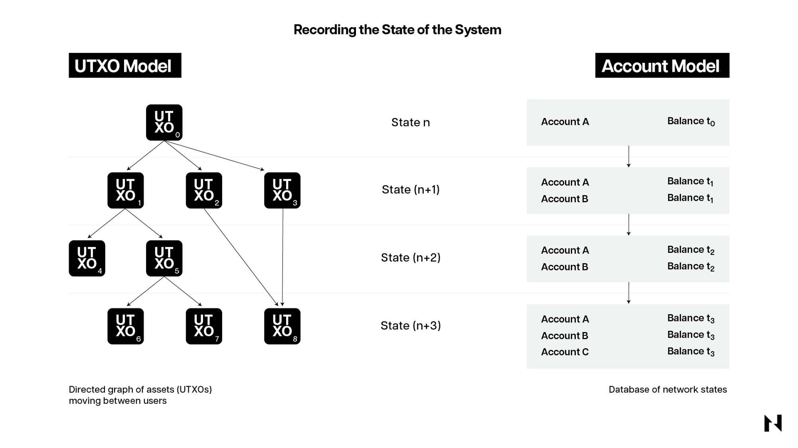
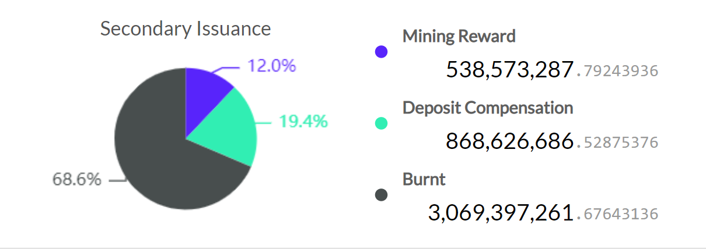

本文力求成为介绍 Nervos Network 底层架构和价值主张的最重要的内容。

Nervos Network 是一个全新的模块化区块链网络，从底层（也就是 Layer 1）开始就确保了安全性、去中心化、灵活性和互操作性，同时在上层具备无与伦比的可扩展性。

Nervos Network 的 Layer 1 被称为 CKB（Common Knowledge Base，共同知识库）。CKB 采用了 PoW（工作量证明）机制来实现共识，使用了全新的通用版 UTXO 模型来记账，以及利用基于 RISC-V 指令集的虚拟机来执行交易和智能合约。CKB 支持所有当前和未来的密码学原语，因此开发者可以在 CKB 上构建各种类型的 Layer 2 网络。

## 模块化区块链 vs. 单片区块链

要了解 Nervos Network 的设计和价值主张，首先需要介绍一下所有区块链普遍面临的关键性问题，以及通常会采用的两种解决方法。

区块链执行的主要任务包括三个方面：

1. 执行交易，即节点如何处理待定交易并推动区块链状态向前发展。这个过程发生在所谓的 “执行环境” 中，通常包括虚拟机，比如 [Ethereum 虚拟机](https://ethereum.org/en/developers/docs/evm/)（EVM）和 Nervos 的 CKB-VM。
2. 保证数据的可用性，这意味着让区块链网络中的所有节点都能够获得与交易相关的所有数据。这一点非常重要，因为它使得所有网络参与者能够独立验证交易并计算区块链的状态，而不需要相互信任。
3. 达成共识，就区块链的真实状态达成共识是非常必要的。区块链本质上代表了广泛分布的数据库，必须同步、独立验证并得到所有数据库持有者的信任。如果网络参与者不能实时就数据库的正确状态达成一致，那么区块链实际上就毫无用处。

在尝试执行这些任务时，会遇到一个通常被称为区块链 “不可能三角” 的问题，即区块链网络无法同时兼顾安全性、可扩展性和去中心化。这是因为区块链的可扩展性与节点的硬件和带宽需求呈负相关。如果要实现更高的交易吞吐量和数据可用性，就需要更昂贵的硬件，从而导致更少的参与节点和更强的中心化现象。

因此，所有的区块链在设计时都必须进行架构上的权衡，接受在某一方面的牺牲以换取其他方面的收益。例如，像 Solana 或 BNB Chain 这样的高吞吐量区块链，优化了可扩展性，但在去中心化方面做出了牺牲。考虑到去中心化与安全性的关系，可以说它们在这方面也做出了相当大的牺牲。另一方面，像比特币这样的第一代区块链，非常注重安全性和去中心化，但缺乏足够的可扩展性，这意味着它们在单位时间内只能处理少量的交易。

为了解决这个问题，许多区块链最近开始从单片区块链设计（即交易执行、共识和数据可用性都在同一层）转向更加模块化的设计，其中一个或多个功能被放在不同的层上。

Nervos 很早就意识到，在不牺牲安全性和去中心化的情况下实现可扩展性的唯一方法是通过分层架构，因此从一开始，Nervos 就被设计成了一个模块化的区块链网络。

Nervos Network 的底层是 [CKB](https://github.com/nervosnetwork/rfcs/blob/master/rfcs/0002-ckb/0002-ckb.md)，专注于安全性、去中心化、灵活性和可互操作性。搭建在 CKB 之上的不同类型的 Layer 2 可以提供几乎无限的可扩展性和可编程性。

由于从一开始就考虑了模块化区块链的架构，Nervos 与那些最初设计为单片的区块链项目相比，具有显著的技术优势。

底层 CKB 非常通用且高度灵活，开发者可以获得更大的自由和更多的新功能。CKB 可以支持所有的密码学原语，这让 CKB 与其他异构的 Layer 1、Layer 2 甚至现有的互联网协议之间拥有更好的互操作性。

因此，开发者可以很容易地在 CKB-VM 内运行不同的虚拟机，例如 EVM，或者搭建通用应用程序，让所有类型的区块链用户、钱包甚至标准认证协议（例如 [Apple Passkey](https://developer.apple.com/passkeys/)）都能访问。这将带来任何其他区块链都无法比拟的用户体验，降低新用户的进入门槛，并让现有区块链用户可以丝滑地与 CKB 进行交互。此外，模块化设计使 Nervos 可以轻松地通过 Layer 2 网络实现扩展，而 Layer 1 则保证了 Layer 2 网络的安全性。这种分层架构，最近被广泛采纳，是业内扩展区块链网络的最佳方式。

如果您想了解这一切是如何实现的以及它对用户意味着什么，请继续阅读下文。

## 安全性和去中心化

在启动区块链时，选择适合的共识机制是最初的架构设计之一。共识机制代表正式的协议或规则，区块链利用这些协议或规则来确保参与节点之间就账本的正确状态持续地达成一致。

需要注意的是，尽管所有的共识机制都有效地利用了 “胡萝卜加大棒” 的激励模式，但它们在安全性和去中心化方面的博弈结果（理论上）是不同的。

在 PoW（工作量证明）共识模型中，矿工必须获得专门的挖矿硬件并消耗大量电力才能参与区块生产。如果他们诚实并遵守协议的规则，他们将获得新铸造的加密货币作为奖励，这是激励他们验证交易和保护网络安全的 “胡萝卜”。如果他们不遵守规则，他们将花费巨额电费但得不到任何奖励，这就是阻止他们欺骗和破坏网络的 “大棒”。

PoS（权益证明）机制也利用了相同的逻辑，但实现方式有所不同，从而导致结果也不尽相同。与消耗外部资源（如 PoW 案例中的电力资源）不同，PoS 验证者需要参与质押（并冒着被罚没的风险），同时获得相同的加密货币作为验证交易的奖励，从而保证系统安全。

_PoW vs. PoS_

在 PoS 机制下，潜在的激励结构本质上可能会导致更大的中心化，对网络的安全性和抗审查性产生负面影响。这一观点的证据是，以太坊转向 PoS 后的五个月里，大约 [52%](https://dune.com/hildobby/eth2-staking) 的验证权集中在四个实体手中：Lido（去中心化流动性质押协议）、Coinbase、Kraken 和 Binance。这与矿池中哈希算力的中心化有着本质的区别。矿池按照个体矿工（他们可以随时离开矿池）的算力占比分配挖矿奖励。在以太坊中，机构验证者控制或保管用户直接委托给他们的 ETH，这意味着他们可以相对容易地被监管机构追踪或者影响到，并被迫遵守可能对网络造成伤害的规则。

_以太坊质押分布图（来源： [Dune](https://dune.com/hildobby/eth2-staking)）_

因此，我们可以看到在以太坊区块链上，[已经有审查的情况出现了](https://www.mevwatch.info/)。具体来说，OFAC（美国财政部外国资产控制办公室）规定与隐私协议 [Tornado Cash](https://www.coincenter.org/how-does-tornado-cash-actually-work/) 有交互的交易要被排除在外，这表明区块链网络非常需要的共识层中立性已经丧失。更糟糕的是，PoS 系统分配质押奖励的确定性方式将进一步增加头部验证者的权力，从而导致更大的中心化。在 PoS 系统中，头部验证者的权力优势被有效锁定，因为没有自然的市场力量来挑战它。

另一方面，PoW 为保护网络安全的挖矿节点提供了完全不同的运营方式。矿工和矿池必须不断创新、追求稳健的商业战略，并持续投资基础设施，以保持竞争力。PoW 确保了更高的安全性、去中心化和抗审查性，最重要的是，PoW 是客观可验证的。终端用户可以快速验证生成区块链所付出的努力，并确信他们所看到的是准确的区块链历史记录。

基于上述原因，Nervos 选择了当前最强大且经过实战检验的共识模型：PoW。具体而言，CKB 采用了比特币中本聪共识模型的优化版本，称为 NC-MAX。NC-MAX 修补了中本聪共识在自私挖矿攻击方面的漏洞，加强了这个已经很强大的机制，并提高了交易吞吐量。NC-MAX 还使用了新的哈希函数 Eaglesong，确保 CKB 在启动时具有与比特币相同的[路径依赖](https://en.wikipedia.org/wiki/Path_dependence)衍生的安全性。所有这些意味着，相比基于 PoS 的区块链，CKB 在去中心化、无需许可和中立性方面绝对更胜一筹，并且即使在安全预算相同的情况下，也能够实现比比特币更高的安全性。

## 灵活性和互操作性

除了去中心化和安全性，设计充分的模块化区块链的理想基础层必须具备高度的灵活性和可互操作性。灵活性意味着高度通用或 “抽象” 的区块链架构，可以让开发者在默认情况下或者不需要核心协议更新/硬分叉的情况下，使用更全面的系统和应用程序的密码学原语。互操作性指的是这条区块链与其他异构区块链、Layer 2，甚至 Web2 系统进行通信和连接的能力。将灵活性和可互操作性这两个功能相结合，可以确保模块化区块链的 Layer 1 持续面向未来，这也是任何区块链网络都想拥有的最理想的属性之一。

说到这里，Nervos CKB 是该领域最灵活和可互操作的区块链。它支持所有当前和未来的密码学原语，因此可作为强大的基础，为使用不同共识机制、编程语言、执行环境和数据可用性存储方案的各种 Layer 2 网络提供安全性。此外，它还可作为中心枢纽或跨链桥，与各种异构区块链进行通信。Nervos 的独特记账模型和基于 RISC-V 指令集的虚拟机，使这种前所未有的灵活性和互操作性成为可能。

### 记账模型：Cell 模型（通用版的 UTXO）

区块链中的记账模型是区块链开发者需要在一开始就做出的重要架构选择之一，这将决定系统如何记录和保存状态。

从本质上讲，区块链是一个确定性的状态机，或者更广泛地说，是一个 “有状态的系统”。这意味着区块链是一个被配置为在可复制但不可更改的分布式账本上记录所有事件和用户交互的系统。分布式账本上保留的信息被定义为区块链的 “状态”。首先，用户进行交易并广播交易，然后矿工验证这些交易并将其包含到区块中，这些区块随后永久记录在区块链上。这基本上就是区块链记录状态的方式，每次将新区块添加到区块链时，其状态都会发生变化。

区块链有两种最流行的状态记录方式，分别是比特币首创的 UTXO（未花费的交易输出）模型和以太坊首创的账户模型。对于这些模型有何不同，最好的非技术性解释是用 “现金和银行账户” 来做类比。

UTXO 的工作方式类似于现金，其中每个 UTXO 就像一张独特的纸币，用户只能使用一次。在基于 UTXO 的区块链上，每个用户通过将他们拥有的独特 “纸币” 相加来追踪他们的余额。例如，当 Alice 想要向 Bob 发送 13 美元时，她可以递给他两张纸币，一张为 10 美元，另一张为 5 美元。每张 “纸币” 都有唯一的序列号。此外，Alice 将会收到一张 2 美元的零钱，这是一个新的 UTXO。在这个模型中，用户的余额是用户钱包生成的抽象概念，这些钱包记录了不同地址的 UTXO。

相比之下，账户模型中的账户就像银行账户一样，资金转移被记录为不同用户账户的收支。当 Alice 想要向 Bob 发送 10 美元时，银行会从 Alice 的账户余额中扣除 10 美元，并在 Bob 的账户余额中增加 10 美元。同样的情况也发生在基于账户模型的区块链上，只不过记录的账本分布在许多节点中而已。

从功能的角度来看，两种记账模型各有优缺点。账户模型是有状态的，这使得开发需要访问区块链状态信息的智能合约变得更容易，但可扩展性较差。另一方面，UTXO 模型是无状态的，这使得开发需要状态信息的智能合约变得更加困难，但它支持并行交易处理，从而提供了更强的可扩展性。此外，账户模型是基于计算的，而 UTXO 模型是基于验证的，这意味着后者需要的资源密集度较低，可以让参与节点在更便宜的硬件上运行。

Nervos 的独特之处在于，它使用了一种全新的记账模型，称为 Cell 模型。Cell 模型充分结合了上述两个模型的优点：账户模型的可编程性和 UTXO 模型的可扩展性以及灵活性。简单来说，Cell 模型是一种更通用或者说更抽象的记账模型，它对系统和应用的合约开发者的限制更少。

“Cell 模型是抽象的，Cell 只是简单的存储，没有任何内部结构，其布局完全由开发者自主决定。”

Cell模型完美地补充了 Nervos 的模块化设计，因为它让底层公链 CKB 的发展可以不通过破坏性的硬分叉来实现。几乎所有的算法、密码学原语和数据结构，都可以在 CKB 上通过存储在 Cell 中的脚本来实现，让 CKB 网络更加灵活和面向未来。对比之下，其他区块链项目往往将算法进行硬编码或者在虚拟机中焊死。如果量子计算机问世，它能破解当今大多数区块链所依赖的密码学，那么，Nervos CKB 是目前唯一一个能够在不用硬分叉的情况下，将其使用的密码学原语升级为新的抗量子密码学原语的区块链。硬分叉是一个充满争议的过程，可能需要几个月或几年才能实现，且容易对网络造成严重破坏。

此外，由于 Cell 模型在 Nervos 中的运作方式，所有资产，包括用户自定义代币和 NFT，都被视为[一等公民](https://en.wiktionary.org/wiki/first-class_object#English)。这意味着代币的合约仅存储或定义代币的操作逻辑，例如 “发行上限为 1,000,000 个代币” 或 “通胀率为每个区块 50 个代币”。决定用户余额的资产记录，例如“Alice 拥有 100 个代币”，存储在用户直接控制的 Cell 中。这使得 Nervos 上的资产比基于账户模型的区块链上的资产更安全。即使攻击者设法破坏了代币的合约，他们也无法窃取或更改用户的余额，因为在这种情况下，代币由用户直接控制，任何更改都需要得到他们的明确许可。

### CKB-VM：基于 RISC-V 指令集的虚拟机

Nervos 的许多功能和灵活性来自其交易执行环境的设计：[CKB-VM](https://github.com/nervosnetwork/rfcs/blob/master/rfcs/0002-ckb/0002-ckb.md#43-vm)。虽然目前支持智能合约的区块链大多使用了更高级的指令集，如 WebAssembly 或 EVM，但 CKB-VM 选择了 RISC-V 计算机指令集。CKB-VM 创建了一个尽可能偏底层的软件堆栈，并直接向 CPU 提供原始指令。换句话说，Nervos 的虚拟机直接搭建在硬件上，而像 EVM 这样的其他虚拟机则是搭建在软件之上，这从本质上限制了它们的能力。

使用 [RISC-V](https://riscv.org/) 构建虚拟机的优势很多。一方面，CKB-VM 的底层特性带来了前所未有的灵活性，让应用开发者在区块链上构建有了更大的选择。例如，开发者可以使用所有编程语言在 CKB 上构建智能合约，大大拓宽了可以加入生态系统的开发者群体以及可以构建的应用程序的多样性。此外，Nervos 上的 dApp 开发者可以使用任何密码学原语，例如 [Schnorr](https://en.wikipedia.org/wiki/Schnorr_signature) 签名、[BLS](https://en.wikipedia.org/wiki/BLS_digital_signature) 签名、[zkSNARKs](https://z.cash/technology/zksnarks/) 和 [zkSTARKs](https://starkware.co/stark/)，在不影响其他应用的情况下构建他们自己的应用产品。这也意味着 CKB-VM 可以相对轻松地运行 EVM 等其他虚拟机，从而拥有比其他区块链项目更强大的互操作性。

使用 RISC-V 构建的 CKB-VM 还提供了更稳定和可预测的编程环境，并且在交易执行处理方面可以比其他虚拟机更高效。最后，RISC-V 是行业领先的开源标准，可确保 Nervos CKB 能够在数十年内保持灵活性和面向未来。理论上，芯片制造商可以设计专门的 RISC-V CPU 来运行 Nervos 节点，从而将网络的算力提高好几个数量级。这相当于在 Apple 最新的 M2 处理器上运行区块链，而不是在旧的、过时的 Intel 或 AMD 芯片上运行它们。

## 可扩展性

Nervos 的基本价值主张在于其分层或者说模块化架构。这样的设计使得 Nervos 能够在不牺牲安全性和去中心化的情况下，通过许多不同的 Layer 2 网络来扩展至每秒数百万笔交易。这是因为 Nervos 的 Layer 1，也就是 CKB，专注于状态验证，而 Layer 2 则专注于计算或状态生成。

目前，区块链领域中大多数的 Layer 1 项目都使用单片区块链架构。它们没有将状态生成、交易执行和状态验证分离到不同的层上。所以这些项目存在固有缺陷，很难从技术上解决区块链 “不可能三角” 问题。

以太坊中非常好地体现了这点，它最初被设计为一条单片区块链，试图在一层上做所有的事情。但经过七年的规划和开发，最终选择了模块化的方法，采用多条 Layer 2 进行扩展。

然而，由于以太坊最初并没有考虑到这个想法，因此它将不得不经历许多变更和硬分叉。相比之下，Nervos 从一开始就构建了一个非常适合未来的 Layer 1，使其能够支持和扩展 Layer 2，而无需进行任何难以实施的更新或做出任何技术妥协。

PoW 共识机制赋予了 Nervos 的底层公链 CKB 无与伦比的安全性，而基于 RISC-V 的虚拟机为其提供了必要的稳定性和灵活性，使其能够轻松地与不同类型的区块链和 Layer 2 网络进行互操作。同时，Layer 2 也可以利用 CKB 的安全性，为 Nervos 网络提供无限的可扩展性和吞吐量，以及低廉的交易手续费。

CKB 被设计成一个通用的验证机，而不是一台计算机，非常适合充当验证链下状态转换的 “密码法院”。正如前面所提到的，它是目前唯一一条支持所有密码学原语的区块链，这意味着它可以验证几乎所有类型的 Layer 2 解决方案生成的欺诈证明。用通俗易懂的语言来说，CKB 就像一个掌握多种语言的人，能够与不同语言的人进行有效的交流和互动。

在实践中，这意味着 CKB 具备天生的或无需进行复杂修改即可理解其他所有区块链网络语言的能力，并成为它们的 “翻译” 中心。例如，开发者可以在 CKB 上利用不同的共识机制构建基于 EVM、Move 或 CosmWasm 的 Rollup，而不会遇到任何问题。此外，CKB 可以充当跨链桥，允许所有基于 UTXO 的区块链（包括 Cardano、ERGO 和 Fuel）进行互操作。机构还可以利用 CKB 的灵活性和安全性，在 CKB 上构建需要许可且合规的 Layer 2 网络。

## 代币经济学上的突破

代币经济学是设计区块链经济模型的一门科学，主要目标是确保区块链系统的长期可持续性。

可持续性意味着区块链在任何情况下都能保持在线、抵御攻击并正常运行的能力。为实现这一目标，需要精心设计的经济模型来激励所有网络参与者，包括用户、矿工和代币持有者，共同为网络的成功和安全做出贡献。

保障区块链的安全本身就十分昂贵，PoW 矿工必须消耗大量电力，PoS 验证者则必须承担因质押代币而产生的机会成本。因此，区块链系统必须为这些服务提供足够的补偿。目前为止，常用的手段是通过区块奖励和交易手续费的方式来奖励他们做出的贡献。

然而，像比特币这种发行量有上限的区块链，后期会越来越依赖交易手续费来补偿矿工。也就是说，在所有代币都被开采出来之后，它们的网络安全成本必须完全用交易手续费来支付。在经济上，这就导致了一个分歧，即专门使用区块链进行支付的用户对其安全性没有长期的既得利益，而那些将其用作为价值存储的用户因为操作次数少，很少支付交易手续费，所以长期暴露于安全风险之中。

换句话说，使用区块链进行支付的用户不必持有其原生代币或在交易结算后留在网络上，这意味着他们不愿意或者没有动力为网络的长期安全付费。另一方面，持有代币并从区块链的长期安全性中获益最多的用户可能愿意为此付费，但他们几乎不进行交易并支付交易手续费。

在支持智能合约的区块链中，这种激励错位变得更加明显，因为这些区块链被优化为交易性平台或价值存储的平台。这两种用例对系统资源的利用是不同的：交易消耗的是瞬时但可再生的计算和带宽资源，而保存需要长期占用全局状态。为其中一种用例优化的经济模型不太可能为另一种用例也做出优化。

有竞争力的交易平台必须优先考虑低交易成本，他们的用户暴露在安全风险中的时间有限，所以对安全性的要求没有那么高。对比之下，作为价值存储的平台必须优先考虑安全性，本质上这意味着更高的交易成本，因为它们的用户长期暴露在安全风险之下。

问题在于，目前越来越多的用作价值存储的 Layer 1 区块链，采用了针对交易平台进行优化的经济模型设计。相比之下，CKB 利用了经过优化的经济模型设计，从而确保能长期保存状态，同时捕获价值。

### CKB 的经济模型

CKB采用了充满创新的代币经济模型，该模型专为长期可持续性发展而设计，且独立于交易需求，并为所有利益相关者提供良好的价值捕获属性。该模型通过基础发行、二级发行以及能避免被二级发行所稀释的 Nervos DAO 相结合，解决了其他区块链中普遍存在的激励失调问题。

基础发行的总供应量有限，发行机制类似于比特币，其中区块奖励大约每四年减半，直到变为零。所有通过基础发行的币都给矿工，以激励他们持续保护 Nervos 网络。另一方面，二级发行是恒定的，没有供应上限。它的功能之一是向矿工提供状态租金（在链上存储数据的成本），减少矿工对交易需求的依赖，从而保证网络的长期安全。

与此同时，原生代币 CKB 不仅用于支付交易手续费，还代表了链上空间的使用权利，其中一个 CKB 等于区块链上一个字节的空间。这意味着区块链的链上空间受到代币供应的限制，使其成为一种稀缺资源。此外，对链上空间的需求意味着对 CKB 代币的需求，这会产生飞轮效应，将区块链的安全性与对链上空间的需求联系起来，让 CKB 持有者与区块链用户、链上状态占有者之间的激励保持公平公正。

_CKB 二级发行的[目前状态](https://explorer.nervos.org/nervosdao)_

二级发行确保在区块链上存储状态的用户，通过固定的二级发行为区块链的长期安全买单。另外，为了确保协议不会对不用于存储状态的 CKB 代币不公平地征税，这些代币可以锁定到 [Nervos DAO](https://dao.ckb.pw/#/) 这个特定的合约中，享受二级发行带来的补偿，避免被不公平地稀释。

总而言之，CKB 的代币经济学设计：

1. 确保了维护区块链安全的 CKB 矿工在任何情况下都会得到补偿；
2. 让仅使用区块链进行支付的用户通过交易费用为其安全性买单；
3. 占用了链上状态的用户，通过二次发行变相地交了状态租金或者说通货膨胀税；
4. 通过 NervosDAO 智能合约，保护 CKB 长期持有者免受不公平的稀释。

通过充分利用网络效应，并协调各利益相关方的激励措施，CKB 能够提升其作为模块化 Layer 1区块链的内在价值。此外，它还能促进生态系统的更紧密结合，让系统不易受到治理挑战。

## 总结

Nervos 是一个模块化的区块链网络，完全可以满足 Web3 未来的需求。它利用独特设计的 Layer 1，即非常安全、去中心化、灵活且可互操作的 CKB 区块链，为上层各种类型的 Layer 2 解决方案提供了理想的基础层。此外，CKB 采用了创新的经济模型，为 Nervos 网络的所有利益相关者提供了足够的价值捕获。

