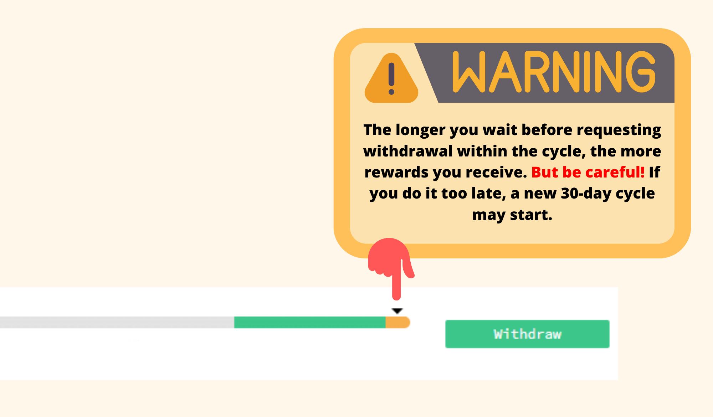
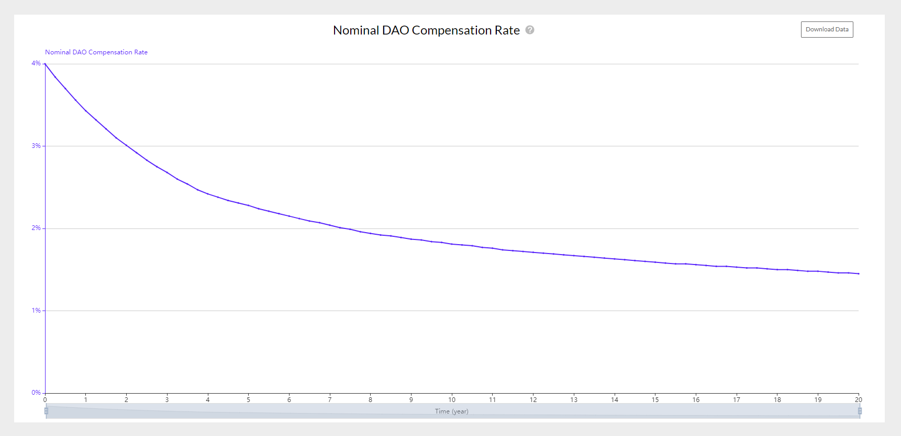

To understand how Nervos DAO works, you must first know that it works through cycles, and that each of these cycles are 180 epochs. On the Nervos network, each epoch has an estimated time of 4 hours. Therefore we can calculate that each cycle lasts approximately 30 days. This means that if you deposit in the DAO, the minimum possible deposit is 30 days; it means, one cycle.

This cycle is represented on the [Neuron](https://docs.nervos.org/docs/basics/guides/crypto%20wallets/neuron/) interface with an indicator bar, which is shown on the image below:

Although the deposit in Nervos DAO does not entail any special difficulty, the withdrawal process tend to create more doubts since it is made up of the following two steps:

* **First Step:** Initial withdrawal transaction, also called withdrawal request.

You can send this transaction at any time to Nervos DAO to indicate your withdrawal request. When doing so, it is ideal to wait until the compensation cycle is in the green area of the indicator bar to maximize DAO rewards. Note that by requesting a withdrawal before the end of the compensation cycle, your funds will stop generating rewards, but will remain locked until the full ~30 days of the cycle have elapsed.

If you do not make the withdrawal request during the current cycle, the deposit will automatically roll over to the next cycle.  
   

  

* **Second Step:** Final withdrawal transaction, also called unlocking the deposit.

This is the transaction that withdraws your initial CKByte deposit along with any accumulated Nervos DAO rewards. You can do this second step at the end of the cycle, that is, when the arrow reaches the end of the indicator bar, only if you have previously done the first step or withdrawal request.

To better understand the withdrawal process, let’s see a practical example:

* Imagine that you deposit in the DAO on October 1st.
* Since the deposit period is in 30-day cycles, you can make the withdrawal request, which is the first step, during any day of the month of October (remember that it is recommended to do this step in the green area of the indicator bar to maximize rewards), but the unlocking of the deposit, that is, the second step, will not be possible until November 1.
* If you do not make the withdrawal request before the end of the cycle, in our case on November 1, then a new 30-day cycle starts automatically, and you will not be able to unlock the deposit until December 1, and in order to unlock it you have to Make the withdrawal request sometime in November.
* If you do not make the withdrawal request again during November, the deposit period would be extended for another 30-day cycle, until January 1.

_This pattern repeats continuously._

Keep in mind that for didactic reasons we assume that every month has 30 days, when it really is not.

Here’s another example:

### FAQ

* **If I have not made the withdrawal request before the end of the cycle, will I have to wait another cycle, that is, another 30 days, to unlock the deposit?**

Yes, a new 30-day cycle starts automatically if no withdrawal request has been made.

* **If I make the withdrawal request, will I stop receiving rewards from the secondary issuance?** 

Yes, the rewards will stop. For this reason, it is recommended to make the withdrawal request in the green area of the indicator bar, which is the area that is closest to the end of the cycle.

* **is it a compound interest?** 

Yes. It is an annual and compound interest. Therefore, you do not need to withdraw and redeposit funds to get compound interest.

* **Is it a fixed or variable interest?** 

It is a variable interest, since it decreases over time. This means that even if you block your CKB at a certain percentage, it does not always stay at that percentage, it will gradually decrease.

* **When will I receive the Nervos DAO compensation rewards?** 

Rewards from Nervos DAO are distributed per block to your deposit. Once you unlock the deposit, which is the second step in the withdrawal process, you will unlock your initial deposit of CKBytes along with the accumulated Nervos DAO rewards.

* **Do Nervos DAO rewards decrease over time?** 

Yes. One of the purposes of the Nervos DAO is to create a Bitcoin-like hard cap for DAO depositors. As a long-term holder, you always get the same part of the new supply, but the rate of new supply itself is decreasing. This is why the APC rate actually decreases as time goes by and means that the total supply of CKBytes increases more and more slowly, approaching zero.

* **Can I add funds to an existing deposit?**

No, you have to create a new deposit. You can also withdraw an existing deposit to later create a unique deposit.

* **What is the minimum deposit time?** 

The minimum deposit period is one cycle, or what is the same, approximately 30 days.

* **What is the maximum deposit time?** 

There is no maximum deposit time since as long as you do not make the withdrawal request, the deposit will be automatically extended to the next cycle continuously.

* **Does Nervos DAO work the same on all wallets?** 

Yes, it works exactly the same in any wallet you use to deposit in the DAO, be it Neuron, PortalWallet, CKBull or any other. The only difference is how each user interface represents Nervos DAO.

* **How many CKBs should I leave out of the DAO to make a withdrawal?** 

Due to the Cell model, the wallet must have a minimum of 61 CKBs to perform a Nervos DAO withdrawal operation. To understand how the Cell Model and Nervos DAO work you can read [this article](https://medium.com/nervosnetwork/understanding-the-nervos-dao-and-cell-model-d68f38272c24).

* **How many CKBs do I need at least to make a deposit in Nervos DAO?**

The wallet must have a minimum of 102 CKBs to perform a deposit operation on Nervos DAO.

* **I have made the withdrawal request in Neuron before the end of the cycle and even so a new cycle has started and I cannot unlock the deposit.** 

This can be due to several reasons:

* Your Neuron wallet is not 100% synchronized. You can see Neuron’s sync status in the bottom left corner.
* Your version of Neuron is older than a hard fork. To solve it, it is best to download the latest version available. You can do it from Neuron by clicking on Help — Check for updates.
* The database is corrupt. To fix it, clean the cache by selecting the full rebuild option.

### Links of Interest

* [RFC0023: Deposit and Withdraw in Nervos DAO](https://github.com/nervosnetwork/rfcs/blob/master/rfcs/0023-dao-deposit-withdraw/0023-dao-deposit-withdraw.md)
* [Understanding the Nervos DAO and Cell Model](https://medium.com/nervosnetwork/understanding-the-nervos-dao-and-cell-model-d68f38272c24)
* [Nervos DAO Explained](https://medium.com/nervosnetwork/nervos-dao-explained-95e33898b1c)
* [Neuron Wallet](https://docs.nervos.org/docs/basics/guides/crypto%20wallets/neuron/)
