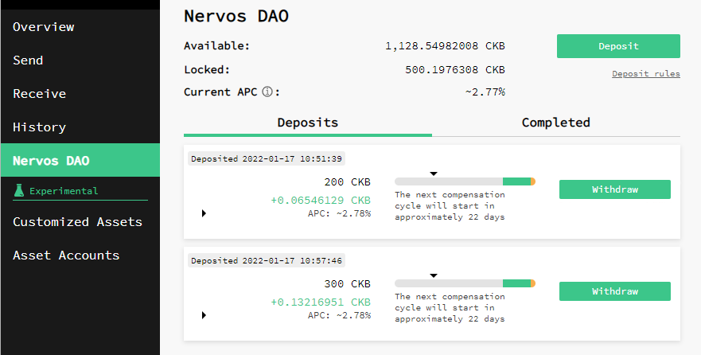

Para entender el funcionamiento de Nervos DAO primero debes saber que funciona mediante ciclos, y que cada uno de estos ciclos tiene una duración de 180 epochs. En la red Nervos, cada epoch tiene un tiempo estimado de 4 horas. Por tanto podemos calcular que cada ciclo dura 30 días aproximadamente. Esto significa que si depositas en la DAO, el depósito mínimo posible es de 30 días, o lo que es lo mismo, un ciclo.

Este ciclo se representa en la interfaz de [Neuron](https://docs.nervos.org/docs/basics/guides/crypto%20wallets/neuron/) con una barra indicadora, la cual se muestra a continuación:

Si bien el depósito en Nervos DAO no entraña una especial dificultad, el proceso de retiro si suele crear más dudas ya que está compuesto por los siguientes dos pasos:

* **Primer Paso:** Transacción inicial de retiro, también llamado solicitud de retiro.

Puedes enviar esta transacción en cualquier momento a Nervos DAO para indicar tu solicitud de retiro. Al hacerlo, es ideal esperar hasta que el ciclo de compensación esté en la región verde de la barra indicadora para maximizar las recompensas de la DAO. Hay que tener en cuenta que al solicitar un retiro antes de que finalice el ciclo de compensación, tus fondos dejarán de generar recompensas, pero permanecerán bloqueados hasta que transcurran los ~30 días completos del ciclo.

Si no realizas la solicitud de retiro durante el ciclo actual, el depósito se extenderá automáticamente al siguiente ciclo.  
   

  

* **Second Step:** Final withdrawal transaction, also called unlocking the deposit.

Esta es la transacción que retira tu depósito inicial de CKBytes junto con las recompensas acumuladas de Nervos DAO. Puedes hacer este segundo paso al final del ciclo, es decir cuando la flecha llega al final de la barra indicadora, solo si previamente has hecho el primer paso o solicitud de retiro.

Para entender mejor el proceso de retiro veamos un ejemplo práctico:

* Imagina que depositas en la DAO el 1 de octubre.
* Puesto que el período de depósito es en ciclos de 30 días, puedes realizar la solicitud de retiro, que es el primer paso, durante cualquier día del mes de octubre (recuerda que se recomienda hacer este paso en la zona verde de la barra indicadora para maximizar recompensas), pero el desbloqueo del depósito, osea el segundo paso, no será posible hasta el 1 de noviembre.
* Si no haces la solicitud de retiro antes de que termine el ciclo, en nuestro caso el 1 de noviembre, entonces un nuevo ciclo de 30 días empieza automáticamente, y no podrás desbloquear el depósito hasta el 1 de diciembre, y para poder desbloquearlo tienes que hacer la solicitud de retiro en algún momento del mes de noviembre.
* Si de nuevo no haces la solicitud de retiro durante noviembre el periodo de depósito se extendería otro ciclo más de 30 días, hasta el 1 de enero.

_Este patrón se repite continuamente._

Ten en cuenta que por motivos didácticos damos por hecho que todos los meses son de 30 días, cuando realmente no es así.

Aquí tienes otro ejemplo:

### Preguntas Frecuentes

* **¿Si no he hecho la solicitud de retiro antes de terminar el ciclo tendré que esperar otro ciclo, es decir otros 30 días, para desbloquear el depósito?**

Si, un nuevo ciclo de 30 días empieza automáticamente si no se ha hecho la solicitud de retiro.

* **¿Si hago la solicitud de retiro dejaré de recibir recompensas de la emisión secundaria?** 

Si, las recompensas pararán. Por eso se recomienda hacer la solicitud de retiro en la zona verde de la barra indicadora, que es la zona que está más cerca del fin de ciclo.

* **¿Es un interés compuesto?** 

Si. Es un interés anual y compuesto. Por lo tanto, no necesitas retirar y volver a depositar fondos para obtener un interés compuesto.

* **¿Es un interés fijo o variable?** 

Es un interés variable, ya que disminuye a lo largo del tiempo. Esto significa que aunque bloquees tus CKB en un porcentaje determinado, no se mantiene siempre en ese porcentaje, irá disminuyendo paulatinamente.

* **¿Cuando recibiré las recompensas de compensación de Nervos DAO?** 

Las recompensas de Nervos DAO se distribuyen por bloque a tu deposito. Una vez desbloqueas el depósito, que es el segundo paso en el proceso de retiro, desbloquearás tú depósito inicial de CKBytes junto con las recompensas acumuladas de Nervos DAO.

* **¿Las recompensas de Nervos DAO disminuyen con el tiempo?** 

Si. Uno de los propósitos de Nervos DAO es crear un límite máximo similar a Bitcoin para los depositantes de la DAO. Cómo holder a largo plazo, siempre obtienes la misma parte del nuevo suministro, pero la tasa de nuevo suministro en sí misma está disminuyendo. Es por eso que la tasa de APC en realidad disminuye a medida que pasa el tiempo y significa que el suministro total de CKBytes aumenta cada vez más lentamente, aproximándose a cero.

* **¿Puedo añadir fondos a un depósito ya existente?**

No, tienes que crear un nuevo depósito. También puedes retirar un depósito ya existente para posteriormente crear un depósito único.

* **¿Cuál es el tiempo mínimo de depósito?** 

El periodo mínimo de depósito es de un ciclo, o lo que es lo mismo, aproximadamente 30 días.

* **¿Cuál es el tiempo máximo de depósito?** 

No existe un tiempo máximo de depósito ya que mientras no hagas la solicitud de retiro el depósito se extenderá automáticamente al siguiente ciclo continuamente.

* **¿Nervos DAO funciona igual en todas las billeteras?** 

Si, funciona exactamente igual en cualquier billetera que uses para depositar en la DAO, ya sea Neuron, PortalWallet, CKBull o cualquier otra. La única diferencia es como cada interfaz de usuario representa Nervos DAO.

* **¿Cuántos CKBs debo dejar fuera de la DAO para realizar un retiro?** 

Debido al modelo Cell, la billetera debe tener un mínimo de 61 CKBs para realizar una operación de retiro de Nervos DAO. Para entender cómo funciona el Modelo Cell y Nervos DAO puedes leer [este artículo](https://medium.com/nervosnetwork/understanding-the-nervos-dao-and-cell-model-d68f38272c24).

* **¿Cuántos CKBs necesito como mínimo para hacer un depósito en Nervos DAO?**

La billetera debe tener un mínimo de 102 CKBs para realizar una operación de depósito en Nervos DAO.

* **He hecho la solicitud de retiro en Neuron antes de terminar el ciclo y aun así ha empezado un nuevo ciclo y no puedo desbloquear el depósito.** 

Esto puede deberse a varias razones:

* Tu Neuron wallet no está 100% sincronizada. Puedes ver el estado de sincronización de Neuron en la esquina inferior izquierda.
* Tu versión de Neuron es anterior a un hard fork. Para solucionarlo lo más recomendable es descargar la última versión disponible. Puedes hacerlo desde Neuron haciendo click en Help — Check for updates.
* La base de datos está corrupta. Para solucionarlo limpia cache seleccionando la opción full rebuild.

### Enlaces de interés

* [RFC0023: Deposit and Withdraw in Nervos DAO](https://github.com/nervosnetwork/rfcs/blob/master/rfcs/0023-dao-deposit-withdraw/0023-dao-deposit-withdraw.md)
* [Understanding the Nervos DAO and Cell Model](https://medium.com/nervosnetwork/understanding-the-nervos-dao-and-cell-model-d68f38272c24)
* [Nervos DAO Explained](https://medium.com/nervosnetwork/nervos-dao-explained-95e33898b1c)
* [Neuron Wallet](https://docs.nervos.org/docs/basics/guides/crypto%20wallets/neuron/)
