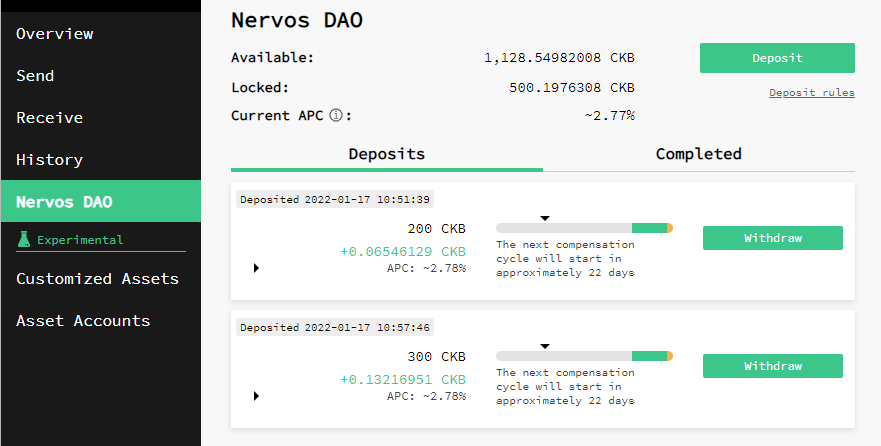
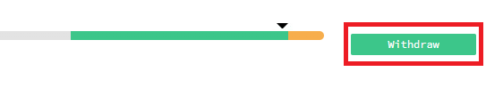
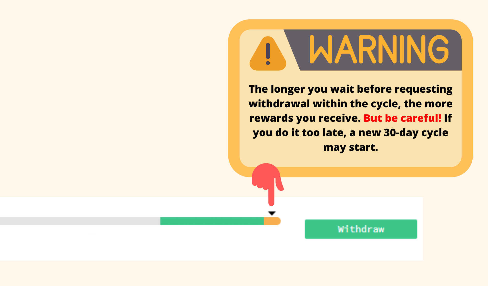
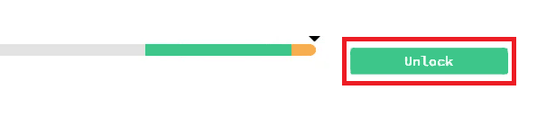
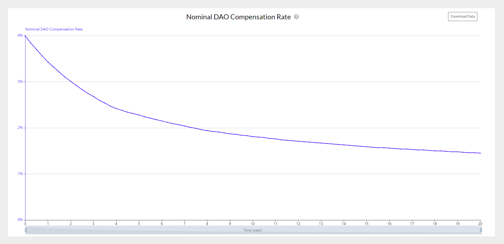

要理解 Nervos DAO 是如何工作的，你必须要先知道它是按周期工作的，每个周期都是 180 个 epoch。在 Nervos 网络上，每个 epoch 大约是 4 小时。所以，我们可以计算出每个周期大约持续 30 天。这意味着，如果你在 Nervos DAO 中存入资金，最短存款周期大约为 30 天，即一个周期。

这个周期在 [Neuron](https://docs.nervos.org/docs/basics/guides/crypto%20wallets/neuron/) 钱包的界面上用指示条表示，如下图所示：

虽然在 Nervos DAO 中进行存款并没有什么特别的困难，但提款的过程往往会让很多新手产生诸多疑问，因为提款由以下两个步骤组成：

* **第 1 步：** 发起提款请求

你可以随时将此交易发送到 Nervos DAO 以表明你的提现请求。这里建议大家等到补偿周期位于指示条的绿色区域时发起提款请求，从而最大化 Nervos DAO 的奖励。请注意，在补偿周期结束前发起提款请求，你的资金将停止产生奖励，但会保持锁定状态，直到整个周期结束。

如果你在当前周期内没有发起提款请求，资金将自动转入下一个周期。
   

  

* **第 2 步：** 解锁存款 

这一步的交易用于提取你的 CKB 本金以及累积的 Nervos DAO 奖励。你可以在周期结束时执行这一步，即当箭头到达指示条的末尾时，前提是你之前已完成了第 1 步的提款请求。

为了更好地理解提款流程，我们来看一个实际的例子：

- 想象一下，你在 10 月 1 日存入 Nervos DAO。
- 由于存款周期为 30 天，你可以在 10 月的任何一天发起提款请求，这是第 1 步（建议在箭头到达指示条绿色区域时执行此步骤，从而最大化奖励），但存款的解锁，即第 2 步，要到 11 月 1 日后才能操作。
- 如果你没有在周期结束前（在我们的例子中是 11 月 1 日）发起提款请求，那么新的 30 天存款周期将自动开始，你将无法在 12 月 1 日之前解锁存款，并且为了解锁，你必须在 11 月的某个时候发起提款请求。
- 如果你在 11 月期间也没有发起提款请求，则存款自动进入下一个周期，至 1 月 1 日。

_如此循环下去。_

请注意，为了方便计算，上述例子中我们假设每个月只有 30 天，但实际上并非如此。

以下是另外一个例子：

### 常见问题

* **如果我在周期结束前没有发起提款请求，我是否需要等待另一个周期，即再过 30 天才能解锁存款？**

是的，如果没有发起提款请求，一个新的 30 天存款周期会自动开始。

* **如果我发起了提款请求，是否会停止获得二次发行的奖励？**

是的，奖励会停止。因此，建议在指示条到达绿色区域时发起提款请求，这是最接近周期结束的时间段。

* **它是复利吗？**

是的。因此，你无需提取和重新存入资金就可以获得复利。

* **利息是固定的还是不固定的？**

利息是不固定的，随着时间的推移利息不断减少。

* **Nervos DAO 的奖励是否随时间推移而减少？** 

是的。Nervos DAO 的目的之一是为存款者创建类似比特币的硬顶。作为长期持有者，你总是获得相同百分比的二级发行，但二级发行本身的速度正在下降。这就是为什么 APC 这个数值实际上随着时间的推移而下降。

* **我可以在现有的存款中增加资金吗？**

不可以，你必须创建一个新的存款。你也可以提取现有的存款，然后再创建一个存款。

* **最短存款时间是多少？** 

最短的存款期是一个周期，大约 30 天。

* **最长存款时间是多少？**

没有最长的存款时间，因为只要你不发起提款请求，存款就会自动转入下一个周期。

* **Nervos DAO 的工作原理，在所有钱包上都是一样的吗？** 

是的，Nervos DAO 的工作原理与钱包无关，无论是 Neuron、Portal Wallet、CKBull 还是其他任何钱包。唯一的区别是不同钱包的用户界面展示 Nervos DAO 的页面可能有所不同。

* **我应该保留多少 CKB 才能提款？**

由于 Cell 模型的特性，钱包里必须至少有 61 个 CKB 才能执行 Nervos DAO 的提款操作。要了解 Cell 模型和 Nervos DAO 的工作原理，你可以阅读[这篇文章](https://medium.com/nervosnetwork/understanding-the-nervos-dao-and-cell-model-d68f38272c24)。

* **我至少需要多少 CKB 才能在 Nervos DAO 中存款？**

钱包必须有至少 102 个 CKB 才能在 Nervos DAO 中进行存款操作。

* **我已经在周期结束前在 Neuron 上发起了提款请求，而且新的周期已经开始了，为什么还是无法解锁存款？** 

这可能是以下几个原因造成的：

* 你的 Neuron 钱包没有 100% 同步。你可以在左下角看到 Neuron 的同步状态。
* 你的 Neuron 版本太旧了。建议下载 Neuron 最新版，你可以在 Neuron 中单击 “帮助 — 检查更新” 来执行此操作。
* 数据库已损坏。你可以在 “工具” 中，点击“清除所有同步数据” 来清理缓存。

### 相关链接

* [RFC0023: Deposit and Withdraw in Nervos DAO](https://github.com/nervosnetwork/rfcs/blob/master/rfcs/0023-dao-deposit-withdraw/0023-dao-deposit-withdraw.md)
* [Understanding the Nervos DAO and Cell Model](https://medium.com/nervosnetwork/understanding-the-nervos-dao-and-cell-model-d68f38272c24)
* [Nervos DAO Explained](https://medium.com/nervosnetwork/nervos-dao-explained-95e33898b1c)
* [Neuron Wallet](https://docs.nervos.org/docs/basics/guides/crypto%20wallets/neuron/)
