# **How to run a CKB node on a RaspberryPi 400 with Ubuntu desktop 22.04**

Running a node on a RaspberryPi can be a fun, efficient way of helping to decentralise the Nervos Network. Old pro's have probably already got this all up and running but for those inexperienced with Pi's or Linux running your own full node like this can be quite daunting. With a decent internet connection you can have everything up and syncing in an hour or so (there's a bit of waiting for stuff to download on a fresh install). The initial sync will take several days and the pi may need restarting from time to time as they can be prone to freezing under heavy load from my experience. The "hard work" is over fairly quickly though. This guide will walk you through the process from flashing ubuntu on to a hdd to "ckb run".

What you'll need

\* RaspberryPi4/400(4gb Pi4 built into a keyboard handy)

\* Power supply for the Pi (2A 5V usb charger will do it)

\* UsbA-UsbC cable

\* Micro SD card for the bootloader software (only need at the start then can be repurposed)

\* Micro SD card reader/adaptor if your computer doesn't have an inbuilt one

\* USB HDD, an SSD is the best/fastest option but can be done with any drive. If you're not planning on doing to much else on the Operating system you'll get away with a 128gb, a 256 or 512gb drive is a better for long term flexability though. The faster transfer speeds of an SSD (500MBps probably all you need to look at as the Pi won't handle even this in practice) will speed up all operations and by 5-20x over using a micro SD card. I'd estimate several weeks to achieve an initial sync with a micro SD card. While 3-5 days will get it done on a SSD.

\* Micro-HDMI – HDMI cable (Pi4 has micro-HDMI outputs) to run to monitor/tv

\* Mouse

\* Keyboard if not using the 400

\* Internet Connection, Ethernet better but WiFi works

## Flashing the Bootloader to the Micro SD and Ubuntu to HDD

Easiest way is by using the Raspberry Pi Imager, Go to:

[https://www.raspberrypi.com/software/](https://www.raspberrypi.com/software/)

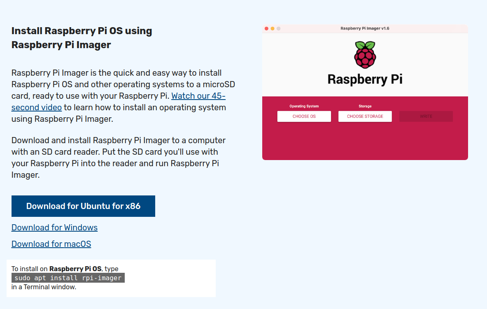 download and install the imager for your operating system (Windows, Mac or Linux[ubuntu])

If you haven't plugged in and or inserted the micro SD to your PC yet, do that now.

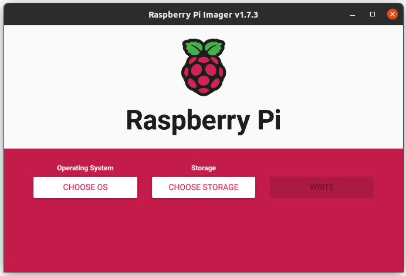

Open the Raspberry Pi Imager you just installed

Select "CHOOSE OS".

Scroll down to "Misc Utility Images"

in the next menu choose "Bootloader"

then "USB Boot"

Select "CHOOSE STORAGE" and select your micro SD card.

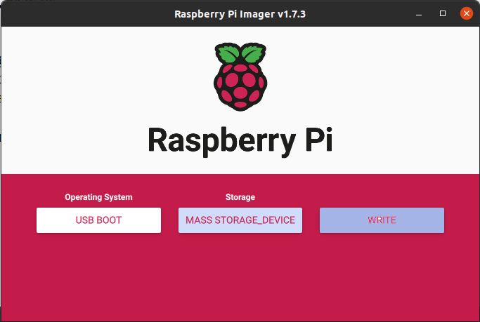

Click Write, you'll get a warning popup about erasing the card, stop and back up the card if you need to now, then a progress bar will appear.

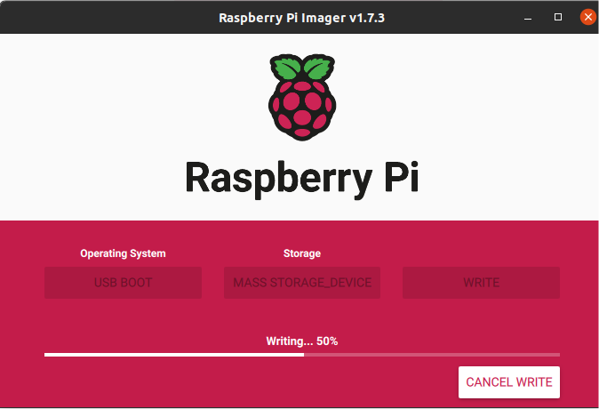

Success!

Next we'll flash the HDD with the ubuntu image.

If you haven't plugged in the external HDD to your PC yet, do that now.

Again select the "CHOOSE OS" button (Which now says USB BOOT, you might have to click back a couple times to reach the root menu).

select "Other General Purpose OS"

choose "Ubuntu"

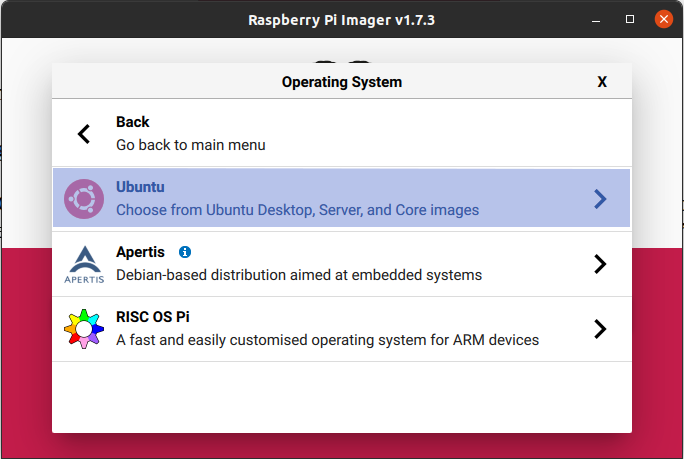

then "Ubuntu Desktop 22.04.2 LTS (64 Bit)"

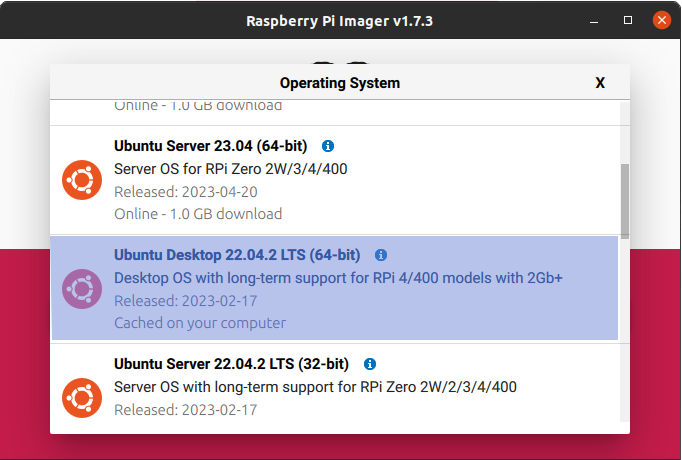

Select "CHOOSE STORAGE" and select your HDD.

Click Write. And Wait.

Now you're already ready to get started setting up Ubuntu on the Pi.

## Setting Up the Pi

Ubuntu 22.04.2LTS Desktop is an open source, fully functional, Graphical Operating System. Often people will run ubuntu server, the command line client version of ubuntu, to run a dedicated task such as a blockchain node. While Server edition is superior as far as overhead usage is concerned, the lack of a Graphical User Interface makes operation for "Novice" linux users a all round unpleasant experience. Ubuntu Desktop looks and feels like a traditional OS a regular user is acustomed to. And makes other operations on the system straigtforward and familiar. With that said some command line operations are required but they're fairly simple and can be copy and pasted from this guide. (Pro tip – view this guide on the pi iteself via the pre-installed firefox browser). There are a couple requisite library installs to get your CKB node up and running. They're all things that you should install on any linux distro anyway with the 1 exception. CKB on ARM64 currently depends on an older OpenSSL library that Ubuntu 22.04.02 no longer ships with (needs 1.1.1 has 3.0.0) you'll need to downgrade two libraries to get it happening.

 
## Connecting the pi
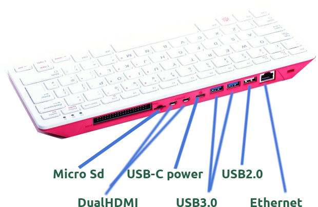

Plug your HDD into a blue USB3.0 port on the Pi, use the a white 2.0 port for the mouse. Connect the micro HDMI cable to a HDMI enabled display/TV. For the first run put the bootloader micro sd card in the slot. Connect the USBA-C cable between the usb C power port on the Pi and the power supply. The pi will power on and should load the bootloader from the micro sd card let this run until the green indicator light begins to flash steadily, this needs to be done once to tell the Pi to check the USB bus first (the external HDD)for a bootable image. After the sequence has finished turn off the pi and remove the SD card, now restart the Pi and it should start to display the boot/initialisation sequence from the external HDD. You'll now need to set up the operating system details, WiFi connection details, timezone, keyboard layout. You also be asked to create a default user for logging into the operating system. All very straight forward.

## Install required software

First we can download the latest CKB Binaries for the ARM64 CPU. Open up firefox and go to:

https://github.com/nervosnetwork/ckb/releases/tag/v0.110.0

Click "tarball" and download the binary

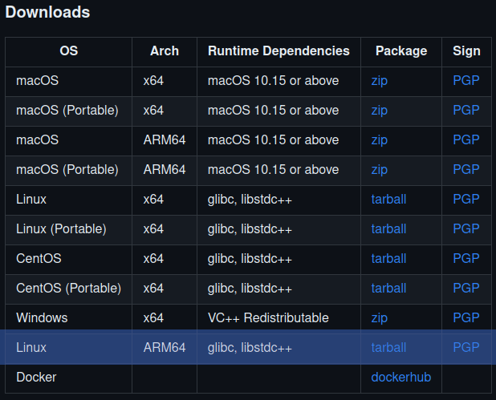

Once the download is finished click open file, choose archive manager to open the tarball.

Extract to a new folder called "ckb"

This is the part where we need to do some command line work, it's pretty straightforward, you can copy and paste the below where needed.

To bring up a terminal window press: "Ctrl" + "Alt" + "T"

First update and upgrade the existing libraries: 

sudo apt-get update

sudo apt-get upgrade

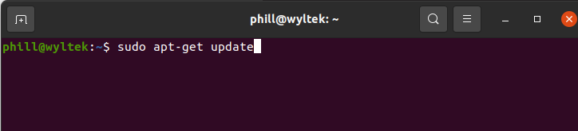

Once Ubuntu determines how many upgrades need to be installed it'll prompt you to confirm installing them, hit "Y" and press enter. There should be about 200 things to upgrade as it's a fresh install, go walk your dog or grab a bite to eat, it'll take about 30-60 minutes depending on your connection. It'll look like this when upgrading.

Next install the following applications which are essential for linux life. Make and Curl

sudo apt-get install make

sudo apt-get install curl

Next install Rustup, which maintains and updates Rust on your OS.

curl --proto '=https' --tlsv1.2 -sSf https://sh.rustup.rs | sh

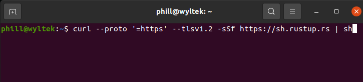

You'll be prompted to confirm the installation type "1" then enter to install to in the default method. The install will take a few minutes.

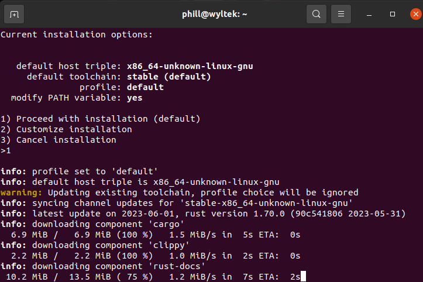

Now install the C++ toolchain and clang

sudo apt-get install -y git gcc libc6-dev pkg-config libssl-dev libclang-dev clang
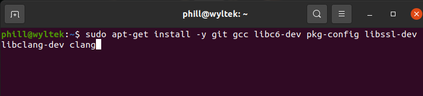

Next install the required Openssl libraries

wget http://ports.ubuntu.com/pool/main/o/openssl/libssl1.1\_1.1.0g-2ubuntu4\_arm64.deb

sudo dpkg -i libssl1.1\_1.1.0g-2ubuntu4\_arm64.deb

wget http://ports.ubuntu.com/pool/main/o/openssl/openssl\_1.1.1f-1ubuntu2\_arm64.deb

sudo dpkg -i openssl\_1.1.1f-1ubuntu2\_arm6d 

## Overclocking and Over Volting

Overclocking isn't necessary and does come with some risk but offers significant performance upgrades, I am personally running my pi400 at 2Ghz instead of the default 1.8Ghz. From everything I've read running the pi400 at 2Ghz is reasonably safe and stable. From the terminal (Ctrl + Alt +T), in the root (default) directory. Enter the following to access config file you need to overclock your pi.

sudo nano /boot/firmware/config.txt

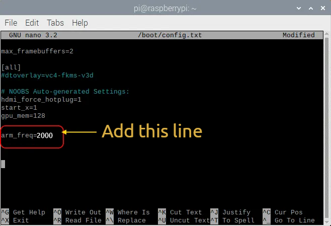

Scroll to the bottom and add the following line

arm\_freq=2000

Hit Ctrl+X to exit and confirm the changes.

Now restart the Pi.

## RUN CKB

That's all the intensive stuff done. Now all that's left is to initialise the node and let it sync. You can navigate your way around the command line directories by using "dir" and "cd" to list directory contents and change directory respectively but given we have a graphical user interface with Ubuntu desktop you can navigate there through the file manager and open a terminal from that directory. Go to home → ckb → [ckb\_v0.110.0\_aarch64-unknown-linux-gnu](https://github.com/nervosnetwork/ckb/releases/download/v0.110.0/ckb_v0.110.0_aarch64-unknown-linux-gnu.tar.gz) (if that's still the current version when you read this) then right click and choose "Open in Terminal" 

In the terminal type

./ckb init --chain mainnet

then

./ckb run

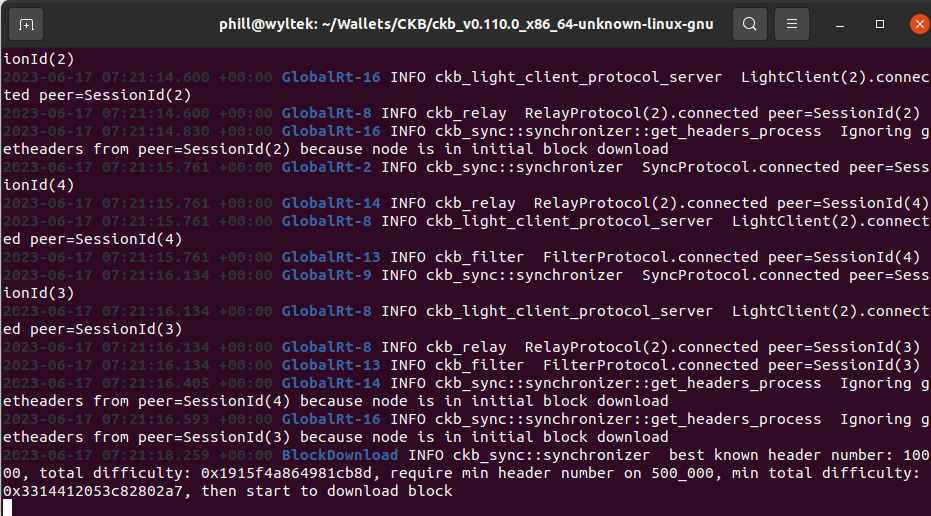

## Congratulations! You now have a node running on a Raspberry Pi. In a few days you be synced and contributing to the decentralisation of the Nervos Network.
