# **如何在使用 Ubuntu 桌面 22.04 的树莓派 400 上运行 CKB 节点**

在树莓派（RaspberryPi）上运行节点有助于实现 Nervos 网络的去中心化，这也是一种有趣且高效的方式。老手们可能已经把这一切都准备好并运行了，但对于那些没有 Pi 或 Linux 经验的人来说，运行你自己的完整节点可能会让人望而生畏。如果有一个良好的网络，你其实可以在一个小时左右的时间完成所有内容并同步（全新安装时需要等待一段时间才能下载内容）。

初始同步可能需要几天的时间，并且 Pi 可能需要不时地重新启动，因为根据我的经验，它们在重负载下容易死机。不过，这个艰苦的工作很快就会结束。本指南将引导你完成从将 Ubuntu 刷入硬盘到 "运行 CKB" 的过程。

你需要的东西：

\* Raspberry Pi 4/400（4GB Pi4 内置键盘）

\* Pi 的电源（2A 5V USB 充电器即可）

\* USBA-USBC 数据线

\* 用于启动软件的 Micro SD 卡（只在开始时需要，后续可以另作他用）

\* Micro SD 读卡器（如果你的计算机没有内置读卡槽）

\* USB HDD、SSD 是最好的选择，可以使用任何存储设备来完成。如果你不打算在操作系统上做太多其他事情，那么你可以选择 128GB，如果从长期来看以及为了灵活性，256GB 或 512GB 更适合。SSD 更快的传输速度（你可能只需要考虑 500MBps，因为 Pi 在实践中甚至无法处理）将加快所有操作的速度，比使用 micro SD 卡快 5～20 倍。我估计需要几周时间才能实现与 micro SD 卡的初始同步，而在 SSD 上 3～5 天就可以完成。

\* Micro-HDMI – HDMI 数据线，用于连接显示器/TV（Pi4 有 micro-HDMI 接口）

\* 鼠标

\* 如果不使用 Pi400，则需要键盘

\* 连上互联网，以太网更好，但 WiFi 也可以

## 在 Micro SD 中刷入 Bootloader ，在 HDD 中刷入 Ubuntu

最简单的方法是使用 Raspberry Pi Imager，请前往：

[https://www.raspberrypi.com/software/](https://www.raspberrypi.com/software/)

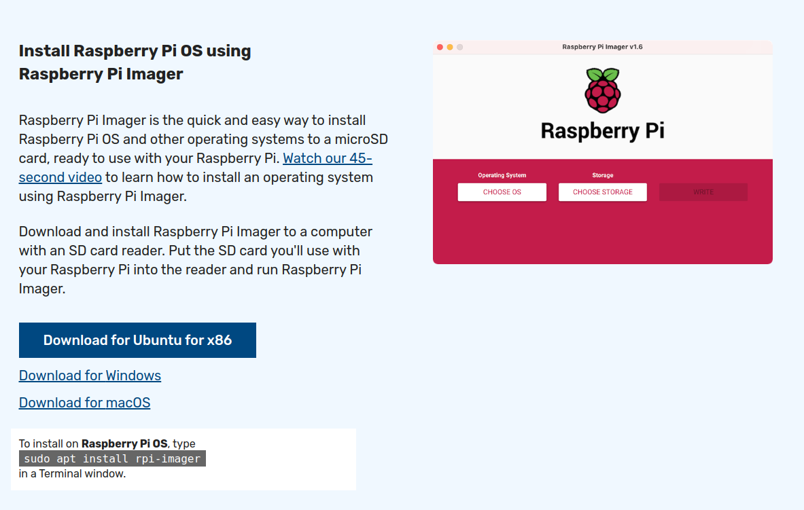 下载并安装适用于你的操作系统（Windows、Mac 或 Linux[ubuntu])的镜像。

如果你尚未将 micro SD 插入电脑，现在就插上吧。

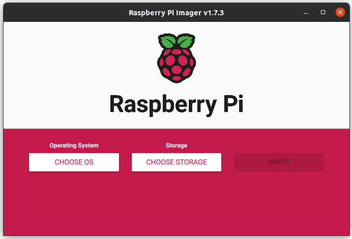

打开你刚刚下载的 Raspberry Pi Imager。

选择 "CHOOSE OS"。

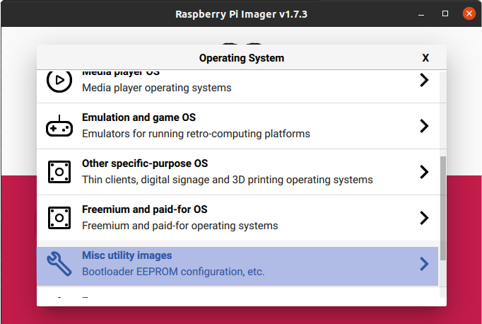

向下划，找到 "Misc Utility Images"。

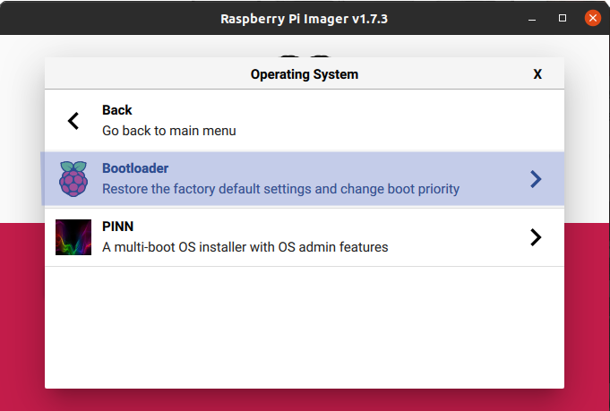

在子菜单中，选择 "Bootloader"。

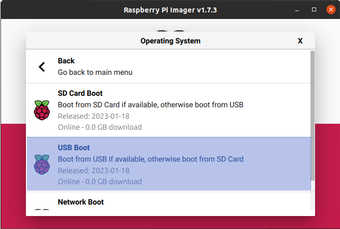

选择 "USB Boot"。

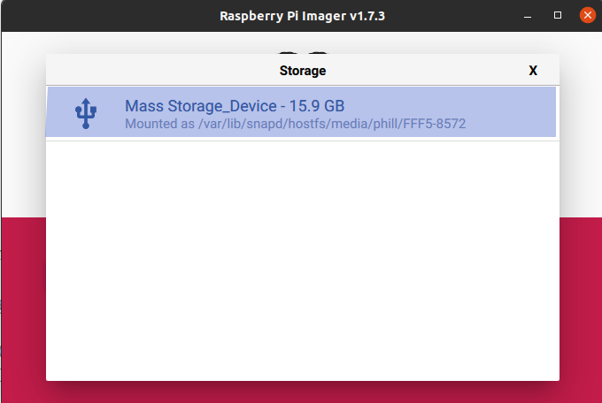

选择 "CHOOSE STORAGE"，然后选择你的 micro SD 卡。

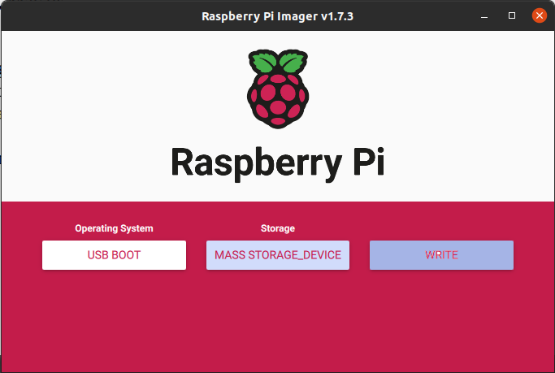

点击 “Write”，你会看到一个关于擦除卡片的警告弹窗，如果你需要，请先停止并备份卡片，然后再继续。之后会出现一个进度条。

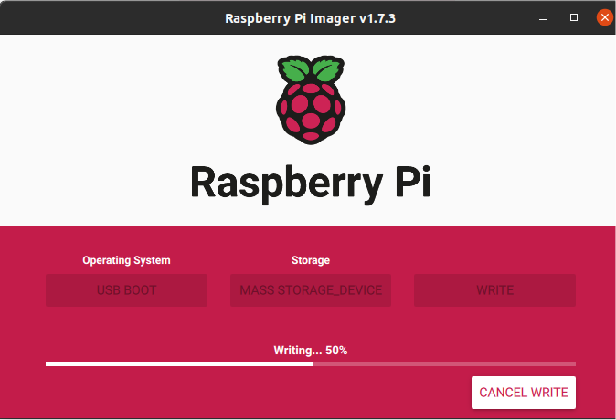

成功了!

接下来，我们将在 HDD 中刷入 ubuntu 镜像。

如果你还没有把外接硬盘插入你的电脑，现在就插上。

同样选择 "CHOOSE OS" 按钮（现在显示的是 USB BOOT，你可能要往回点击几次才能到达根目录）。

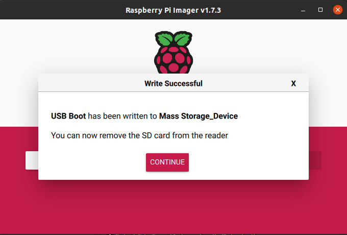

选择 "Other General Purpose OS"。

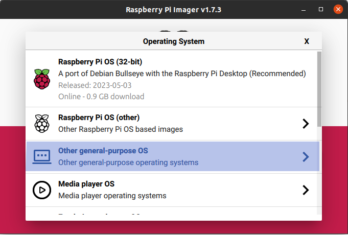

选择 "Ubuntu"。

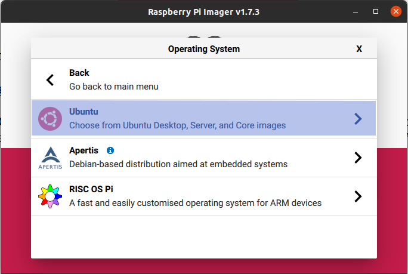

选择 "Ubuntu Desktop 22.04.2 LTS (64 Bit)"。

选择 "CHOOSE STORAGE"，然后选择你的 HDD。

点击 “Write”，然后等待完成。

现在你已经准备好开始在 Pi 上设置 Ubuntu 了。

## 设置 Pi

Ubuntu 22.04.2LTS Desktop 是一个开源、功能齐全的图形操作系统。人们通常会运行 ubuntu 服务器（ubuntu 的命令行客户端版本）来运行专门的任务，例如区块链节点。虽然就开销而言，服务器版更胜一筹，但由于缺乏图形用户界面，对于 "新手 "Linux用户来说，操作体验不够友好。Ubuntu 桌面的外观就像普通用户习惯的传统操作系统，系统上的其他操作也变得简单和熟悉。也就是说，虽然需要一些命令行操作，但它们相当简单，可以直接从本指南中复制和粘贴。（专业提示：通过预装的 Firefox 浏览器在 pi 上查看本指南）。需要安装几个必要的库才能让你的 CKB 节点启动并运行。它们都是你在任何 Linux 发行版上应该安装的东西，只有一个例外。 ARM64 上的 CKB 目前依赖于 Ubuntu 22.04.02，不再提供较旧的 OpenSSL 库（需要 1.1.1 有 3.0.0），你需要将两个库降级来实现它。

## 连接 pi
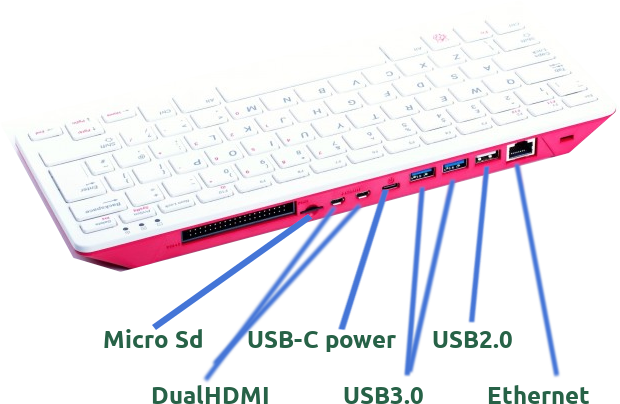

将硬盘插入 Pi 上的蓝色 USB3.0 接口，使用白色 2.0 接口连接鼠标。将 micro HDMI 数据线连接到支持 HDMI 的显示器/电视。首次运行时，将启动程序的 micro SD 卡放入插槽。使用 USBA-C 数据线连接 Pi 上的 USB C 电源端口和电源。Raspberry Pi 开机，并从 micro SD 卡加载启动程序，让其运行，直到绿色指示灯开始稳定闪烁，这需要执行一次，以告诉 Pi 首先检查 USB 总线（外部 HDD） 可启动镜像。在这个过程结束后，关闭 Raspberry Pi 并取出 SD 卡，现在重新启动 Pi，它应该可以显示来自外部 HDD 的启动/初始化过程。你现在需要设置操作系统详细信息、WiFi 连接信息、时区、键盘布局等。系统还会要求你创建一个用于登录操作系统的默认用户。一切都非常简单。

## 安装所需软件

首先，我们可以下载适用于 ARM64 CPU 的最新 CKB 文件。打开 Firefox 并转到：

https://github.com/nervosnetwork/ckb/releases/tag/v0.110.0

点击 "tarball" 并下载文件。

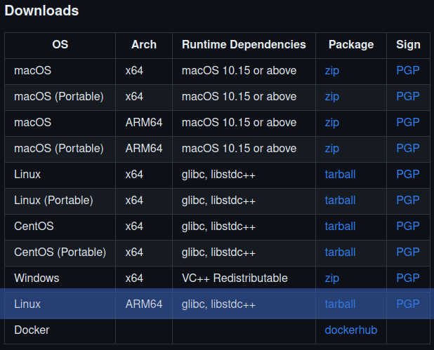

下载完成后，单击打开文件，选择解压工具打开 tarball。

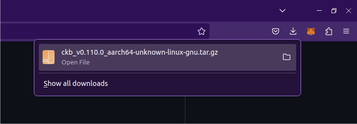

解压到一个名为 "ckb" 的新文件夹中。

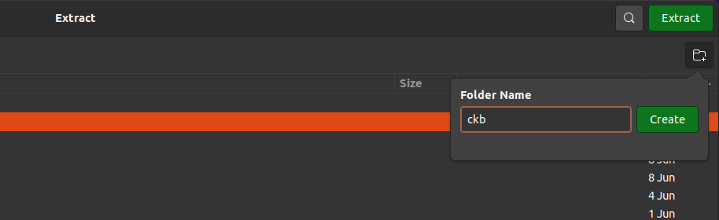

接下去我们需要做一些命令行工作，其实非常简单，你可以在需要的地方复制粘贴。

请按 "Ctrl" + "Alt" + "T" 调出终端窗口。

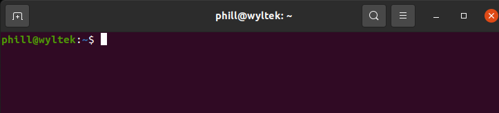

首先，更新和升级现有的库： 

sudo apt-get update

sudo apt-get upgrade

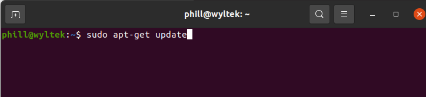

一旦 Ubuntu 确定需要安装多少个升级，它会提示你去确认安装它们，点击 “Y” 并按 Enter 键。大约 200 个东西需要升级，因为是全新安装，你可以选择出去遛狗或者吃点东西，大约需要 30～60 分钟，具体取决于你的网络情况。升级时会是下面这个样子。

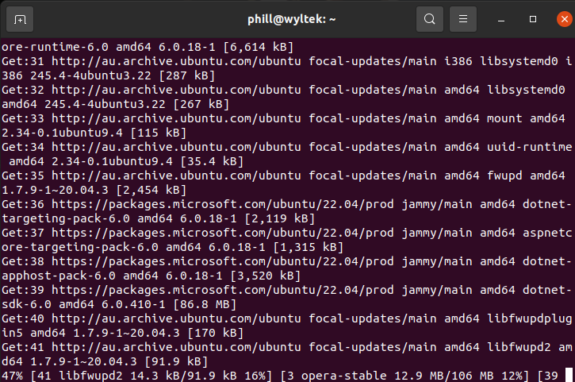

接下来安装以下 Linux 中必不可少的应用程序。

sudo apt-get install make

sudo apt-get install curl

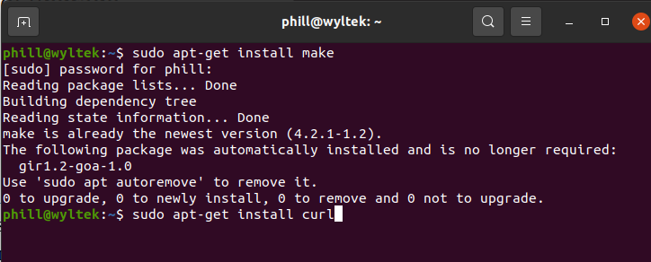

接下来安装 Rustup，它会在你的操作系统上维护和更新 Rust。

curl --proto '=https' --tlsv1.2 -sSf https://sh.rustup.rs | sh

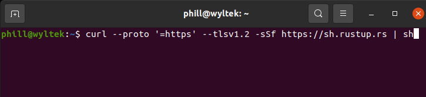

系统会提示你确认安装类型 “1”，然后按默认方法输入并安装。安装的过程需要几分钟时间。

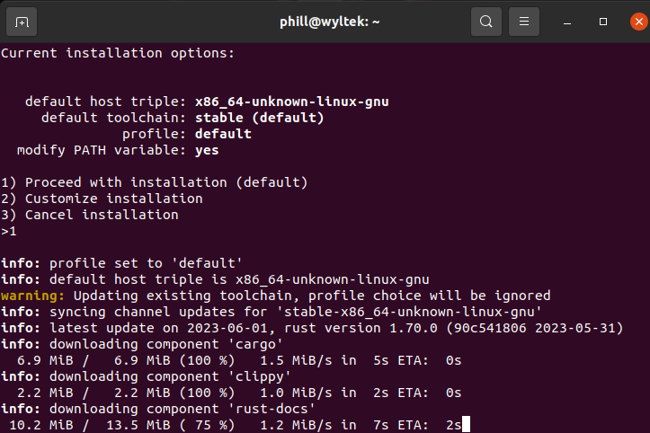

现在安装 C++ toolchain 和 clang。

sudo apt-get install -y git gcc libc6-dev pkg-config libssl-dev libclang-dev clang
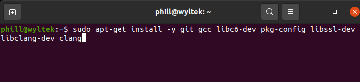

接下来安装所需的 Openssl 库。

wget http://ports.ubuntu.com/pool/main/o/openssl/libssl1.1\_1.1.0g-2ubuntu4\_arm64.deb

sudo dpkg -i libssl1.1\_1.1.0g-2ubuntu4\_arm64.deb

wget http://ports.ubuntu.com/pool/main/o/openssl/openssl\_1.1.1f-1ubuntu2\_arm64.deb

sudo dpkg -i openssl\_1.1.1f-1ubuntu2\_arm6d 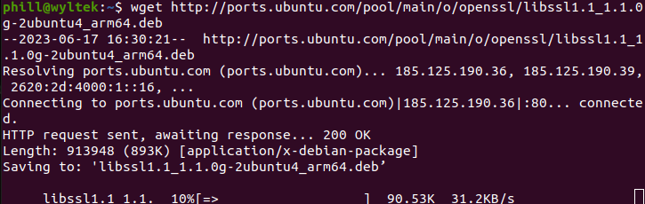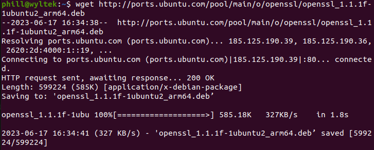

## 超频和超电压

超频不是必需的，并且会带来一些风险，但可以提供性能升级，我个人以 2Ghz 而不是默认的 1.8Ghz 运行我的 pi400。从我读到的所有内容来看，以 2Ghz 运行 pi400 是相当安全和稳定的。在终端（Ctrl + Alt +T）根（默认）目录中，输入以下内容来访问超频 pi 所需的配置文件。

sudo nano /boot/firmware/config.txt

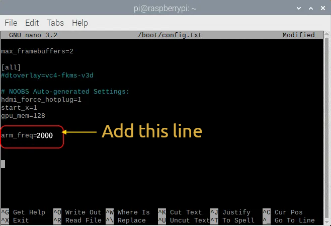

滑到底部，并添加以下命令行。

arm\_freq=2000

按 Ctrl+X 退出并确认更改。

现在，重启Pi。

## 运行 CKB

所有密集的工作已完成，现在剩下的就是初始化节点并让它完成同步。你可以使用 “dir” 和 “cd” 分别列出目录内容和更改目录来浏览命令行目录，但考虑到我们有 Ubuntu 桌面的图形用户界面，你可以通过文件管理器导航并打开终端目录。进入首页 → ckb → [ckb\_v0.110.0\_aarch64-unknown-linux-gnu](https://github.com/nervosnetwork/ckb/releases/download/v0.110.0/ckb_v0.110.0_aarch64-unknown-linux-gnu.tar.gz)（如果你阅读本文时仍然是目前这个版本），然后右键单击并选择 "Open in Terminal" 

在终端输入

./ckb init --chain mainnet
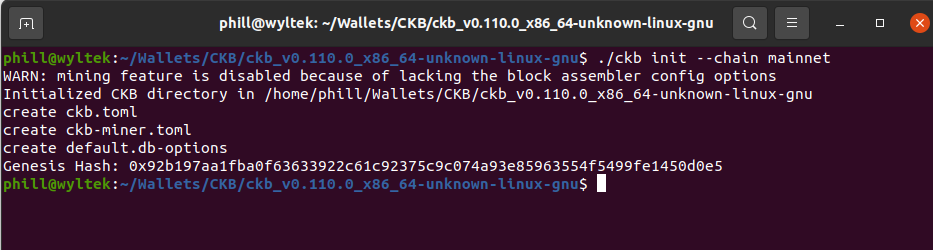

然后

./ckb run

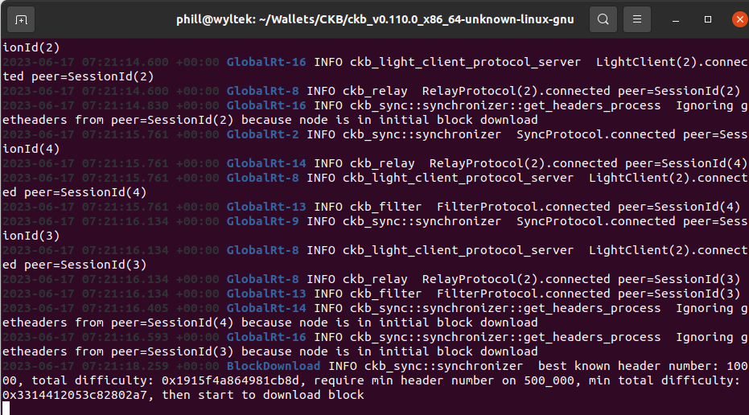

## 恭喜！ 你现在有一个在 Raspberry Pi 上运行的 CKB 节点。几天后，你将同步并为 Nervos 网络的去中心化做出贡献。
