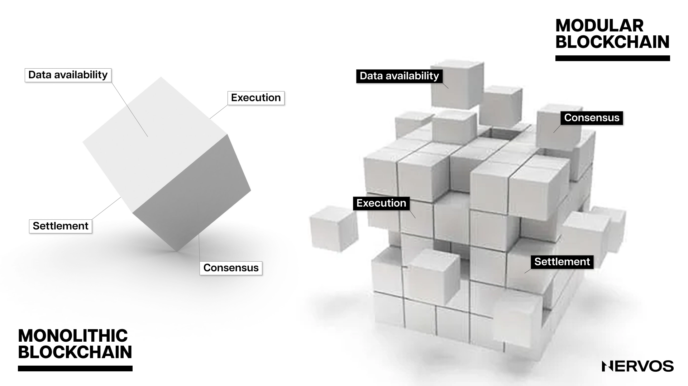
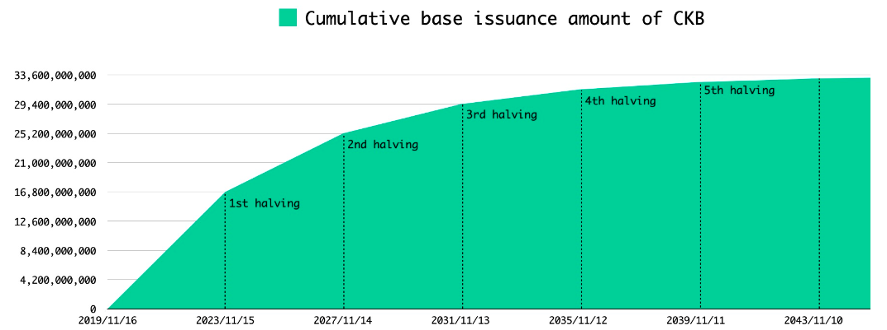
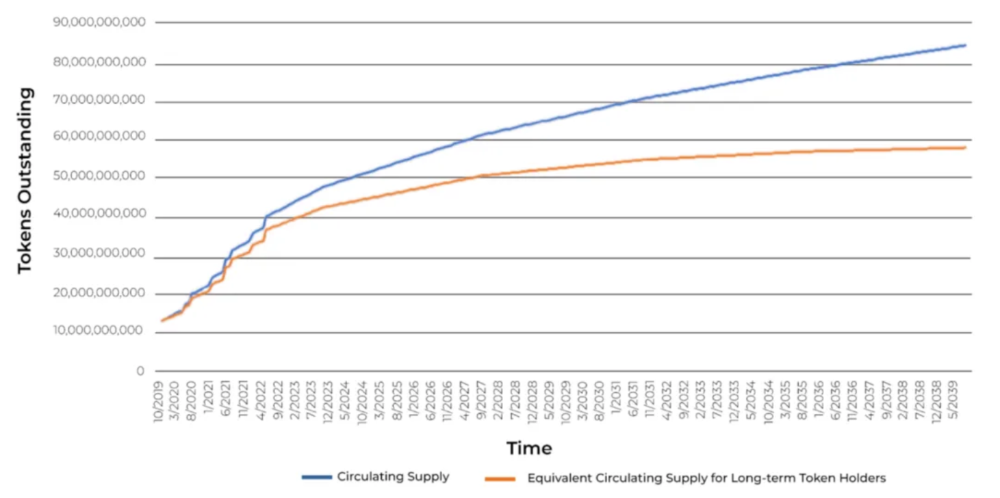
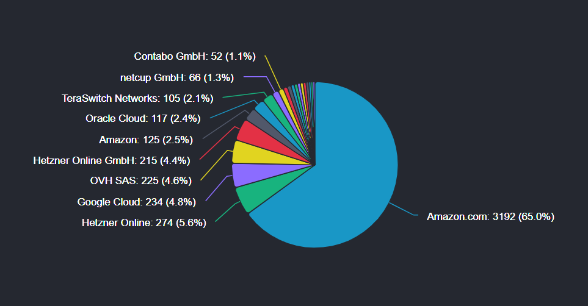
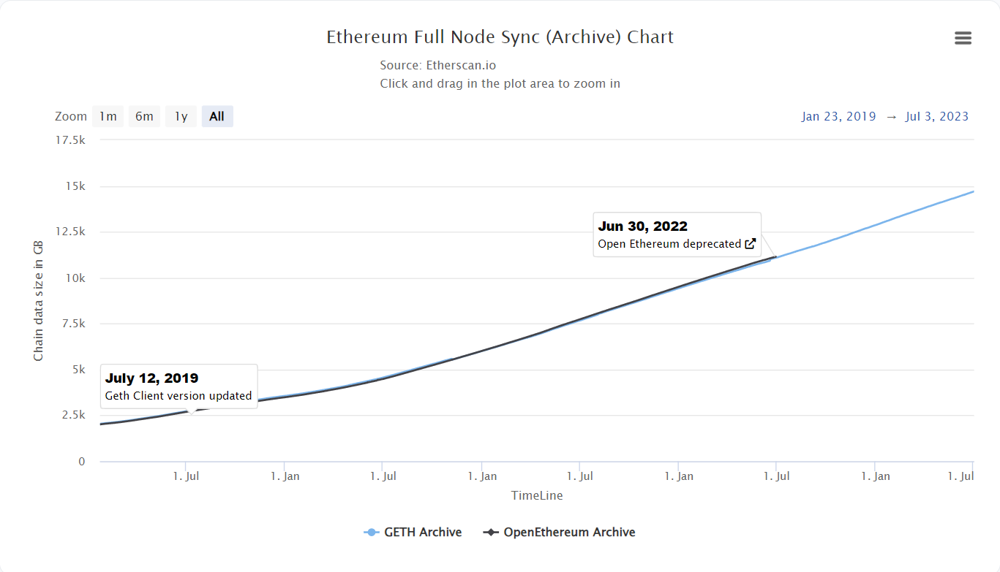
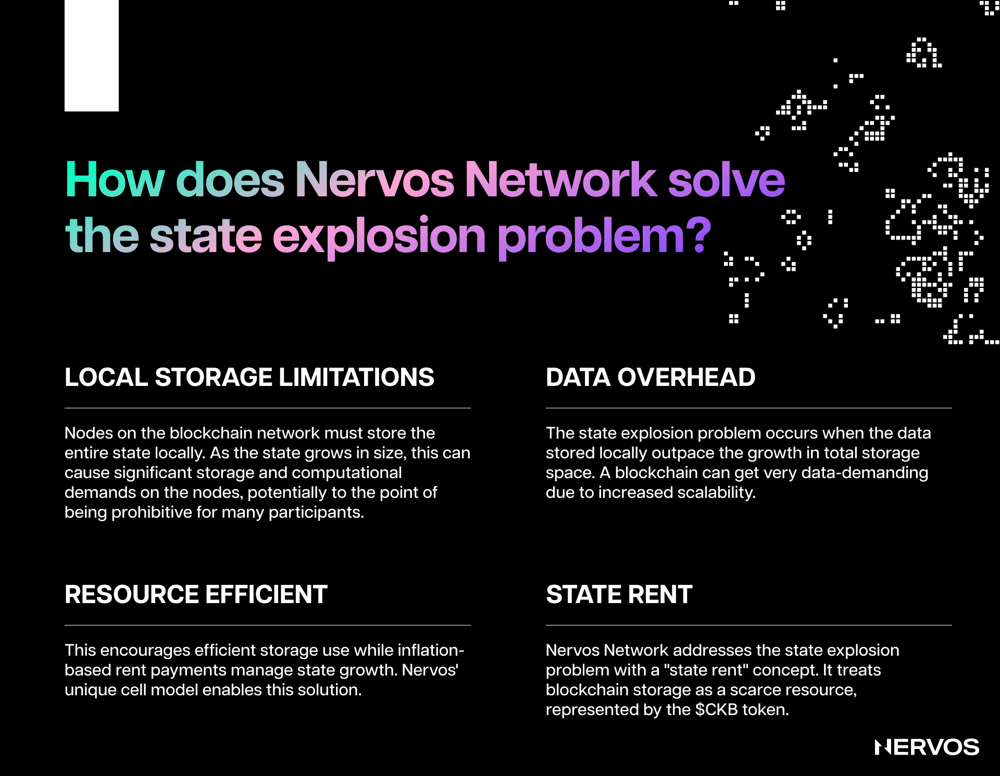
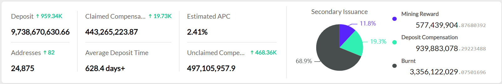

Nervos is a modular blockchain network built from the ground up to ensure outstanding security, decentralization, flexibility, and interoperability on the base layer and unparalleled scalability on the upper layers.

This means that unlike most monolithic blockchains that have transaction execution, consensus, and data availability all happen on the same layer, Nervos separates these functions into two different layers: the Layer 1, comprising the Common Knowledge Base (CKB), a secure and decentralized preservation platform, and the Layer 2, made up of different high-throughput networks optimized for scaling.

To that point, unlike all other Layer 1 blockchains, whose tokenomics are better suited for transactional (Layer 2) platforms, CKB is the only blockchain with a tokenomic model adequately optimized for a preservation-focused, store-of-value platform. Moreover, it is the only blockchain that has innovated on the tokenomics front to create an incentive system that aligns the interest of all network participants and solves the state explosion problem besetting all blockchains.

CKB’s unique tokenomic model guarantees that miners are getting paid for the security they provide to the network in perpetuity, regardless of the transaction volume, while also ensuring the CKByte (CKB) tokens act as hard assets that aren’t diluting their long-term holders. 

More importantly, the tokenomic design creates a flywheel effect where the demand for holding assets on the CKB blockchain puts direct demand pressure on owning the CKB tokens. This creates a value capture mechanism for the native token and ensures that the blockchain’s security grows proportionally with the value of the assets it preserves.

Before exploring the nuanced utility of CKBytes and the unique value proposition of Nervos’ tokenomic model, it’s first worth looking at the token issuance structure.

## CKB Tokenomics

CKByte or CKB is Nervos Network’s native utility and governance token. To adequately reflect the needs of a preservation platform, CKB was designed with two types of native token issuance: primary issuance and secondary issuance. The smallest indivisible unit of the native token is called CK Shannon, where one CKByte equals 100,000,000 CK Shannons.

### Primary Issuance

The primary token issuance of CKB has a finite or hard-capped supply of 33.6 billion CKB. 

Similar to Bitcoin’s issuance schedule, CKB’s primary token issuance halves every four years until all primary issuance tokens are mined into circulation. 

This means that over the first four years, 16.8 billion CKB will be mined, putting the initial yearly issuance rate at 4.2 billion. After the first halving cycle, due sometime in November 2023, the issuance rate will drop to 2.1 billion CKB per year, after the second halving to 1.05 billion CKB per year, and so on, until all primary issuance tokens are mined.

All primary issuance tokens are awarded to the CKB miners, which are paid a fixed amount of CKBytes per block as an incentive or reward for providing the computer resources needed to process transactions and secure the network. As the Nervos network grows and CKB tokens become more valuable, the nominal reward rate can decrease—and eventually, stop—without negatively affecting the network’s security.

The primary issuance also ensures a fair token distribution during the networks’ bootstrapping phase, guaranteeing sufficient economic decentralization in the long term.

### Secondary Issuance

Nervos’ tokenomics are unique because they incorporate another type of token emissions called secondary issuance. It is designed to collect state rent and ensure that the miners are compensated for the security they provide the network in perpetuity, regardless of historical transaction volume.

The secondary issuance is uncapped and follows a fixed emissions schedule of 1.344 billion CKB annually. However, unlike the primary issuance, which goes entirely to miners, the secondary issuance is split between miners, NervosDAO depositors, and the Nervos treasury.

The precise ratio of the split depends on how the currently circulating CKB tokens are utilized within the network. For example, suppose 50% of all CKB are used to store state (more on this later), 30% are deposited into the NervosDAO, and 20% are kept liquid. Then, 50% of the secondary issuance will go to miners, 30% will go to the NervosDAO depositors, and the remaining 20% will go to Nervos’ treasury. Today, the secondary issuance which would be deposited into the treasury fund is being burned, but this could change in the future via a community-initiated hard fork.

Important to understand here is that the inflation from the secondary emissions is narrowly targeted and affects only state occupiers, which means that CKB can simultaneously act as a deflationary token for long-term CKB holders and an inflationary token for the blockchain’s users.

This unique two-tiered token emissions model ensures the long-term sustainability of the Nervos Network by making the miner compensation independent of transaction fees and more closely tied to the utilization of the blockchain as a preservation or store-of-value platform. 

Finally, this tokenomic model is able to bind the growth of the global state and align the interest of the different network participants, including users, miners, developers, and token holders, creating an incentive structure that works in everyone’s favor, which isn’t the case with other Layer 1s on the market.

To better understand how Nervos is able to do this, it’s necessary to analyze the reasons behind this tokenomic design choice.

## Addressing the State Explosion Problem in Blockchains

State explosion is one of the most challenging, yet least talked about problems blockchains face today. In blockchain systems, "state" refers to the current status of all the elements within the network. In the case of Bitcoin, this would include the balance of all Bitcoin addresses. For Ethereum, it would include not just Ether balances but also the current state of all smart contracts and the data associated with them.

As more transactions occur, new addresses are created, contracts are invoked, and data is added, the state of the network expands. If this expansion occurs at a rapid or exponential rate, it can lead to what's referred to as "state explosion."

State explosion can have several adverse effects on blockchain networks, including making running a full node more resource-intensive, as doing so requires maintaining and storing the entire network state locally. This naturally leads to increased centralization because only those with substantial computational resources (Amazon AWS, Google Could, etc.) can participate fully in the network, which effectively denies the core value proposition of blockchains as permissionless and trustless peer-to-peer distributed systems.

Important to understand here is that the state explosion problem isn’t theoretical but troubles all popular Layer 1s today, as none have proper built-in mechanisms to curb it. For example, the global state in Bitcoin is the UTXO set, and its growth rate is effectively capped with the block size limit. However, while users are incentivized (via transaction fee costs) to create UTXOs efficiently, once they do, it doesn't cost them anything to have the UTXOs occupy the global state forever. This means that users can indefinitely store millions or billions of dollars of value on the highly (and expensive to) secure Bitcoin network for a small, one-time fee of a couple of dollars.

On the other hand, Ethereum charges fixed amounts of gas for inserting new values into its state storage and offers fixed amounts of gas as a transaction refund when values are removed. While this is a step in the right direction, it does little to curb state expansion, as the state’s growth rate isn’t bounded in any way. Moreover, Ethereum runs into the same “tragedy of the commons” problem as Bitcoin, as the system charges a one-time fee for expanding the state storage, whereas the miners and full nodes have to bear the costs of storage over time.

 \
_Distribution of Ethereum nodes run by web service providers. Source: [Ethernodes](https://ethernodes.org/networkType/Hosting)._

As a result, over 62% of Ethereum's full nodes currently rely on centralized cloud computing providers, with 65% of these hosted nodes being run on AWS. That is to say, Ethereum is already exposed to central points of failure due to a severe lack of decentralization at the node level, meaning that if a state actor were to attack Ethereum at the protocol level, all they would need to do is go after a couple of centralized, well-regulated entities.

To make things worse, this problem is expected only to worsen as crypto’s popularity grows and blockchains start reaching mass adoption. As things currently stand, most, if not all Layer 1s aside from Common Knowledge Base aren’t prepared to onboard the next billion users without effectively becoming completely centralized at the node level due to the increased burden imposed by state expansion on node runners.

Another issue related to tokenomics and the state explosion problem worth mentioning here is the lack of value alignment on smart contract platforms like Ethereum. Namely, all multi-asset preservation-focused Layer 1s today can potentially become vulnerable to attacks because their security properties aren’t aligned with the growth of the value they preserve. In other words, the value of the native asset that effectively secures the blockchain isn’t directly tied to the growth in value of the non-native assets stored on the blockchain. This means that multi-asset platforms like Ethereum effectively act as banks that keep adding more gold (secure more non-native assets) to their vaults without increasing security (increasing the value of staked Ether).

Therefore, managing state size and preventing state explosion is critical to designing and maintaining efficient and decentralized blockchain networks. The global state’s growth must be bounded to ensure the predictable participation of full nodes. Keeping the barriers to entry or the costs of running full nodes low is necessary to ensure sufficient blockchain security and decentralization, and that can only be done by limiting state growth.

## Solving State Explosion on Nervos via State Rent

Nervos' tokenomics were designed to solve the state explosion and value alignment problems besetting popular blockchains. This is done in three primary ways: bounding the state growth by tying it to the CKB tokens, privatizing the state space, and introducing the secondary issuance to transfer state rent from state occupiers to the miners or state protectors.

On the CKB blockchain, state capacity—a measurement unit for state that determines how much data can be stored on the blockchain—is a first-class asset restricted by pre-defined rules. Namely, storing any arbitrary amount of data on the CKB blockchain requires locking a pre-defined amount of CKB tokens. This means that, among other things, CKB tokens effectively represent cell capacity in bytes, where storing one byte of data on the blockchain requires locking up one CKB.

For example, if a user owns 1,000 CKB, they can create a cell with 1,000 bytes or multiple cells that add up to 1,000 bytes in capacity. They can then use those 1,000 bytes in capacity to store application states, assets, or other types of data. Worth mentioning here is that a cell's occupied capacity can be equal to or smaller than its specified capacity. For example, for a 1,000-byte cell, 4 bytes will be used to specify its own capacity, 64 bytes for the lock script, and 128 bytes for storing state, making the cell's current occupied capacity 196 bytes, with room to grow up to 1,000 bytes.

Considering that CKB tokens represent a right to store or expand the global state of the blockchain, their limited issuance effectively bounds the state growth. For example, after the first halving due in November this year, CKB tokens' annual issuance rate for the next four years will be capped at 3.444 billion CKB (2.1 billion in primary issuance plus 1.344 in secondary issuance). This means Common Knowledge Base's global state can only grow by 3.444 billion bytes or 3.444 gigabytes per year. And with the primary issuance halving every four years, the blockchain's global state becomes an ever more valuable and scarce asset.

Furthermore, the fact that the global state is stored in cells—first-class assets similar to UTXOs in Bitcoin, directly owned and controlled by users—means that the state space is effectively privatized. Privatizing the state space further decreases state bloat as state owners and occupiers are always incentivized to optimize and occupy as little state as possible to avoid paying excessive state rent.

To that point, state rent is what makes Nervos’ tokenomics special. By introducing targeted inflation on state occupiers, Nervos is able to tax long-term state occupiers and reward the miners that act as long-term state preservers or protectors. Transaction fees are paid once to process and insert a transaction into the blockchain, while state rent is paid continuously to preserve the data until it is removed. This incentive structure both prevents excessive state expansion and ensures the long-term security of the blockchain by guaranteeing a predictable source of income for miners that is independent of transaction volume. 

 \
The state of play of the [NervosDAO](https://explorer.nervos.org/nervosdao).

The inflation that pays for the state rent is created through the secondary issuance, which, as previously mentioned, is split between miners, NervosDAO depositors, and the treasury (currently burned). For long-term token holders, as long as they lock their tokens in the NervosDAO—a smart contract that acts as an "inflation shelter"—the inflationary effect of secondary issuance is only nominal. For them, it's as if the secondary issuance doesn't exist, and they hold a hard-capped asset like Bitcoin. 

On the other hand, state occupiers are the only stakeholders without a claim on the interest payments from the secondary issuance, meaning that—even though the number of their CKB tokens doesn't change—their tokens are continually being diluted. This small dilution represents the "inflation tax,” or how the state occupiers pay state rent to the miners. 

Because state is a first-class asset on CKB, the state occupiers are also technically state owners incentivized to remove unnecessary data from Nervos (state pruning) to keep the blockchain manageable in the long term. When they no longer need to utilize the scarce state space, they can consume the cells that occupy it, release the locked CKB tokens and then deposit them into the NervosDAO inflation shelter to stop paying for state rent.

## CKByte’s Value Capture Mechanism

Whereas the native tokens of most Layer 1 blockchains either have a value capture mechanism that doesn't align with the platform's objectives or don't have value capture mechanisms at all, Nervos' tokenomic design directly creates long-term demand for CKB tokens.

Ethereum, arguably the only smart contract platform incorporating a value capture mechanism for Ether via the recent introduction of EIP-1559, is a preservation platform with tokenomics designed for transactional platforms. 

That is to say, Ethereum no longer seeks to scale on Layer 1 but rather settle as many transactions as possible on Layer 2 networks, meaning that the transaction fee-burning mechanism that is supposed to capture value for Ether doesn't benefit from or align with Ethereum's broader objectives. Namely, as a value-preservation platform, Ethereum allows users to occupy state and Layer 2 networks to borrow its security for essentially free, without capturing and transferring any of that value to token holders.

Bitcoin is dealing with very similar issues too. Namely, its tokenomic model, which rewards miners via block rewards and transaction fees, is a suitable economic model for a peer-to-peer payment system but a poor choice for a true store-of-value platform. 

The Bitcoin protocol caps the size of blocks and enforces a fixed block time, making the network's transaction throughput a scarce resource that users must bid on through transaction fees. This means that higher demand for block space directly translates into higher transaction fees for users, making Bitcoin an expensive and, therefore, bad peer-to-peer payment system. 

On the other hand, Bitcoin remains a great store-of-value platform (super secure and decentralized), but only at the ongoing expense of miners. Bitcoin users that utilize the blockchain to store value pay transaction fees only once but then occupy state forever, meaning they enjoy the ongoing security provided by miners (who are required to store the entire state of the chain) without compensating them adequately.

Moreover, after the predictable block rewards drop to zero, Bitcoin’s security model will become entirely dependent on the transaction fees paid by users, who, as demonstrated above, are incentivized to store value on the blockchain long-term rather than use it as a payment system. If the Bitcoin network doesn’t attract a consistent, over-capacity transaction demand over the long term, then the negative impact of the diminishing mining incentives on Bitcoin’s security could be profound.

On the other hand, beyond simply needing the native tokens to pay for cycle and transaction fees on the CKB blockchain, storing data or occupying state space on the chain requires locking CKB, which creates direct long-term demand for the tokens. This means that holding non-native assets on the blockchain puts demand on owning the native tokens, which increases their value and, consequently, improves the chain’s security by increasing the miner rewards. This incentive structure is much better aligned with the goals of preservational, “store-of-assets” platforms like CKB, as its primary goal is not to settle as many transactions as possible but instead reliably store and secure assets for the long term.

Instead of being long-term reliant on transaction fees like Bitcoin or Ethereum, CKB’s security is guaranteed via state rent, which comes from users’ demand for storing value on the blockchain. As more users store data and run applications on CKB, the demand for CKB tokens increases, reducing the circulating token supply on the market and putting upward pressure on the value of CKB tokens. The token’s appreciation then attracts more miners to provide security for the network, while the increasing security further attracts more users to store value and data and run applications on the blockchain.

## Conclusion

It is clear that the problems of state explosion and misaligned value capture mechanisms are significant issues faced by current Layer 1 blockchains such as Bitcoin and Ethereum. These challenges risk the centralization of node operations and the disconnection between the growth of preserved assets and blockchain security. The lack of an appropriate solution could undermine the sustainability and long-term adoption of these blockchains.

On the other hand, Nervos' innovative approach to tokenomics seeks to address these pressing issues directly. The CKB blockchain ties state expansion to its native CKB tokens, effectively bounding the growth of the blockchain state. Making the state a first-class, privately-owned asset encourages optimization and efficiency, limiting unnecessary state expansion.

The introduction of state rent, payable through targeted inflation of state occupiers, is a radical solution to the value alignment problem. The predictable income source it provides for miners prevents not only excessive state expansion but also ensures long-term blockchain security.

In a truly unique value capture mechanism, the CKB blockchain demands that storage and operation of data on the chain require locking up CKB tokens, creating a direct long-term demand for them. This increases their value, improves the blockchain's security, and ultimately aligns with the goal of being a preservational, "store-of-assets" platform.

By addressing these critical challenges head-on, Nervos ensures that its blockchain is well-equipped to onboard the next billion users while preserving the core principles of decentralization and security.
