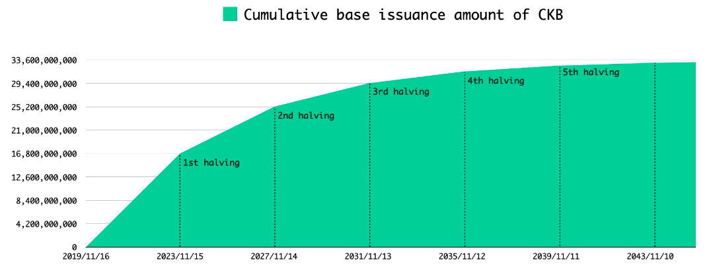
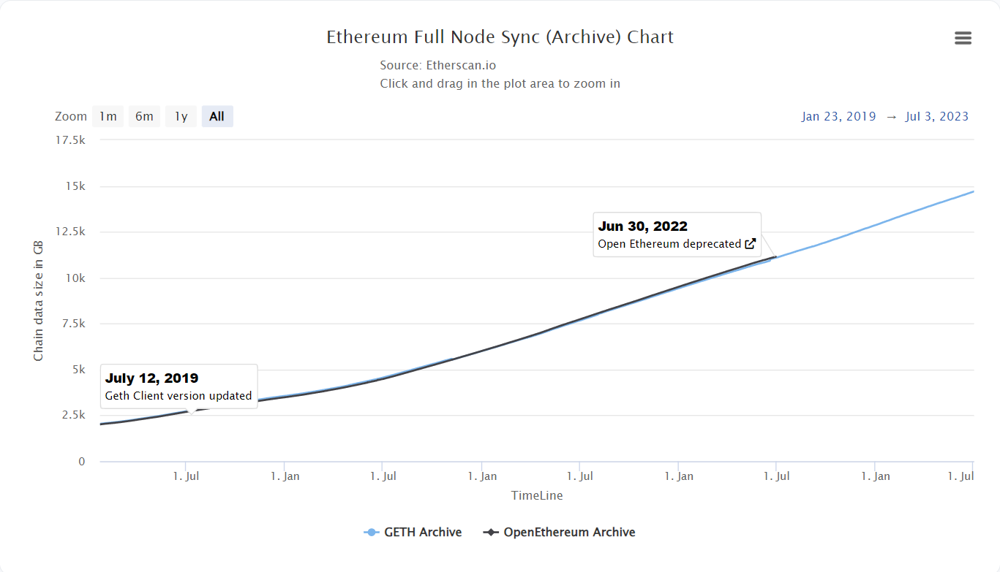
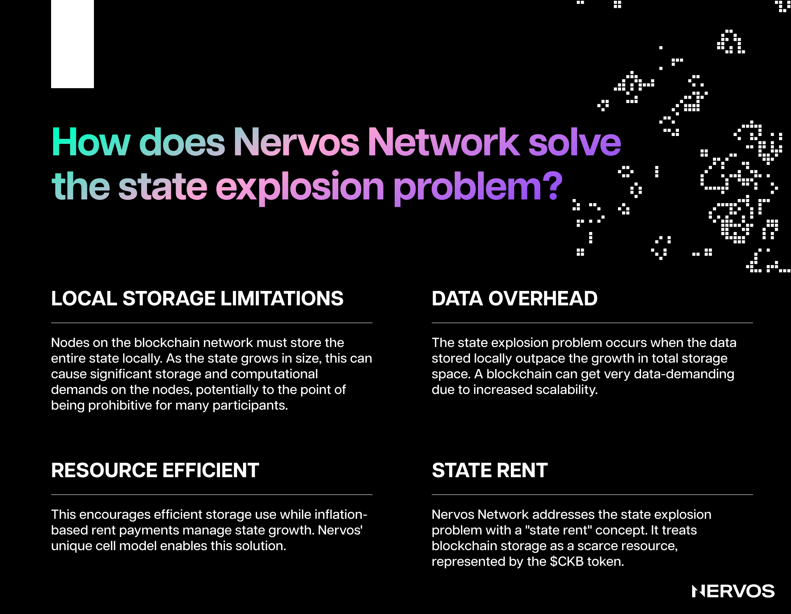

Nervos es una red de cadena de bloques modular construida desde cero para garantizar una seguridad, descentralización, flexibilidad e interoperabilidad excepcionales en la capa base y una escalabilidad sin igual en las capas superiores.

Esto significa que, a diferencia de la mayoría de las cadenas de bloques monolíticas que tienen la ejecución de transacciones, el consenso y la disponibilidad de datos en la misma capa, Nervos separa estas funciones en dos capas diferentes: la Capa 1, Common Knowledge Base (CKB), una plataforma de preservación segura y descentralizada, y la Capa 2, compuesta por diferentes redes de alto rendimiento optimizadas para escalar.

Hasta ese punto, a diferencia de todas las demás cadenas de bloques de Capa 1, cuyas tokenómicas se adaptan mejor a las plataformas transaccionales (Capa 2), CKB es la única cadena de bloques con un modelo tokenómico adecuadamente optimizado para una plataforma de almacenamiento de valor centrada en la preservación. Además, es la única cadena de bloques que ha innovado en el campo de la tokenómica para crear un sistema de incentivos que alinea el interés de todos los participantes de la red y resuelve el problema de la explosión del estado que persigue a todas las cadenas de bloques.

El modelo tokenómico único de CKB garantiza que a los mineros se les paga por la seguridad que brindan a la red a perpetuidad, independientemente del volumen de transacciones, al tiempo que garantiza que los tokens CKByte (CKB) actúen como activos duros que no diluyan a sus poseedores a largo plazo.

Y lo que es más importante, el diseño tokenómico crea un efecto de inercia en el que la demanda de activos en la cadena de bloques de CKB ejerce una presión de demanda directa sobre la propiedad de los tokens de CKB. Esto crea un mecanismo de captura de valor para el token nativo y garantiza que la seguridad de la cadena de bloques crezca proporcionalmente con el valor de los activos que conserva.

Antes de explorar la utilidad matizada de los CKBytes y la propuesta de valor única del modelo tokenómico de Nervos, merece la pena echar un vistazo a la estructura de emisión de tokens.

## Tokenómica de CKB

CKByte o CKB es el token nativo de utilidad y gobernanza de la red Nervos. Para reflejar adecuadamente las necesidades de una plataforma de preservación, CKB se diseñó con dos tipos de emisión de tokens nativos: emisión primaria y emisión secundaria. La unidad indivisible más pequeña del token nativo se llama CK Shannon, donde un CKByte equivale a 100.000.000 CK Shannon.

### Emisión Primaria

La emisión primaria de CKB tiene un suministro finito o limitado de 33.600.000.000 CKBytes.

De manera similar al cronograma de emisión de Bitcoin, la emisión primaria de CKB se reduce a la mitad cada cuatro años hasta que todos los tokens de la emisión primaria se minan y se ponen en circulación.

Esto significa que durante los primeros cuatro años se minarán 16.800.000.000 CKBytes, lo que supone una tasa de emisión anual inicial de 4.200.000.000. Después del primer ciclo de reducción a la mitad, previsto para noviembre de 2023, el tasa de emisión descenderá a 2.100.000.000 CKBytes por año, tras la segunda reducción a la mitad, a 1.050.000.000 CKBytes al año, y así sucesivamente, hasta que se emitan todos los tokens de la emisión principal.

Todos los tokens de la emisión primaria se otorgan a los mineros de CKB, a los que se les paga una cantidad fija de CKBytes por bloque como incentivo o recompensa por proporcionar los recursos informáticos necesarios para procesar las transacciones y asegurar la red. A medida que la red Nervos crece y los tokens CKB se vuelven más valiosos, la tasa de recompensa nominal puede disminuir, y eventualmente detenerse, sin afectar negativamente la seguridad de la red.

La emisión primaria también asegura una distribución justa de tokens durante la fase de arranque de la red, lo que garantiza una descentralización económica suficiente a largo plazo.

### Emisión Secundaria

La tokenómica de Nervos es única porque incorpora otro tipo de emisión de tokens denominada emisión secundaria. Está diseñada para recaudar la renta del estado y garantizar que los mineros sean compensados por la seguridad que brindan a la red a perpetuidad, independientemente del volumen histórico de transacciones.

La emisión secundaria no tiene límite y sigue un calendario de emisiones fijo de 1.344.000.000 CKBytes anuales. Sin embargo, a diferencia de la emisión primaria, que se destina en su totalidad a los mineros, la emisión secundaria se divide entre los mineros, los depositantes de NervosDAO y la tesorería de Nervos.

La proporción precisa de la división depende de cómo se utilizan los tokens CKB que circulan actualmente dentro de la red. Por ejemplo, supongamos que el 50 % de todos los CKB se utilizan para almacenar estado (veremos más sobre esto más adelante), el 30 % se depositan en NervosDAO y el 20 % se mantienen líquidos. Entonces, el 50% de la emisión secundaria se destinará a los mineros, el 30% se destinará a los depositantes de NervosDAO y el 20% restante se destinará a la tesorería de Nervos. Hoy en día, la emisión secundaria que se depositaría en el fondo de tesorería se está quemando, pero esto podría cambiar en el futuro a través de una bifurcación dura iniciada por la comunidad.

Es importante entender aquí que la inflación de la emision secundaria tiene un objetivo limitado y afecta solo a los ocupantes del estado, lo que significa que CKB puede actuar simultáneamente como un token deflacionario para los poseedores de CKB a largo plazo y como un token inflacionario para los usuarios de la cadena de bloques.

Este modelo único de dos niveles de emisión de tokens garantiza la sostenibilidad a largo plazo de la red Nervos al hacer que la compensación del minero sea independiente de las tarifas de transacción y esté más estrechamente vinculada a la utilización de la cadena de bloques como plataforma de preservación o almacenamiento de valor.

Finalmente, este modelo tokenómico es capaz de vincular el crecimiento del estado global y alinear los intereses de los diferentes participantes de la red, incluidos usuarios, mineros, desarrolladores y poseedores de tokens, creando una estructura de incentivos que funciona a favor de todos, que no es el caso con otras Capa 1 en el mercado.

Para comprender mejor cómo Nervos puede hacer esto, es necesario analizar las razones detrás de esta elección de diseño tokenómico.

## Abordando el Problema de la Explosión Estatal en Blockchains

La explosión estatal es uno de los problemas más desafiantes, aunque del que menos se habla, que enfrentan las cadenas de bloques en la actualidad. En los sistemas de cadena de bloques, "estado" se refiere al estado actual de todos los elementos dentro de la red. En el caso de Bitcoin, esto incluiría el saldo de todas las direcciones de Bitcoin. Para Ethereum, incluiría no solo los saldos de Ether sino también el estado actual de todos los contratos inteligentes y los datos asociados con ellos.

A medida que ocurren más transacciones, se crean nuevas direcciones, se invocan contratos y se agregan datos, el estado de la red se expande. Si esta expansión ocurre a un ritmo rápido o exponencial, puede conducir a lo que se conoce como "explosión del estado".

La explosión del estado puede tener varios efectos adversos en las redes de cadena de bloques, entre ellos hacer que la ejecución de un nodo completo consuma más recursos, ya que para ello es necesario mantener y almacenar localmente todo el estado de la red. Naturalmente, esto conduce a una mayor centralización porque solo aquellos con recursos computacionales sustanciales (Amazon AWS, Google Could, etc.) pueden participar plenamente en la red, lo que niega efectivamente la propuesta de valor central de las cadenas de bloques como sistemas distribuidos entre pares sin permisos y sin confianza.

Es importante entender aquí que el problema de la explosión del estado no es teórico, sino que afecta a todas las Capas 1 populares hoy en día, ya que ninguna tiene los mecanismos incorporados adecuados para frenarlo. Por ejemplo, el estado global en Bitcoin es el conjunto UTXO, y su tasa de crecimiento está efectivamente limitada por el límite de tamaño de bloque. Sin embargo, si bien se incentiva a los usuarios (a través de los costos de las tarifas de transacción) para crear UTXOs de manera eficiente, una vez que lo hacen, no les cuesta nada que los UTXO ocupen el estado global para siempre. Esto significa que los usuarios pueden almacenar indefinidamente millones o miles de millones de dólares de valor en la red Bitcoin, altamente segura (y costosa), por una pequeña tarifa única de un par de dólares.

Por otro lado, Ethereum cobra cantidades fijas de gas por insertar nuevos valores en su almacenamiento de estado y ofrece cantidades fijas de gas como transacción de reembolso cuando se eliminan valores. Si bien este es un paso en la dirección correcta, hace poco para frenar la expansión del estado, ya que la tasa de crecimiento del estado no está limitada de ninguna manera. Además, Ethereum se encuentra con el mismo problema de la "tragedia de los bienes comunes" que Bitcoin, ya que el sistema cobra una tarifa única por expandir el almacenamiento del estado, mientras que los mineros y los nodos completos tienen que asumir los costos de almacenamiento a lo largo del tiempo.

 \
_Distribución de nodos de Ethereum a cargo de proveedores de servicios web. Fuente: [Ethernodes](https://ethernodes.org/networkType/Hosting)._

Como resultado, más del 62 % de los nodos completos de Ethereum actualmente dependen de proveedores de computación en la nube centralizados, y el 65 % de estos nodos alojados se ejecutan en AWS. Es decir, Ethereum ya está expuesto a puntos centrales de fallo debido a una grave falta de descentralización a nivel de nodo, lo que significa que si un actor estatal fuera a atacar Ethereum a nivel de protocolo, todo lo que tendría que hacer es ir tras un par de entidades centralizadas y bien reguladas.

Para empeorar las cosas, se espera que este problema empeore a medida que aumente la popularidad de las criptomonedas y las cadenas de bloques comiencen a alcanzar una adopción masiva. Tal como están las cosas actualmente, la mayoría, si no todas las Capas 1, aparte de Common Knowledge Base, no están preparadas para incorporar a los próximos mil millones de usuarios sin llegar a estar completamente centralizadas a nivel de nodo, debido al aumento de la carga impuesta por la expansión estatal sobre los ejecutores de nodos.

Otro problema relacionado con la tokenómica y el problema de la explosión estatal que vale la pena mencionar aquí es la falta de alineación de valores en las plataformas de contratos inteligentes como Ethereum. Es decir, todas las capas 1 centradas en la conservación de activos múltiples hoy en día pueden volverse potencialmente vulnerables a los ataques porque sus propiedades de seguridad no están alineadas con el crecimiento del valor que conservan. En otras palabras, el valor del activo nativo que asegura efectivamente la cadena de bloques no está directamente relacionado con el crecimiento del valor de los activos no nativos almacenados en la cadena de bloques. Esto significa que las plataformas de activos múltiples como Ethereum actúan efectivamente como bancos que siguen agregando más oro (aseguran más activos no nativos) a sus bóvedas sin aumentar la seguridad (aumentando el valor de Ether apostado).

Por lo tanto, administrar el tamaño del estado y prevenir la explosión del estado es fundamental para diseñar y mantener redes de cadenas de bloques eficientes y descentralizadas. El crecimiento del estado global debe estar acotado para garantizar la participación predecible de nodos completos. Es necesario mantener bajas las barreras de entrada o los costos de ejecutar nodos completos para garantizar una seguridad y descentralización suficientes de la cadena de bloques, y eso solo se puede lograr limitando el crecimiento del estado.

## Resolviendo la Explosión del Estado en Nervos a través de la Renta Estatal

La tokenómica de Nervos fue diseñada para resolver los problemas de asociados a la explosión del estado y los problemas de alineación de valores que aquejan a las cadenas de bloques populares. Esto se hace de tres formas principales: limitando el crecimiento del estado vinculándolo a los tokens CKB, privatizando el espacio estatal e introduciendo la emisión secundaria para transferir la renta estatal de los ocupantes estatales a los mineros o protectores estatales.

En la cadena de bloques CKB, la capacidad estatal, una unidad de medida para el estado que determina la cantidad de datos que se pueden almacenar en la cadena de bloques, es un activo de primera clase restringido por reglas predefinidas. Es decir, para almacenar cualquier cantidad arbitraria de datos en la cadena de bloques de CKB es necesario bloquear una cantidad predefinida de tokens CKB. Esto significa que, entre otras cosas, los tokens CKB representan efectivamente la capacidad de la cell en bytes, donde almacenar un byte de datos en la cadena de bloques requiere bloquear un CKB.

Por ejemplo, si un usuario posee 1.000 CKB, puede crear una cell con 1.000 bytes o varias cells que sumen hasta 1.000 bytes de capacidad. Luego pueden usar esos 1.000 bytes de capacidad para almacenar estados de aplicaciones, activos u otros tipos de datos. Vale la pena mencionar aquí que la capacidad ocupada de una cell puede ser igual o menor que su capacidad especificada. Por ejemplo, para una cell de 1.000 bytes, se utilizarán 4 bytes para especificar su propia capacidad, 64 bytes para el script de bloqueo y 128 bytes para almacenar el estado, lo que hace que la capacidad ocupada actual de la celda sea de 196 bytes, con espacio para crecer hasta 1.000 bytes.

Teniendo en cuenta que los tokens CKB representan el derecho a almacenar o expandir el estado global de la cadena de bloques, su emisión limitada efectivamente limita el crecimiento del estado. Por ejemplo, tras la primera reducción a la mitad prevista para noviembre de este año, la tasa de emisión anual de tokens CKB durante los próximos cuatro años se limitará a 3.444.000.000 CKBytes (2.100.000.000 de la emisión primaria más 1.344.000.000 de la emisión secundaria). Esto significa que el estado global de Common Knowledge Base solo puede crecer en 3.444.000.000 bytes o 3.444 gigabytes por año. Y con la emisión primaria reduciéndose a la mitad cada cuatro años, el estado global de la blockchain se convierte en un activo cada vez más valioso y escaso.

Además, el hecho de que el estado global se almacene en cells (activos de primera clase similares a los UTXO en Bitcoin, de propiedad y control directo por parte de los usuarios) significa que el espacio estatal está efectivamente privatizado. Privatizar el espacio estatal reduce aún más la explosión del estado, ya que los propietarios y ocupantes del estado siempre están incentivados para optimizar y ocupar la menor cantidad de estado posible para evitar pagar una renta estatal excesiva.

En este sentido, la renta estatal es lo que hace especial a la tokenómica de Nervos. Al introducir una inflación dirigida a los ocupantes estatales, Nervos es capaz de gravar a los ocupantes del estado a largo plazo y recompensar a los mineros que actúan como preservadores o protectores del estado a largo plazo. Las tarifas de transacción se pagan una vez para procesar e insertar una transacción en la cadena de bloques, mientras que la renta estatal se paga continuamente para preservar los datos hasta que se eliminen. Esta estructura de incentivos evita la expansión excesiva del estado y garantiza la seguridad a largo plazo de la cadena de bloques al garantizar a los mineros una fuente de ingresos predecible e independiente del volumen de transacciones.

 \
El estado actual de [NervosDAO](https://explorer.nervos.org/nervosdao).

La inflación que paga la renta estatal se genera a través de la emisión secundaria que, como se mencionó anteriormente, se divide entre los mineros, los depositantes de NervosDAO y el fisco (actualmente quemado). Para los poseedores de tokens a largo plazo, siempre y cuando bloqueen sus tokens en NervosDAO, un contrato inteligente que actúa como un "refugio contra la inflación", el efecto inflacionario de la emisión secundaria es solo nominal. Para ellos, es como si la emisión secundaria no existiera y tuvieran un activo con límite máximo al igual que Bitcoin.

Por otro lado, los ocupantes estatales son la única parte interesada sin derecho a los pagos de intereses de la emisión secundaria, lo que significa que, aunque la cantidad de sus tokens CKB no cambia, sus tokens se diluyen continuamente. Esta pequeña dilución representa el "impuesto de la inflación", o cómo los ocupantes estatales pagan la renta estatal a los mineros.

Debido a que el estado es un activo de primera clase en CKB, los ocupantes estatales también son técnicamente propietarios estatales incentivados a eliminar datos innecesarios de Nervos (poda de estado) para mantener la cadena de bloques manejable a largo plazo. Cuando ya no necesiten utilizar el escaso espacio estatal, pueden consumir las celdas que lo ocupan, liberar los tokens CKB bloqueados y luego depositarlos en el refugio de inflación NervosDAO para dejar de pagar el alquiler estatal.

## Mecanismo de Captura de Valor de CKByte

Mientras que los tokens nativos de la mayoría de las cadenas de bloques de Capa 1 tienen un mecanismo de captura de valor que no se alinea con los objetivos de la plataforma o no tienen mecanismos de captura de valor en absoluto, el diseño tokenómico de Nervos crea directamente una demanda a largo plazo de tokens CKB.

Ethereum, posiblemente la única plataforma de contrato inteligente que incorpora un mecanismo de captura de valor para Ether a través de la reciente introducción de EIP-1559, es una plataforma de preservación con tokenómica diseñada para plataformas transaccionales.

Es decir, Ethereum ya no busca escalar en la Capa 1, sino liquidar tantas transacciones como sea posible en las redes de la Capa 2, lo que significa que el mecanismo de quema de tarifas de transacción que supuestamente captura valor para Ether no se beneficia ni se alinea con los objetivos más amplios de Ethereum. Es decir, como una plataforma de preservación de valor, Ethereum permite a los usuarios ocupar estado y redes de Capa 2 para tomar prestada su seguridad de forma esencialmente gratuita, sin capturar ni transferir nada de ese valor a los poseedores de tokens.

Bitcoin también se enfrenta a problemas muy similares. En concreto, su modelo tokenómico, que recompensa a los mineros a través de recompensas en bloque y tarifas de transacción, es un modelo económico adecuado para un sistema de pago entre pares, pero una mala elección para una verdadera plataforma de almacenamiento de valor.

El protocolo Bitcoin limita el tamaño de los bloques e impone un tiempo de bloque fijo, lo que hace que el rendimiento de las transacciones de la red sea un recurso escaso por el que los usuarios deben pujar a través de tarifas de transacción. Esto significa que una mayor demanda de espacio en bloque se traduce directamente en tarifas de transacción más altas para los usuarios, lo que hace que Bitcoin sea un sistema de pago entre pares costoso y, por lo tanto, malo.

Por otro lado, Bitcoin sigue siendo una gran plataforma de almacenamiento de valor (súper segura y descentralizada), pero solo a costa de los mineros. Los usuarios de Bitcoin que utilizan la cadena de bloques para almacenar valor pagan tarifas de transacción solo una vez, pero luego ocupan el estado para siempre, lo que significa que disfrutan de la seguridad continua que proporcionan los mineros (que deben almacenar todo el estado de la cadena) sin compensarlos adecuadamente.

Además, después de que las recompensas por bloque predecibles caigan a cero, el modelo de seguridad de Bitcoin se volverá completamente dependiente de las tarifas de transacción pagadas por los usuarios, quienes, como se demostró anteriormente, están incentivados para almacenar valor en la cadena de bloques a largo plazo en lugar de usarlo como sistema de pago. Si la red Bitcoin no atrae una demanda de transacciones consistente y con sobrecapacidad a largo plazo, entonces el impacto negativo de la disminución de los incentivos mineros en la seguridad de Bitcoin podría ser profundo.

Por otra parte, más allá de simplemente necesitar los tokens nativos para pagar las tarifas de ciclo y transacción en la cadena de bloques de CKB, almacenar datos u ocupar espacio de estado en la cadena requiere bloquear CKB, lo que crea una demanda directa a largo plazo de los tokens. Esto significa que mantener activos no nativos en la cadena de bloques impone la demanda de poseer tokens nativos, lo que incrementa su valor y, en consecuencia, mejora la seguridad de la cadena al aumentar las recompensas de los mineros. Esta estructura de incentivos está mucho mejor alineada con los objetivos de las plataformas de preservación y "almacenamiento de activos" como CKB, ya que su objetivo principal no es liquidar tantas transacciones como sea posible, sino almacenar y asegurar activos de manera confiable a largo plazo.

En lugar de depender a largo plazo de las tarifas de transacción como Bitcoin o Ethereum, la seguridad de CKB está garantizada a través de la renta estatal, que proviene de la demanda de los usuarios de almacenar valor en la cadena de bloques. A medida que más usuarios almacenan datos y ejecutan aplicaciones en CKB, la demanda de tokens de CKB aumenta, lo que reduce la oferta de tokens en circulación en el mercado y presiona al alza el valor de los tokens de CKB. La apreciación del token atrae a más mineros para brindar seguridad a la red, mientras que el aumento de la seguridad atrae a más usuarios que almacenan valor, datos y ejecutan aplicaciones en la cadena de bloques.

## Conclusión

Está claro que los problemas de la explosión del estado y los mecanismos de captura de valor desalineados son cuestiones importantes que enfrentan las cadenas de bloques de Capa 1 actuales, como Bitcoin y Ethereum. Estos desafíos ponen en riesgo la centralización de las operaciones de los nodos y la desconexión entre el crecimiento de los activos preservados y la seguridad de la cadena de bloques. La falta de una solución adecuada podría socavar la sostenibilidad y la adopción a largo plazo de estas cadenas de bloques.

Por otro lado, el innovador enfoque de Nervos en materia tokenómica pretende abordar directamente estos acuciantes problemas. La cadena de bloques CKB vincula la expansión del estado con sus tokens CKB nativos, limitando de forma efectiva el crecimiento del estado de la cadena de bloques. Hacer del estado un activo de propiedad privada de primera clase fomenta la optimización y la eficiencia, limitando la expansión innecesaria del estado.

La introducción de la renta estatal, pagadera a través de la inflación dirigida de los ocupantes estatales, es una solución radical al problema de alineación de valores. La fuente de ingresos predecible que proporciona a los mineros evita no solo la expansión estatal excesiva, sino que también garantiza la seguridad de la cadena de bloques a largo plazo.

En un mecanismo de captura de valor verdaderamente único, la cadena de bloques CKB exige que el almacenamiento y la operación de datos en la cadena requieran el bloqueo de tokens CKB, creando una demanda directa a largo plazo para ellos. Esto aumenta su valor, mejora la seguridad de la cadena de bloques y, en última instancia, se alinea con el objetivo de ser una plataforma de preservación y "almacenamiento de activos".

Al abordar estos desafíos críticos de frente, Nervos se asegura de que su cadena de bloques esté bien equipada para incorporar a los próximos mil millones de usuarios mientras preserva los principios básicos de descentralización y seguridad.
