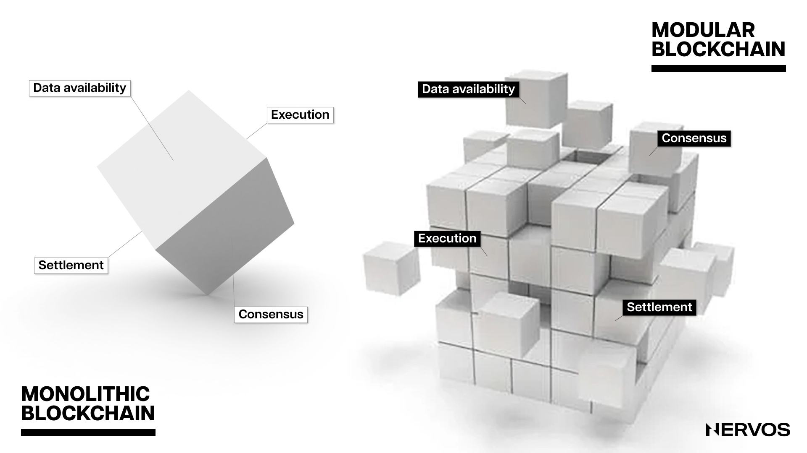
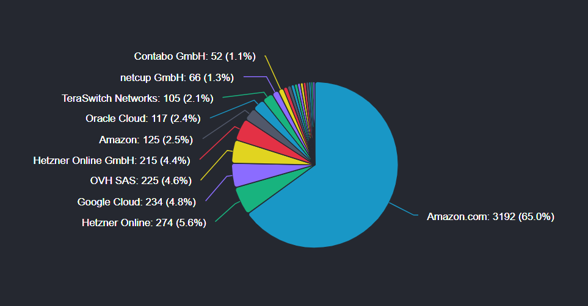

Nervos 是一个全新的模块化区块链网络，其底层（Layer 1）确保安全性、去中心化、灵活性和互操作性，而其他层则拥有无与伦比的可扩展性。

与大多数将交易执行、共识和数据可用性都放在同一层的单片区块链不同，Nervos 将这些功能分到两个不同的层：Layer 1 即 Nervos CKB，是一个安全、去中心化的价值存储平台；而 Layer 2 则由各个高吞吐量网络组成，并对可扩展性进行了优化。

与其他 Layer 1 区块链不同，CKB 的代币经济学针对价值存储平台进行了充分优化和创新。CKB 创建了一套使所有网络参与者的利益保持一致的激励系统，同时解决了困扰所有区块链的状态爆炸问题。

CKB 独特的经济模型确保了无论交易量如何，矿工都能永久地获得报酬，激励他们为网络提供安全保障，同时还确保了 CKB 代币能充当硬资产，让 CKB 长期持有者的权益不会被稀释。

更重要的是，CKB 的经济模型产生了飞轮效应，即持有 CKB 区块链资产的需求会直接产生对 CKB 代币的需求。这为原生代币 CKB 创造了一种价值捕获机制，确保 CKB 区块链的安全性与它所保护的链上资产的价值成正比增长。

在探索 CKB 的微妙效用和 Nervos 代币经济学的独特价值主张之前，我们有必要先了解一下 CKB 代币的发行机制。

## CKB 的经济模型

CKB（CKByte）是 Nervos Network 的原生代币和治理代币。为了充分体现价值存储平台的需求，原生代币 CKB 设计了两种发行方式：基础发行（也称为一级发行）和二级发行。CKB 的最小不可分割单位是 CK Shannon，其中 1 CKB 等于 100,000,000 CK Shannon。

### 基础发行

CKB 基础发行的总量为 336 亿。

与比特币的发行时间表类似，CKB 基础发行的量大约每四年减半，直到所有的基础发行量都被开采出来进入流通状态。

这意味着前四年通过基础发行的量为 168 亿 CKB，即每年 42 亿。第一次减半事件发生后（预计在 2023 年 11 月的某个时间），基础发行的每年发行量将降至 21 亿 CKB，第二次减半事件后，降至每年 10.5 亿 CKB，依此类推，直到通过基础发行的 336 亿 CKB 被开采完毕。

基础发行的所有 CKB 都奖励给矿工，即每个区块都会向矿工支付固定数量的 CKB，作为矿工提供处理交易和保护网络所需的计算机资源的激励或奖励。随着 Nervos 网络的发展和 CKB 代币变得更有价值，名义奖励率将会逐渐降低并最终停止，但不会对网络的安全性产生负面影响。

基础发行的所有 CKB 都奖励给矿工，即每个区块都会向矿工支付固定数量的 CKB，作为矿工处理交易和保护网络的奖励。随着 Nervos 网络的发展和 CKB 代币变得更有价值，通过基础发行获得的奖励会逐渐降低并最终停止，但不会对 Nervos 网络的安全性产生负面影响。

基础发行还确保了在 Nervos 网络的启动阶段公平地分配代币，保证长期的、充分的去中心化。

### 二级发行

Nervos 的代币经济学是独一无二的，因为它还包含了另一种类型的代币发行方式，称为二级发行。二级发行的目的是收取状态租金，确保无论 CKB 的链上交易量如何，矿工都会因其永久保护网络的安全性而获得补偿。

二级发行没有上限，遵循每年 13.44 亿 CKB 的固定发行计划。然而，与完全面向矿工的基础发行不同，二级发行在矿工、NervosDAO 储户和国库基金之间进行分配。

二级发行的具体分配比例取决于当前流通的 CKB 在网络中的使用方式。举个例子，假设所有流通的 CKB 中，有 50% 用于存储状态，30% 锁定在 NervosDAO 中，20% 完全保持的流动性。那么，二级发行的 50% 将分配给矿工，30% 将分配给 NervosDAO 储户，剩余的 20% 将分配给国库基金。目前，存入国库基金的二级发行直接被销毁，未来可能会通过社区发起的硬分叉而改变。

这里需要特别强调的是，二级发行造成的通胀影响范围有限，仅影响链上状态占用者，这意味着 CKB 可以同时充当长期持有者的通缩代币和区块链用户的通胀代币。

Nervos 独特的两种代币发行方式，不仅使矿工报酬独立于交易手续费，而且与区块链作为价值存储平台的使用更加紧密地联系在一起，确保 Nervos 网络的长期可持续性。

最后，这种代币经济模型能够约束全局状态的增长，协调不同网络参与者（包括用户、矿工、开发者和代币持有者）的利益，创建一个对每个人都有利的激励结构，这与市场上其他 Layer 1 的情况有所不同。

为了更好地理解 Nervos 如何做到这一点，有必要分析选择这种代币设计背后的原因。

## 解决区块链的状态爆炸问题

状态爆炸是当今区块链面临的最具挑战性却很少被谈论的问题之一。在区块链系统中，“状态” 是指网络上所有元素的当前状态。例如，对于比特币而言，状态包括所有比特币地址的余额；对于以太坊来说，状态不仅包括 ETH 余额，还包括所有智能合约的当前状态以及与其相关的各类数据。

随着更多交易的发生、新地址的创建、合约的调用、数据的添加，网络的状态不断扩张。如果这种扩张以极快速度或指数级速度发生，则可能发生所谓的 “状态爆炸”。

状态爆炸可能会对区块链网络产生一些负面影响，包括让全节点运营者耗费更多的资源，因为他们需要在本地维护和存储整个网络的状态。这自然会导致中心化程度的提高，因为只有拥有大量计算资源（例如亚马逊 AWS、谷歌云等）的人才能充分参与网络，这实际上否定了区块链的核心价值主张 —— 无需许可、无需信任的点对点分布式系统。

需要注意的是，状态爆炸并不是理论上的，而是困扰着当今所有的主流 Layer 1 区块链，因为它们没有适当的内置机制来遏制状态爆炸。举个例子，比特币的全局状态是 UTXO 集，其增长率实际上受到区块大小的限制。然而，虽然鼓励用户有效地创建 UTXO（通过矿工费调节），但 UTXO 一旦创建，就不需要花费任何额外成本让 UTXO 永远占据着全局状态。这意味着用户可以在高度安全（且昂贵）的比特币网络上无限期地存储数百万或数十亿美元的资产，只需一次性支付几美元的矿工费即可。

另一方面，在把新的数据加入到以太坊的状态存储时，以太坊收取固定数量的 gas，并在删除数据时收取固定数量的 gas 作为交易退款。虽然这是朝着正确方向迈出的一步，但它对遏制状态爆炸几乎没有作用，因为状态的增长率不受任何限制。此外，以太坊也遇到了与比特币相同的 “公地悲剧” 问题，系统对扩展状态存储收取一次性费用，而矿工和全节点则必须承担随着时间的推移而产生的存储成本。

 \
_由网络服务提供商运行的以太坊全节点分布图。来源：[Ethernodes](https://ethernodes.org/networkType/Hosting)_

因此，目前以太坊超过 62% 的全节点依赖中心化的云计算服务提供商，其中 65% 的托管节点运行在 AWS 上。也就是说，由于节点层面严重缺乏去中心化，以太坊已经暴露在中心故障点的威胁之下，这意味着如果要在协议层面攻击以太坊，所需要做的就是攻击几个中心化、受到良好监管的实体。

更糟糕的是，随着加密货币的普及和区块链开始大规模采用，这个问题预计只会变得更糟。从目前的情况来看，除了 CKB 之外，大多数（如果不是全部）Layer 1 都没有准备好如何避免全节点集中化的情况下吸纳下一个十亿用户，因为状态爆炸会给节点运营者带来更大的负担。

与代币经济学和状态爆炸相关的另一个值得一提的问题，是像以太坊这样的智能合约平台缺乏价值一致性。也就是说，当今所有以多资产存储为重点的 Layer 1 都可能容易受到攻击，因为它们的安全属性与它们所托管的资产价值增长不一致。换句话说，区块链原生资产的价值并不直接与存储在区块链上的非原生资产的价值增长挂钩。这意味着像以太坊这样的多资产平台实际上就像银行一样，不断向其金库添加更多黄金（非原生资产），却没有增加安全性（增加质押以太币的价值）。

因此，管理状态大小并防止状态爆炸对于设计和维护高效且去中心化的区块链网络至关重要。链上全局状态的增长必须受到限制，以确保全节点的参与情况可预测。保持较低的进入壁垒或运行全节点的成本对于确保区块链的安全性和去中心化是必要的，而这只能通过限制状态增长过快来实现。

## 通过状态租金解决 Nervos 上的状态爆炸问题

Nervos 的代币经济学旨在解决困扰主流区块链的状态爆炸和价值一致性问题。Nervos 是通过三种主要方式完成的：通过将状态增长与 CKB 代币挂钩来限制状态爆炸，私有化状态空间，以及引入二级发行，将状态租金从状态占用者转移给矿工或者是状态保护者。

在 CKB 区块链上，状态容量（状态的测量单位，决定区块链上可以存储多少数据）会受预先定义的规则限制。也就是说，在 CKB 区块链上存储任意数量的数据都需要锁定预先定义的 CKB 数量。这意味着，CKB 代币有效地代表了以字节为单位的 cell 容量，在区块链上存储一个字节的数据需要锁定一个 CKB。

举个例子，如果用户拥有 1,000 CKB，他可以创建一个 1,000 字节的 cell，或者多个容量加起来可达 1,000 字节的 cell。然后，他可以使用这 1,000 字节的容量来存储应用程序的状态、资产或其他类型的数据。这里值得一提的是，占用容量可以等于或小于其指定容量。例如，对于一个 1,000 字节的 cell，可以用 4 个字节来指定自己的容量，64 个字节用于锁定脚本，128 个字节用于存储状态，于是该 cell 当前占用的容量为 196 个字节，还有空间可以增长到 1,000 字节。

CKB 代币代表了存储或扩展区块链全局状态的权利，其有限发行有效地限制了状态增长。例如，今年 11 月第一次减半后，CKB 代币未来四年每年的年发行量上限为 34.44 亿（其中一级发行 21 亿，二级发行 13.44 亿）。这意味着 CKB 的全局状态每年只能增长 34.44 亿字节（3.444 GB）。随着基础发行的 CKB 每四年减半，链上的全局状态将变得越来越稀缺，越来越有价值。

此外，全局状态存储在 cell 中（类似于比特币中的 UTXO，属于一等资产，由用户直接拥有和控制），这意味着状态空间实际上被私有化了。状态空间私有化进一步减少状态爆炸，因为状态所有者和占用者总是被激励去优化和占用尽可能少的状态，以避免支付过高的状态租金。

就这一点而言，状态租金是 Nervos 代币经济学的特殊之处。通过对状态占有者实行定向通胀，Nervos 能够对长期状态占有者征税，并奖励充当长期状态维护者或保护者的矿工。矿工费只需支付一次即可处理交易并将其写入区块链，而状态租金则需要持续支付以保存数据，直到数据被删除。这种激励结构既可以防止状态过度扩张，又可以保证矿工拥有独立于交易量的可预测收入来源，确保区块链的长期安全。

 \
_[Nervos DAO](https://explorer.nervos.org/nervosdao) 的运行情况_

支付状态租金的通货膨胀是通过二级发行产生的，如前所述，二级发行在矿工、Nervos DAO 储户和国库基金（目前直接销毁）之间进行分配。对于 CKB 的长期持有者来说，只要他们将 CKB 锁定在 Nervos DAO（一种充当 “通胀避难所” 的智能合约）中，二级发行的通货膨胀效应只是名义上的。对他们来说，就好像二级发行不存在了一样，他们持有 CKB 就像持有比特币那种有硬顶的资产一样。

另一方面，状态占用者是唯一对二级发行没有索取权的利益相关者，这意味着即使他们的 CKB 代币数量没有变化，他们的代币也在不断被稀释。这种小幅稀释代表了 “通货膨胀税”，或者说状态占有者向矿工支付状态租金的一种方式。

由于状态是 CKB 上的一等资产，因此从技术上讲，状态占用者也被激励从 Nervos 中删除不必要的数据（状态修剪），以保持区块链的长期可管理性。当他们不再需要利用稀缺的状态空间时，他们可以解散占用的 cell，释放锁定的 CKB 代币，然后将其存入 Nervos DAO 以停止支付状态租金。

## CKB 的价值捕获机制 

尽管大多数 Layer 1 区块链的原生代币要么具有与平台目标不相符的价值捕获机制，要么根本不具有价值捕获机制，但 Nervos 的代币经济学设计直接创造了对 CKB 代币的长期需求。

以太坊可以说是唯一一个通过最近推出的 EIP-1559 将 ETH 纳入价值捕获机制的智能合约平台，是一个专为交易平台设计的具有代币经济学的储值平台。

也就是说，以太坊不再寻求在 Layer 1 上扩展，而是在 Layer 2 网络上结算尽可能多的交易，这意味着本应为以太坊获取价值的 gas 燃烧机制并没有受益于以太坊更广泛的目标。换句话说，作为一个价值存储平台，以太坊允许用户占用状态和 Layer 2 网络，基本上免费借用其安全性，而无需捕获任何价值并将其转移给 ETH 持有者。

比特币也正在处理非常相似的问题。比特币的代币模型通过区块奖励和交易手续费奖励矿工，这对于点对点支付系统来说是一个合适的经济模型，但对于真正的价值存储平台来说却是一个糟糕的选择。

比特币协议限制了区块的大小并强制执行基本固定的区块时间，使网络的交易吞吐量成为用户必须通过矿工费竞价的稀缺资源。这意味着对区块空间的更高需求直接转化为更高的矿工费，使比特币成为一种昂贵且糟糕的点对点支付系统。

另一方面，比特币仍然是一个伟大的价值存储平台（超级安全和去中心化），但前提是矿工持续付出代价。利用区块链存储价值的比特币用户只需支付一次矿工费，就可以永远占据状态，这意味着他们享受矿工（需要存储链的整个状态）提供的持续安全性，而无需给予他们足够的补偿。

此外，在可预测的区块奖励降至零后，比特币的安全模型将完全依赖于用户支付的矿工费，如上所述，用户被激励在区块链上长期存储价值，而不是将其用作支付系统。如果比特币网络长期无法吸引持续的、足够多的交易需求，那么挖矿激励的减少对比特币安全的负面影响可能是深远的。

另一方面，除了简单地需要原生代币支付 CKB 区块链上的矿工费之外，在链上存储数据或占用状态空间都需要锁定 CKB，这对 CKB 代币产生了直接的长期需求。这意味着在区块链上持有非原生资产需要拥有原生代币，这会增加原生代币的价值，从而增加矿工奖励，提高链的安全性。这种激励结构更符合 CKB 等保值型 “资产存储” 平台的目标，因为其主要目标不是解决尽可能多的交易，而是长期可靠地存储和保护资产。

CKB 的安全性不是像比特币或以太坊那样长期依赖交易手续费，而是通过状态租金来保证，状态租金来自用户在区块链上存储价值的需求。随着越来越多的用户在 CKB 上存储数据和运行应用程序，对 CKB 代币的需求也将增加，从而减少了市场上 CKB 的流通量，推动 CKB 代币的价值上涨。代币的升值会吸引更多的矿工为网络提供安全性，而安全性的提高进一步吸引更多的用户在区块链上存储价值和数据，运行各类应用程序。

## 总结

显然，当前 Layer 1 区块链（例如比特币和以太坊）面临着状态爆炸的难题和价值捕获机制错位的问题。这些挑战可能导致节点运营商的集中化，以及储值资产的增长与区块链安全之间的脱节。如果缺乏适当的解决方案，可能会破坏这些区块链的可持续性和长期采用。

Nervos 代币经济学上的创新旨在直接解决这些紧迫问题。CKB 区块链将状态爆炸与其原生 CKB 代币联系起来，有效限制了区块链状态的过快增长。将状态作为一等的私有资产可以鼓励优化和提高效率，限制不必要的状态扩张。

此外，Nervos 还引入了状态租金，针对状态占有者进行通货膨胀。这一解决方案为矿工提供了可预测的收入来源，不仅可以防止状态过度扩张，还可以确保长期的区块链安全。

CKB 区块链采用了独特的价值捕获机制，要求链上数据的存储和操作需要锁定 CKB 代币，从而对其产生直接的长期需求。这增加了代币的价值，提高了区块链的安全性，与最终成为一个 “资产存储” 平台的目标保持一致。

通过积极应对这些关键挑战，Nervos 确保其区块链具备足够的能力来吸引下一个十亿用户，同时能够坚守去中心化和安全性的核心原则。

