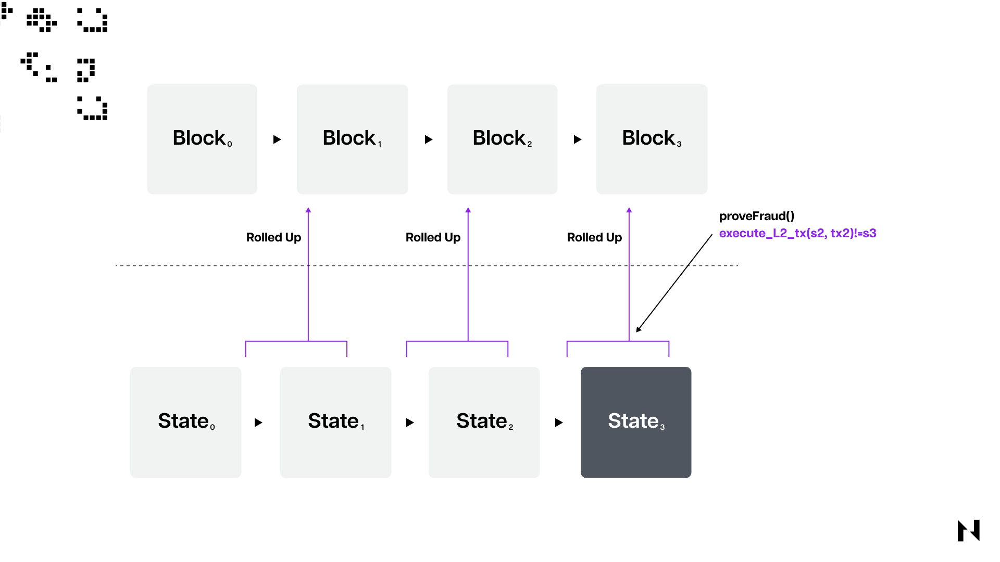

Los Optimistic Rollups son soluciones de escalado de Capa 2 diseñadas para descargar parte del procesamiento de transacciones de las cadenas de bloques de Capa 1 subyacentes en las que están construidas para aumentar el rendimiento de sus transacciones. Se llaman "optimistas" porque asumen que todas las transacciones en la Capa 2 son válidas de forma predeterminada y solo verifican las transacciones si los validadores cuestionan su validez durante el período de disputa.

Los Optimistic Rollups ejecutan transacciones fuera de la cadena y luego agrupan muchas transacciones en lotes antes de enviarlas a la cadena base. Los beneficios de los Optimistic Rollups en comparación con otras soluciones de escalado de Capa 2 como ZK-Rollups o canales de estado incluyen una relativa simplicidad y costos de transacción más bajos, que tienen el costo de períodos de disputa prolongados o tiempos de retiro.

Otra gran ventaja de los Optimistic Rollups en comparación con sus contrapartes de conocimiento cero es que son más generalistas y pueden admitir contratos inteligentes de manera muy similar a las cadenas de bloques subyacentes en las que están construidos. El soporte nativo para contratos inteligentes significa que los desarrolladores pueden implementar sus aplicaciones descentralizadas existentes en la red de Capa 2 con relativa facilidad y solo con ajustes de código menores.

Si bien existen varios enfoques diferentes para escalar cadenas de bloques a través de redes de Capa 2, los Optimistic Rollups son la solución más popular.

## ¿Qué son las redes de Capa 2?

La Capa 2 es un término general que se usa para escalar soluciones que procesan transacciones en una red separada o "capa" lejos de la cadena de bloques principal, pero también toman prestada o aprovechan la seguridad de la cadena principal. La última parte es el diferenciador más crítico entre las soluciones de escalado de Capa 2, como canales de estado y rollups, y otras soluciones de escalado, como cadenas laterales, que están conectadas a redes de Capa 1 pero tienen sus propios mecanismos de seguridad.

Las cadenas de bloques utilizan redes de Capa 2 para escalar porque tienen un rendimiento de transacciones muy limitado, lo que significa que se congestionan en momentos de alta demanda, lo que genera tarifas de transacción muy altas para los usuarios. Las cadenas de bloques monolíticas que buscan escalar en la cadena deben sacrificar la descentralización, la seguridad o ambas, lo que para muchos suele ser una compensación inaceptable. Por esta razón, muchas cadenas de bloques de Capa 1 han comenzado recientemente a adoptar un enfoque de escalado más estratificado, lo que implica aprovechar los rollups en el caso de Nervos o Ethereum, por ejemplo, o canales de estado como Lightning Network en el caso de Bitcoin.

## ¿Cómo funcionan los Optimistic Rollups?

Como se mencionó, los Optimistic Rollups son una solución de escalado de Capa 2 diseñada para ayudar a mejorar el rendimiento y la eficiencia de las redes de cadena de bloques al mover las transacciones y el cómputo fuera de la cadena principal, reducir la congestión y generar transacciones más rápidas y económicas en la cadena base.

Para hacer esto, los Optimistic Rollups implementan un contrato inteligente específico, llamado contrato rollup, en la Capa 1 subyacente, que es responsable de administrar el estado del rollup, realizar un seguimiento de los saldos de los usuarios y manejar depósitos, retiros y resolución de disputas. En los Optimistic Rollups, las transacciones son recopiladas y agregadas fuera de la cadena por "secuenciadores" u "operadores" que agrupan varias transacciones en un solo "bloque rollup". Este bloque contiene un resumen del estado de la nueva cuenta y una prueba criptográfica (una raíz de árbol de Merkle). Después de eso, los secuenciadores envían el bloque rollup a la cadena principal proporcionando la raíz del árbol de Merkle y datos adicionales, llamados "datos de llamada", que se utilizarán para verificar la validez del bloque rollup más adelante.

Es importante tener en cuenta aquí que el término "rollup" proviene del hecho de que el protocolo asume que los bloques rollup enviados son válidos de forma predeterminada sin verificar cada transacción. Esto reduce la cantidad de cómputo en cadena y, como resultado, disminuye las tarifas de gas en la Capa 2. Para garantizar la seguridad del rollup o la validez de las transacciones, se emplea un mecanismo llamado "pruebas de fraude". Si alguien cree que una transacción enviada en un bloque rollup no es válida, puede enviar una "prueba de fraude" para impugnarla. La "prueba de fraude" contiene detalles sobre la transacción específica que un validador considera fraudulenta.

 

Después de que un validador presente una prueba de fraude que cuestione la validez de una transacción específica, el contrato rollup verificará la transacción en cuestión en la cadena. Si la transacción es realmente inválida, se revertirá el bloque rollup y el retador recibirá una recompensa. En consecuencia, el secuenciador responsable del bloque inválido será penalizado.

Finalmente, los usuarios deben enviar una solicitud de retiro al contrato rollup para retirar fondos de la Capa 2 a la Capa 1. El contrato verificará que el usuario tenga fondos suficientes en el rollup y actualizará su saldo en la cadena principal en consecuencia.

1. Entrar en el rollup

Para transferir un activo digital a un Optimistic Rollup, los usuarios deben bloquear sus fondos en un contrato inteligente del puente. Este contrato inteligente transfiere la información de depósito de la Capa 1 a la Capa 2, creando posteriormente una representación correspondiente del activo digital en la Capa 2. Por ejemplo, si un usuario desea transferir 1 ETH de Ethereum a Arbitrum, bloqueará 1 ETH en el contrato inteligente del puente en Ethereum y recibe 10 tokens ETH envueltos (wrapped) recién acuñados en la Capa 2.

Un secuenciador, responsable de crear bloques rollup y conectar la información de transacciones entre la Capa 2 y la Capa 1, luego asigna la representación de activos de la Capa 2 a la dirección de la billetera del usuario en la Capa 2. Las direcciones de la billetera del usuario en la Capa 1 y la Capa 2 se sincronizan automaticamente. El activo original en la Capa 1 permanece bloqueado hasta que el usuario lo retira, mientras que puede realizar transacciones libremente con el activo recién acuñado correspondiente en el rollup.

2. Usar el rollup

Una vez que los usuarios han ingresado al rollup, pueden comenzar a realizar transacciones utilizando los activos envueltos. Para hacer esto, los usuarios firman transacciones y las envían al secuenciador, quien asume que las transacciones son válidas antes de agruparlas para enviarlas a la Capa 1. Para este propósito, se utiliza un contrato inteligente del rollup, que utiliza raíces anteriores y posteriores al estado . La raíz anterior al estado representa el estado del rollup antes de la ejecución de la transacción, mientras que la raíz posterior al estado representa el estado del rollup después de la ejecución de la transacción. El contrato rollup verifica que la raíz del estado actual coincida con la raíz anterior al estado y, al recibir la propuesta de raíz posterior al estado del secuenciador, la raíz anterior al estado se reemplaza con la raíz posterior al estado como raíz del estado actual.

3. Salir del rollup

Para retirar sus activos de los rollups, los usuarios deben enviar una solicitud de retiro al contrato inteligente del puente. Aunque la transferencia puede parecer sencilla, lleva más tiempo completarla en comparación con el depósito. El proceso de retiro comienza cuando el usuario envía una solicitud de retiro y proporciona una prueba de Merkle que demuestra que su transacción es parte de la raíz del estado del rollup actual, como se explicó en la sección anterior.

El usuario obtiene esta prueba del secuenciador, quien luego incluye la solicitud de retiro del usuario en el siguiente lote de transacciones a procesar. Sin embargo, los retiros no son instantáneos; los usuarios deben esperar de 7 a 14 días para que transcurra el período de tiempo conocido como período de disputa (o proceso de impugnación). Durante este período, cualquier entidad que detecte una discrepancia entre los estados del rollup puede disputar el proceso de retiro y afirmar que el lote actual de transacciones no es válido. Estas entidades, llamadas verificadores o validadores, pueden recibir recompensas si se demuestra que sus afirmaciones de fraude son precisas. En la mayoría de los casos, no se realizan reclamos de disputa, lo que significa que los usuarios pueden desbloquear sus activos originales en la Capa 1 después de que finaliza el período de disputa.

## Ejemplos de Optimistic Rollup

Los proyectos Optimistic Rollup más populares son las redes de Capa 2 **[Arbitrum](https://arbitrum.io/)** y **[Optimism](https://www.optimism.io/)** construidas en Ethereum.

Arbitrum y Optimism son similares. Arbitrum implementa pruebas de fraude de rondas múltiples para cuando los usuarios quieren salir del rollup, mientras que Optimism solo usa pruebas de fraude de ronda única.

La prueba de fraude de rondas múltiples de Arbitrum permite a los validadores cuestionar solo una transacción en particular en lugar de un lote completo de transacciones. Hay una compensación en tener pruebas de fraude de varias rondas porque las pruebas de fraude de varias rondas ralentizan la finalidad de la transacción en la Capa 1. Pero, al mismo tiempo, las pruebas de fraude de varias rondas también tienen tarifas de transacción posiblemente más bajas que las pruebas de fraude de una sola ronda.

Nervos también tiene su propio Optimistic Rollup de Capa 2 llamado **Godwoken**, construido en su cadena de bloques de Capa 1 llamada Common Knowledge Base. Para obtener más información sobre cómo funciona Godwoken, visita su [página web oficial](https://godwoken.com/).
