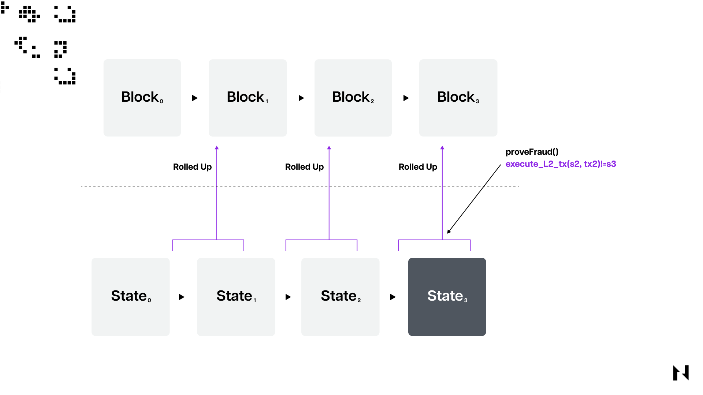
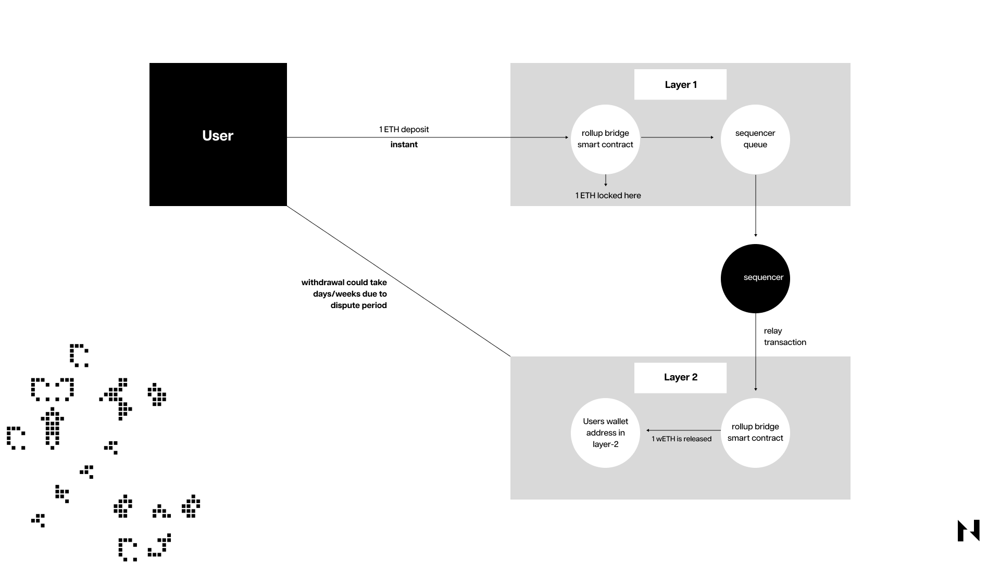

Optimistic Rollup 是 Layer 2 扩展解决方案，旨在从其构建的底层 Layer 1 区块链中卸载一些交易处理，以提高交易吞吐量。它们之所以被称为“optimistic”，是因为它们假设 Layer 2 上的所有交易在默认情况下都是有效的，并且只有在验证者在争议期间质疑其有效性时才会验证交易。

Optimistic Rollup 在链下执行交易，然后将许多交易进行打包，然后再将它们提交到基础链。与 ZK-Rollup 或状态通道等其他 2 层扩展解决方案相比，Optimistic Rollup 的优势包括相对简单和较低的交易成本，这是以延长争议期或取款时间为代价的。

与零知识相比，Optimistic Rollup 的另一大优势是它们更全面，并且可以像它们所构建的底层区块链一样支持智能合约。对智能合约的原生支持意味着开发人员可以相对轻松地在 Layer 2 网络上部署他们现有的去中心化应用程序，并且只需进行少量代码调整。

虽然存在多种通过 Layer 2 网络扩展区块链的不同方法，但 Optimistic Rollup 是最流行的解决方案。

## 什么是 Layer 2 网络？

Layer 2 是一个通用术语，用于扩展解决方案，这些解决方案在远离主区块链的单独网络或“层”上处理交易，但也借用或利用主链的安全性。最后一部分是 Layer 2 扩展解决方案（如状态通道和 rollup）与其他扩展解决方案（如侧链）之间最关键的区别在于，后者连接到 Layer 1 网络但具有自己的安全机制。

区块链利用 Layer 2 网络进行扩展，因为它们的交易吞吐量非常有限，这意味着它们在高需求时会变得拥挤，从而导致用户的交易费用非常高。寻求在链上扩展的区块链必须牺牲去中心化、安全性或两者兼而有之，这对许多人来说通常是不可接受的权衡。出于这个原因，许多 1 层区块链最近开始采用更加分层的方法来扩展，这意味着利用例如 Nervos 或以太坊的 rollup，或者像比特币的闪电网络这样的状态通道。

## Optimistic Rollups 如何运作？

如前所述，Optimistic Rollup 是一种 Layer 2扩展解决方案，旨在通过将交易和计算移出主链、减少拥挤，并在基础链上实现更快、更便宜的交易，从而帮助提高区块链网络的吞吐量和效率。

为此，Optimistic Rollup 在底层 Layer 1 部署了一个特定的智能合约，称为 rollup 合约，该合约负责管理 rollup 的状态，跟踪用户余额，处理存款、取款和争议解决。在 Optimistic Rollup 中，交易由 “排序者” 或 “操作员” 在链下收集和聚合，他们将多个交易捆绑在一起成为一个 “rollup 块”。该块包含新帐户状态的摘要和加密证明（Merkle Tree）。之后，定序器通过提供 Merkle 树根和称为 “calldata” 的附加数据将汇总块提交给主链，这些数据将用于稍后验证 rollup 块的有效性。

这里需要注意的是，术语 “optimistic” 来自这样一个事实，即协议假设提交的 rollup 块在默认情况下是有效的，而不检查每笔交易。这减少了链上计算量，从而减少了 Layer 2 的 gas 费。为了确保 rollup 的安全性或交易的有效性，采用了一种称为“欺诈证明”的机制。如果有人认为 rollup 块中提交的交易无效，他们可以提交“欺诈证明”来质疑它。 “欺诈证明”包含验证者认为欺诈的特定交易的详细信息。

在验证者提交对特定交易有效性提出争议的欺诈证明后，rollup 合约将在链上验证有问题的交易。如果交易确实无效，则 rollup 块将被恢复，挑战者将获得奖励。因此，负责无效块的定序器将受到惩罚。

最后，用户必须向 rollup 合约提交取款请求，才能将资金从 Layer 2 提取到 Layer 1。合约将验证用户在 rollup 上是否有足够的资金，并相应地更新他们在主链上的余额。

1. 进入 Rollup

要将数字资产转移到 Optimistic Rollup，用户必须将他们的资金锁定在桥接智能合约中。该智能合约将存款信息从 Layer 1 传输到 Layer 2 ，随后在 Layer 2 创建相应的数字资产表示。例如，如果用户想将 1 个 ETH 从以太坊转移到 Arbitrum，他们会将 1 个 ETH 锁定到以太坊上的桥接智能合约中，并在 Layer 2 接收 10 个新铸造的包装 ETH 代币。

Sequencer 负责创建 rollup 区块并连接 Layer 2 和 Layer 1 之间的交易信息，然后将 Layer 2 资产表示分配给 Layer 2 上用户的钱包地址。用户在 Layer 1 和 Layer 2 上的钱包地址自动同步。 Layer 1 上的原始资产在用户提取之前一直处于锁定状态，同时他们可以自由地与 rollup 上相应的新铸造资产进行交易。

2. 使用 Rollup

一旦用户进入 rollup，他们就可以开始使用包装资产进行交易处理。为此，用户签署交易并将其提交给定序器，定序器在将交易分批发送到 1 层之前假定交易有效。Rollup 智能合约即用于此目的，它利用了前状态和后状态根。前状态根表示交易执行前的 rollup 状态，后状态根表示交易执行后的 rollup 状态。Rollup 合约验证当前状态根是否与前状态根匹配，并在收到来自定序器的后状态根提议后，将前状态根替换为后状态根作为当前状态根。

3. 退出 Rollup

要从 Rollup 中提取资产，用户必须向桥接智能合约提交提取请求。虽然转账看似简单，但与存款相比需要更长的时间才能完成。当用户提交取款请求并提供 Merkle 证明，证明他们的交易是当前 rollup 状态根的一部分时，取款过程开始，如前一节所述。

用户从 sequencer 获得此证明，然后 sequencer 将用户的取款请求包含在下一批要处理的交易中。但是，提款不是即时的；用户必须等待 7～14 天，这段时间被称为争议期（或挑战过程）。在此期间，任何检测到 rollup 状态之间存在差异的实体都可以对提款过程提出异议，并断言当前批次的交易无效。这些实体称为验证者或验证者，如果他们的欺诈声明被证明是准确的，他们可以获得奖励。在大多数情况下，没有争议索赔，这意味着用户可以在争议期结束后解锁他们在 Layer 1 上的原始资产。

## Optimistic Rollup 的例子

最受欢迎的 Optimistic rollup 项目是建立在以太坊上的 [**Arbitrum**](https://arbitrum.io/) 和 [**Optimism**](https://www.optimism.io/) Layer 2 网络。

Arbitrum 和 Optimism 是相似的。Arbitrum 在用户想要退出 rollup 时部署多轮欺诈证明，而 Optimism 仅使用单轮欺诈证明。

Arbitrum 的多轮防欺诈允许验证者仅对特定交易而不是整批交易提出挑战。在进行多轮欺诈证明时有一个权衡，因为多轮会减慢 1 层的交易最终确定性。但与此同时，多轮欺诈证明的交易费用也比单轮欺诈证明低。

Nervos 也有自己的 Layer 2 Optimistic rollup，Godwoken，建立在被称为 Common Knowledge Base 的 Layer 1 区块链上。要了解更多关于 Godwoken 工作原理的信息，请访问其[官网](https://godwoken.com/)。
