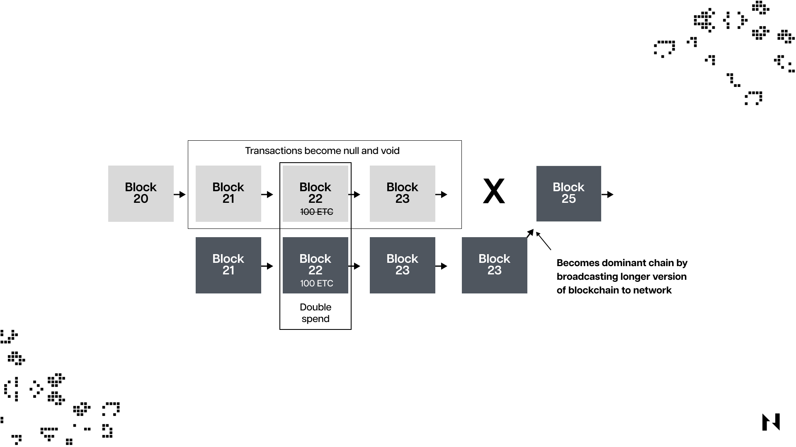

## ¿Qué es un ataque del 51% y cómo funciona?

Un ataque del 51% es un ataque a una criptomoneda cuando un minero o un grupo de mineros secuestra y controla con éxito más del 50 % de la tasa de hash de una cadena de bloques. Al tener más del 50 % de control de la tasa de hash de la cadena de bloques, los atacantes deshonestos pueden manipular los registros de transacciones de criptomonedas en la cadena de bloques.

La dificultad de ejecutar un ataque del 51% en una criptomoneda depende de la tasa de hash acumulada de la red. Es decir, es mucho más desafiante para un atacante ejecutar un ataque del 50% en una cadena de bloques con una tasa de hash muy alta. Y viceversa, ejecutar el ataque en redes con una tasa de hash más baja es proporcionalmente más fácil.

*Nota: La tasa de hash es la potencia computacional total utilizada por los mineros en las cadenas de bloques de prueba de trabajo para procesar transacciones.

Cuando un atacante o grupo de atacantes controla más de la mitad de la potencia computacional total en una cadena de bloques de prueba de trabajo, pueden manipular transacciones y gastar monedas dos veces sin que nadie más en la red pueda hacer nada al respecto.

Cuando nadie controla más de la mitad de la tasa de hash, nadie puede alterar la transacción y esperar que la mayoría la acepte. Pero si los atacantes tienen la mayor parte de la tasa de hash de la cadena de bloques, los nodos honestos no tendrán poder para detenerlo, incluso si todos lo sospechan.

Es esencial reconocer que un ataque del 51% en una cadena de bloques de prueba de participación (PoS) no es lo mismo que un ataque del 51% en una cadena de bloques de prueba de trabajo (PoW). Con las cadenas de bloques de prueba de participación, los atacantes tendrían que poseer más de la mitad de las criptomonedas apostadas en la cadena de bloques y no la mayoría de la tasa de hash.

Una cadena de bloques como Bitcoin es segura cuando nadie controla más de la mitad de su tasa de hash, mientras que una cadena de bloques de prueba de participación como Ethereum es segura cuando nadie controla más de la mitad de sus criptomonedas apostadas.

## ¿Por qué los riesgos de ataque del 51% son importantes para los mineros?

Comprender los riesgos potenciales asociados con los ataques del 51% es un aspecto crucial para los mineros, dada la considerable inversión en recursos computacionales y costos de electricidad que soportan. La ocurrencia de un ataque de este tipo puede comprometer la cadena de bloques, lo que hace que no sea rentable para los mineros honestos participar en actividades mineras y, posteriormente, afectar el precio de la criptomoneda subyacente. Por lo tanto, es imperativo que los mineros extraigan cadenas de bloques de prueba de trabajo que no sean susceptibles a ataques del 51% y que tengan garantías de seguridad a largo plazo.

## ¿Qué sucede cuando un atacante obtiene el control del 51 % de la tasa de hash de una red?

Un atacante que controle más de la mitad de la tasa de hash de una blockchain de prueba de trabajo puede manipular fácilmente las transacciones de criptomonedas. Estas manipulaciones de transacciones pueden afectar gravemente el precio y la credibilidad de la criptomoneda objetivo.

Los atacantes podrían hacer cumplir su versión de las transacciones manipuladas validadas, ya que controlan más de la mitad de la tasa de hash, y pueden revertir transacciones confirmadas recientemente para gastar las mismas criptomonedas dos veces. Esta estrategia se llama doble gasto. Los atacantes hacen esto para seguir gastando la misma cantidad de monedas varias veces.

No son  solo los problemas de doble gasto, sino que también los ataques del 51% permiten a los atacantes realizar un ataque de denegación de servicio (DoS), donde los atacantes pueden filtrar las direcciones de otros mineros o validadores antes de que la cadena comprometida finalmente se vuelva permanente.

Imagina un escenario en el que todos en una tienda puedan comprar 20 camisetas con el mismo billete de $10. La tienda irá a la quiebra porque todos abusarán de ella. Esto también sucederá cuando el 51% de los atacantes abusen de una cadena de bloques.

Los atacantes seguirán gastando las mismas criptomonedas y las desecharán por otras criptomonedas lo más rápido posible, y las moverán a fiat a través de algunas prácticas sospechosas de lavado de dinero en criptomonedas.

## ¿Cómo afecta la tasa de hash de una red Blockchain a su seguridad y rendimiento?

Hablando de la tasa de hash y la seguridad de la cadena de bloques, todo depende de factores como la dificultad de la minería, la adopción y el precio de la criptomoneda así como cuántos mineros compiten en la misma cadena de bloques.

Cuando hay más adopción para una cadena de bloques específica, es más probable que suba el precio de la criptomoneda. Por lo tanto, más mineros ingresarán a la misma red ya que pueden ganar dinero. Y cuando más mineros tienen computadoras de minería más avanzadas en la misma cadena de bloques de prueba de trabajo, aumenta la dificultad de la minería y aumenta la tasa de hash de la cadena de bloques.

Las redes de cadena de bloques con tasas de hash más altas se consideran más seguras porque los atacantes pueden considerar que los ataques son demasiado costosos. Por ejemplo, una cadena de bloques de prueba de trabajo establecida como Bitcoin tiene una tasa de hash enorme, lo que significa que un intento de ataque del 51% puede costar cientos de miles de dólares por día para ejecutarse con éxito. Esta es la razón por la que históricamente estos ataques han ocurrido en cadenas de bloques más pequeñas con tasas de hash mucho más débiles.

## Factores que afectan la tasa de hash de una cadena de bloques

Varios factores pueden afectar la tasa de hash de las cadenas de bloques de prueba de trabajo, que incluyen:

* La dificultad minera
* El número de mineros participantes.
* El poder acumulativo de las plataformas mineras de los mineros
* La rentabilidad de las recompensas mineras

Como se mencionó anteriormente, cuando hay más mineros en la misma red de blockchain, la dificultad de la minería debería aumentar y, por lo tanto, la tasa de hash y su seguridad general aumentarán.

## ¿Pueden las cadenas de bloques defenderse de los ataques del 51%?

Los ataques del 51% representan una amenaza importante para la seguridad y confiabilidad de las redes blockchain, por lo que deben mantener una tasa de hash y una descentralización suficientes, ya que esto aumenta significativamente la dificultad y el costo para los posibles atacantes.

En el caso de redes bien establecidas como Bitcoin, la probabilidad de que ocurra un ataque del 51% es mínima, especialmente si se considera su hash y descentralización extremadamente altos. Sin embargo, las redes de cadenas de bloques más pequeñas son más vulnerables a tales ataques, y los atacantes con recursos sustanciales pueden intentar comprometerlas cuando surja la oportunidad.

Para protegerse contra los ataques del 51%, las redes blockchain más pequeñas deberían aumentar su adopción, ya que esto aumentaría tanto la descentralización como la tasa de hash. Además, es esencial tener en cuenta que los diferentes algoritmos de prueba de trabajo empleados por varias cadenas de bloques pueden ayudar a mitigar los riesgos asociados con los ataques del 51%.
