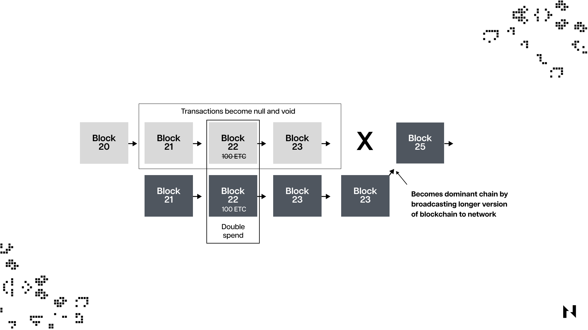

## 51% 攻击及其工作原理

51%攻击是一种针对加密货币的攻击，当一个矿工或一组矿工成功劫持并控制了区块链 50% 以上的哈希率。通过拥有超过 50% 的区块链哈希率控制，恶意攻击者可以操纵区块链上的加密货币交易记录。

对加密货币执行 51% 攻击的难度取决于网络的累积哈希率。也就是说，攻击者对具有非常高哈希率的区块链执行 51% 攻击更具挑战性。反之亦然，对具有较低哈希率的网络执行攻击相应地更容易。

**注意：哈希率是矿工在工作量证明区块链中用于处理交易的总计算能力。*

当一个或一组攻击者控制了工作量证明区块链中超过一半的总计算能力时，他们可以操纵交易并进行双花，而网络中的任何其他人都无法对此做任何事情。

当没有人控制超过一半的哈希率时，没有人可以更改交易并期望大多数人会接受它。但如果攻击者掌握了区块链的大部分哈希率，诚实节点将无力阻止它，即使他们都怀疑它。

必须认识到，对权益证明 (PoS) 区块链的 51% 攻击与对工作量证明 (PoW) 区块链的 51% 攻击不同。使用 PoS 的区块链，攻击者必须拥有区块链上一半以上的抵押加密货币，而不是大部分哈希率。

像比特币这样的区块链，在没有人控制超过一半的哈希率时是安全的，而像以太坊这样的权益证明区块链，在没有人控制超过一半的加密货币时是安全的。

## 为什么 51% 攻击风险对矿工很重要？

考虑到矿工在计算资源和电力成本方面的大量投资，了解与 51% 攻击相关的潜在风险是矿工的一个重要方面。这种攻击的发生可能会危及区块链，使诚实的矿工参与挖矿活动无利可图，并随后影响基础加密货币的价格。因此，矿工必须去挖不易受到51%攻击且具有长期安全保证的工作量证明区块链。

## 当攻击者控制了网络 51% 的哈希率时会发生什么？

控制超过一半的工作量证明区块链哈希率的攻击者，可以轻松操纵加密货币交易。这些交易操纵会严重影响目标加密货币的价格和可信度。

攻击者可以强制执行他们的操纵交易验证版本，因为他们控制了一半以上的哈希率，并且他们可以逆转最近确认的交易，将相同的加密货币花费两次。这种策略称为双花。攻击者这样做是为了多次花费相同数量的代币。

不仅是双花问题，51% 攻击还使攻击者能够进行 Denial-of-Service (DoS) 攻击，攻击者可以在受损链最终变为永久性之前，过滤掉其他矿工或验证者的地址。

想象这样一个场景，商店里的每个人都可以用同样的 10 美元钞票购买 20 件衬衫。那么这家商店就会破产，因为每个人都会滥用它。当区块链被 51% 的攻击者滥用时，也会发生这种情况。

攻击者将继续重复使用相同的加密货币，并尽快将它们转储为其他加密货币，并通过一些阴暗的加密货币洗钱行为将它们转移到法定货币。

## 区块链网络的哈希率如何影响其安全性和性能？

谈到区块链哈希率和安全性，一切都取决于挖矿难度、区块链采用率、区块链的加密货币价格以及有多少矿工在同一区块链中竞争等因素。

当特定区块链的采用率更高时，区块链的加密货币价格更有可能上涨。因此，更多的矿工将进入同一个网络，因为他们可以赚钱。当更多的矿工在同一个工作量证明区块链中拥有更先进的挖矿计算机时，挖矿难度会增加，区块链哈希率也会增加。

具有更高哈希率的区块链网络被认为更安全，因为攻击者可能认为攻击成本太高。例如，像比特币这样的已建立的工作量证明区块链具有巨大的哈希率，这意味着 51% 的攻击尝试每天可能花费数十万美元才能成功执行。这就是为什么这些攻击历来发生在哈希率低得多的较小区块链上的原因。

## 影响区块链哈希率的因素

有几个因素会影响工作量证明区块链的哈希率，包括：

* 挖矿难度
* 参与矿工数量
* 矿工矿机累计算力
* 挖矿奖励的盈利能力

如前所述，当同一个区块链网络中有更多的矿工时，挖矿难度应该增加，因此区块链的哈希率和整体安全性将增加。

## 区块链能否抵御 51% 攻击？

51% 攻击对区块链网络的安全性和可靠性构成了重大威胁，这就是为什么它们必须保持足够的哈希率和去中心化，因为这显着增加了潜在攻击者的难度和成本。

对于像比特币这样成熟的网络，发生 51% 攻击的可能性很小，尤其是考虑到它们极高的哈希值和去中心化时。然而，较小的区块链网络更容易受到此类攻击，拥有大量资源的攻击者可能会在机会出现时试图破坏它们。

为了防止 51% 攻击，较小的区块链网络应该增加它们的采用，因为这会增加去中心化和哈希率。此外，必须注意的是，各种区块链采用的不同工作量证明算法可以帮助减轻与 51% 攻击相关的风险。

