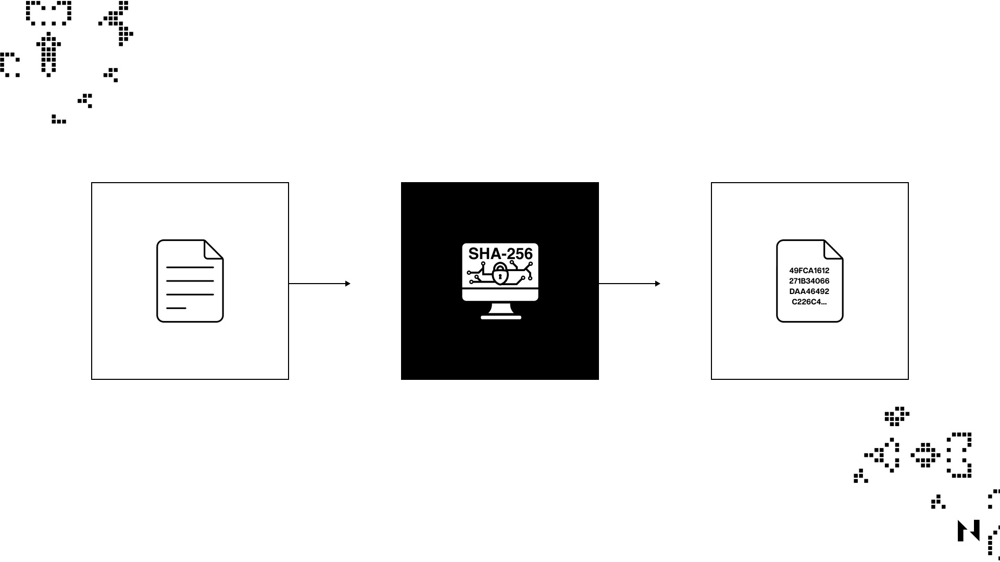

## What Is a Hash Function?

Hash functions are mathematical functions that take an input of any length and transform it into a fixed-length character string. They’re a staple encryption tool in cryptography, used by many everyday digital systems, including messaging, banking applications, and cryptocurrencies.

The key thing to understand about hash functions is that they are one-way functions, meaning that their input cannot be reverse-engineered from their output, making them very simple but reliable encryption tools.

Consider the following example:

As the above example shows, running the “let’s learn blockchain” input through a hash function gives the following output: 77db72b12a7667ad73fd33544d1f397268dffe18ca3042e0a09af9f993a8f9c1. 

However, adding a single dot to the input, and rerunning it through the hash function, changes the output completely: 17368fcb5bab73c97aa60aa7ae9e54e6676d292743587b9a35ace927a626520a.

This example is the best way to showcase hash functions’ power as encryption mechanisms. Even the slightest change in the input changes the output completely, meaning that it’s (almost) impossible to reverse-engineer and find out the original input simply by analyzing the output.

## Why are Hash Functions Useful?

Hash functions play a critical role in Bitcoin and Proof-of-Work mining. They are used to secure the integrity of the blockchain by ensuring that each block contains a unique, unalterable hash value based on the block's contents.

In Bitcoin mining, miners compete to find a hash value smaller than a target value set by the network. This is done by combining the block's header data with a nonce (a random number) and then running the resulting data through a hash function (SHA-256). The output of this hash function is a fixed-length string of numbers and letters unique to the block's contents. Miners must try many different nonces until they find one that results in a hash value smaller than the target value. Once a miner finds a suitable hash value, they broadcast it to the network as proof of work and are rewarded with newly minted bitcoins.

Hash functions are also used to link blocks together in the blockchain. Each block contains a hash of the previous block's header data, which creates a chain of blocks linked together in a tamper-evident way. Any attempt to alter the data in one block would result in a different hash value, which would be detected by the network and rejected as invalid.

Overall, hash functions are critical for the security and integrity of the Bitcoin network and Proof-of-Work mining. They ensure that each block contains unique and unalterable data and enable the creation of a tamper-evident chain of blocks that forms the basis of the blockchain.

## What are Some of the Most Common Hashing Algorithms?

While there are many different types of hashing algorithms, each with unique characteristics, used by individuals and businesses today, the most popular include Message Digest 5 (MD5), Secure Hash Algorithm 1 (SHA-1), Secure Hash Algorithm 2 (SHA-2), and Secure Hash Algorithm 3 (SHA-3).

### Message Digest 5 (MD5)

Message Digest 5 (MD5) is a cryptographic hash function that generates a fixed-size output of 128 bits, regardless of the size of the input message. It was developed by Ronald Rivest in 1991 and is widely used in digital signature applications, as well as for verifying the integrity of files.

MD5 takes an input message of any length and divides it into fixed blocks. Each block is then processed through a series of rounds, with each round using a different mathematical function to transform the input block. During each round, MD5 applies four basic operations to the input block: addition, bitwise logical operations, circular shifts, and modular addition. These operations are designed to scramble the input block in an irreversible way and produce a fixed-size output unique to the input message.

MD5 is considered a relatively fast and efficient hash function, but it is also known to have several weaknesses that make it vulnerable to attacks. For example, it is possible to create different input messages that produce the same MD5 output (known as a "collision") which makes it easier for attackers to create malicious files that appear to have the same integrity as legitimate files. Because of its vulnerabilities, MD5 is no longer recommended for use in new applications that require strong cryptographic security. Instead, more secure hash functions like SHA-256 or SHA-3 are recommended.

### Secure Hash Algorithm 1 (SHA-1)

Secure Hash Algorithm 1 (SHA-1) is a hash function that takes a random-length input and produces a 160-bit (20-byte) hash value called a message digest, typically represented as 40 hexadecimal digits. The U.S. [National Security Agency](https://en.wikipedia.org/wiki/National_Security_Agency) designed the algorithm in 1995, but the hash function has since been broken and replaced by more secure protocols.

SHA-1 transforms the user’s data by breaking the input into an ‘n’ number of parts; each size is 448 bits, then it adds 64 bits of padding to get a total of 512 bits. These 512 bits are sent through a compression function that outputs a final 160-bit hash value.

### Secure Hash Algorithm (SHA-2)

Secure Hash Algorithm (SHA-2) is a family of cryptographic hash functions that includes SHA-224, SHA-256, SHA-384, and SHA-512. Like SHA-1, SHA-2 is designed by the National Security Agency (NSA) and is widely used in various security protocols and applications.

SHA-2 uses the same basic structure as SHA-1, but with longer input and output block sizes, which makes it more secure against brute-force attacks. SHA-224 and SHA-256 have a 32-bit word size, while SHA-384 and SHA-512 have a 64-bit word size.

SHA-2 operates by dividing the input message into blocks of a fixed size and then processing each block using a series of mathematical operations. The processing of each block involves a series of logical functions, such as AND, OR, and XOR, as well as modular addition and bit rotation operations.

The core of the SHA-2 algorithm is the compression function, which takes a message block and a set of variables called the message schedule and updates the variables to produce a new hash value. This compression function is iterated repeatedly until all of the message blocks have been processed, at which point the final hash value is produced.

SHA-2 is widely considered a secure and robust cryptographic hash function and is used in various applications such as digital signatures in blockchains (SHA-256), SSL/TLS, and file integrity checking. Many security researchers, however, believe that sooner or later, the world will migrate from SHA-256 to SHA-512 to ensure even greater security.

### Secure Hash Algorithm 3 (SHA-3)

Secure Hash Algorithm 3 (SHA-3) is the latest iteration in the Secure Hash Algorithm family of cryptographic hash functions, released in 2015 by the National Institute of Standards and Technology (NIST). It is based on a new design called the Keccak algorithm, which was selected from a public competition to develop a new hashing standard to replace SHA-2.

Like its predecessors, SHA-3 takes an input message of any length and produces a fixed-length output, or hash, of 224, 256, 384, or 512 bits. SHA-3 uses a sponge construction, meaning that the input message is absorbed into the algorithm's state, and then the state is squeezed to produce the output hash.

The sponge construction is based on a permutation function, a bijective mapping of the input bits to the output bits. The permutation function is applied repeatedly to the state, along with the input message, until the entire message has been absorbed. The remaining state is then squeezed to produce the output hash.

One of the main advantages of SHA-3 over SHA-2 is that it is resistant to length extension attacks, a type of attack where an attacker can append additional data to a hash without knowing the original input. SHA-3 also has a simpler design than SHA-2, which makes it easier to implement in hardware and software.

Overall, SHA-3 is considered a secure and efficient cryptographic hash function, and it is recommended for use in applications such as digital signatures, key derivation, and data integrity. For this reason, a popular hash function of the SHA-3 family, known as keccak-256, is used in several established blockchains today, including Ethereum. Nervos’ Layer 1 blockchain, [Common Knowledge Base (CKB)](https://medium.com/nervosnetwork/nervos-ckb-in-a-nutshell-7a4ac8f99e0e), uses a novel, SHA-3-inspired hashing algorithm called [Eaglesong](https://medium.com/nervosnetwork/the-proof-of-work-function-of-nervos-ckb-3cc8364464d9).

## Potential Vulnerabilities Linked to Hash Functions

While hash functions are generally secure and widely used in cryptography, they're not bulletproof. Namely, some potential vulnerabilities associated with them include: 

* **Collision attacks:** This type of attack occurs when an attacker can generate two inputs that produce the same hash output. This can allow an attacker to substitute one input for another, potentially leading to security vulnerabilities.
* **Length extension attacks:** In this type of attack, an attacker can append additional data to the end of a message without knowing the original message's contents. This can allow an attacker to create a fake message with a valid hash, making it appear as though the message is legitimate.
* **Preimage attacks:** A preimage attack occurs when an attacker can find an input that generates a specific hash output. This can allow an attacker to create a message that hashes to a known value, potentially leading to security vulnerabilities.
* **Birthday attacks:** In a birthday attack, an attacker exploits the birthday paradox to find two messages that hash to the same value. This type of attack is particularly effective against hash functions with smaller output sizes, such as MD5.
* **Side-channel attacks:** These do not directly target the hash function but instead exploit weaknesses in the implementation or environment in which the hash function is used. Side-channel attacks can include timing, power analysis, or electromagnetic attacks.

It's worth noting that many of these vulnerabilities are related to older or weaker hash functions, such as MD5 or SHA-1. More modern hash functions, such as SHA-256 or SHA-3, have been designed with these attack vectors in mind and are generally considered unbreakable.
