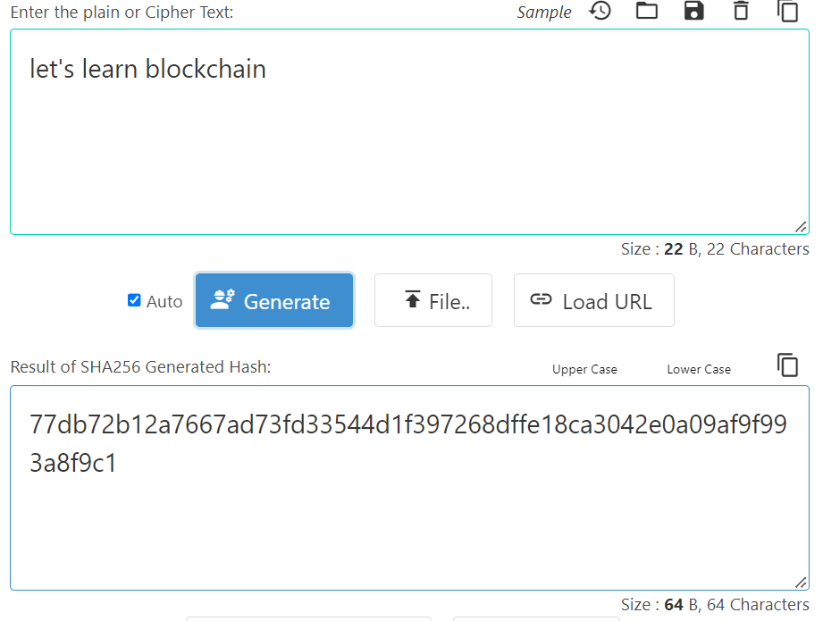
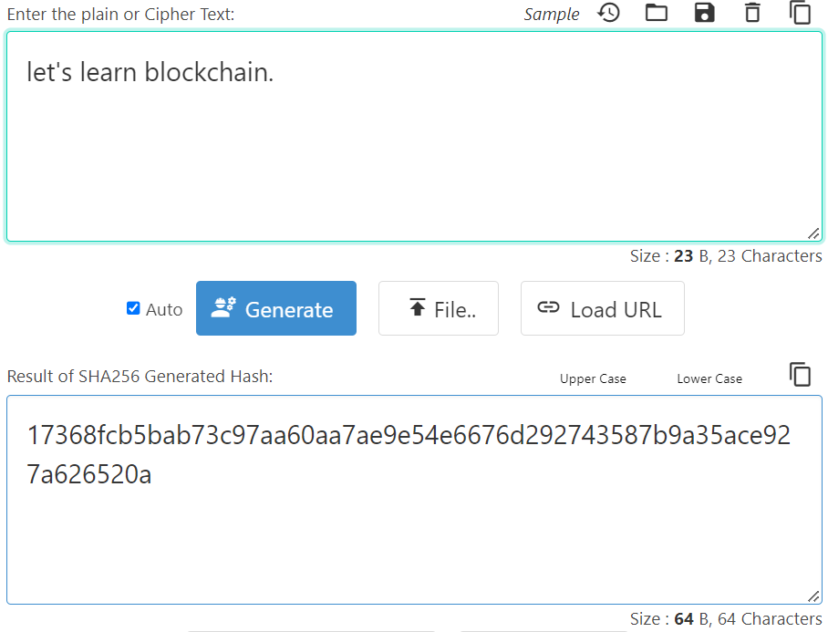

## ¿Qué es una función hash?

Las funciones hash son funciones matemáticas que toman una entrada de cualquier longitud y la transforman en una cadena de caracteres de longitud fija. Son una herramienta de cifrado básica en criptografía, utilizada por muchos sistemas digitales cotidianos, incluidos los mensajes, las aplicaciones bancarias y las criptomonedas.

La clave para comprender las funciones hash es que son funciones unidireccionales, lo que significa que su entrada no puede ser objeto de ingeniería inversa a partir de su salida, lo que las convierte en herramientas de encriptación muy simples pero confiables.

Considera el siguiente ejemplo:

Como muestra el ejemplo anterior, ejecutar la entrada "vamos a aprender blockchain" a través de una función hash da el siguiente resultado: 77db72b12a7667ad73fd33544d1f397268dffe18ca3042e0a09af9f993a8f9c1.

Sin embargo, agregar un solo punto a la entrada y volver a ejecutarlo a través de la función hash cambia la salida por completo: 17368fcb5bab73c97aa60aa7ae9e54e6676d292743587b9a35ace927a626520a.

Este ejemplo es la mejor manera de mostrar el poder de las funciones hash como mecanismos de encriptación. Incluso el más mínimo cambio en la entrada cambia la salida por completo, lo que significa que es (casi) imposible aplicar ingeniería inversa y descubrir la entrada original simplemente analizando la salida.

## ¿Por qué son útiles las funciones hash?

Las funciones hash desempeñan un papel fundamental en la minería de Bitcoin y de prueba de trabajo. Se utilizan para asegurar la integridad de la cadena de bloques al garantizar que cada bloque contenga un valor hash único e inalterable basado en el contenido del bloque.

En la minería de Bitcoin, los mineros compiten para encontrar un valor hash más pequeño que el valor objetivo establecido por la red. Esto se hace combinando los datos del encabezado del bloque con un nonce (un número aleatorio) y luego ejecutando los datos resultantes a través de una función hash (SHA-256). El resultado de esta función hash es una cadena de números y letras de longitud fija exclusiva del contenido del bloque. Los mineros deben probar muchos nonces diferentes hasta que encuentren uno que resulte en un valor hash más pequeño que el valor objetivo. Una vez que un minero encuentra un valor hash adecuado, lo transmite a la red como prueba de trabajo y es recompensado con bitcoins recién acuñados.

Las funciones hash también se utilizan para vincular bloques en la cadena de bloques. Cada bloque contiene un hash de los datos del encabezado del bloque anterior, lo que crea una cadena de bloques vinculados entre sí de manera que sea evidente la manipulación. Cualquier intento de alterar los datos en un bloque daría como resultado un valor hash diferente, que sería detectado por la red y rechazado como no válido.

En general, las funciones hash son fundamentales para la seguridad y la integridad de la red Bitcoin y la minería de prueba de trabajo. Se aseguran de que cada bloque contenga datos únicos e inalterables y permiten la creación de una cadena de bloques a prueba de manipulaciones que forman la base de la cadena de bloques.

## ¿Cuáles son algunos de los algoritmos hash más comunes?

Si bien existen muchos tipos diferentes de algoritmos hash, cada uno con características únicas, utilizados por individuos y empresas hoy en día, los más populares incluyen Message Digest 5 (MD5), Secure Hash Algorithm 1 (SHA-1), Secure Hash Algorithm 2 (SHA- 2) y Secure Hash Algorithm 3 (SHA-3).

### Resumen del mensaje 5 (MD5)

Message Digest 5 (MD5) es una función hash criptográfica que genera una salida de tamaño fijo de 128 bits, independientemente del tamaño del mensaje de entrada. Fue desarrollado por Ronald Rivest en 1991 y es ampliamente utilizado en aplicaciones de firma digital, así como para verificar la integridad de los archivos.

MD5 toma un mensaje de entrada de cualquier longitud y lo divide en bloques fijos. Luego, cada bloque se procesa a través de una serie de rondas, y cada ronda usa una función matemática diferente para transformar el bloque de entrada. Durante cada ronda, MD5 aplica cuatro operaciones básicas al bloque de entrada: suma, operaciones lógicas bit a bit, desplazamientos circulares y suma modular. Estas operaciones están diseñadas para codificar el bloque de entrada de forma irreversible y producir una salida de tamaño fijo única para el mensaje de entrada.

MD5 se considera una función hash relativamente rápida y eficiente, pero también se sabe que tiene varias debilidades que la hacen vulnerable a los ataques. Por ejemplo, es posible crear diferentes mensajes de entrada que produzcan la misma salida MD5 (lo que se conoce como "colisión"), lo que facilita que los atacantes creen archivos maliciosos que parecen tener la misma integridad que los archivos legítimos. Debido a sus vulnerabilidades, ya no se recomienda el uso de MD5 en nuevas aplicaciones que requieren una fuerte seguridad criptográfica. En su lugar, se recomiendan funciones hash más seguras como SHA-256 o SHA-3.

### Secure Hash Algorithm 1 (SHA-1)

Secure Hash Algorithm 1 (SHA-1) es una función hash que toma una entrada de longitud aleatoria y produce un valor hash de 160 bits (20 bytes) llamado resumen de mensaje, normalmente representado como 40 dígitos hexadecimales. La [Agencia de Seguridad Nacional de EE. UU.](https://en.wikipedia.org/wiki/National_Security_Agency) diseñó el algoritmo en 1995, pero desde entonces la función hash se rompió y se reemplazó por protocolos más seguros.

SHA-1 transforma los datos del usuario dividiendo la entrada en un número 'n' de partes; cada tamaño es de 448 bits, luego agrega 64 bits de relleno para obtener un total de 512 bits. Estos 512 bits se envían a través de una función de compresión que genera un valor hash final de 160 bits.

### Secure Hash Algorithm (SHA-2)

Secure Hash Algorithm (SHA-2) es una familia de funciones hash criptográficas que incluye SHA-224, SHA-256, SHA-384 y SHA-512. Al igual que SHA-1, SHA-2 está diseñado por la Agencia de Seguridad Nacional (NSA) y se usa ampliamente en varios protocolos y aplicaciones de seguridad.

SHA-2 usa la misma estructura básica que SHA-1, pero con tamaños de bloque de entrada y salida más largos, lo que lo hace más seguro contra ataques de fuerza bruta. SHA-224 y SHA-256 tienen un tamaño de palabra de 32 bits, mientras que SHA-384 y SHA-512 tienen un tamaño de palabra de 64 bits.

SHA-2 opera dividiendo el mensaje de entrada en bloques de un tamaño fijo y luego procesando cada bloque usando una serie de operaciones matemáticas. El procesamiento de cada bloque implica una serie de funciones lógicas, como AND, OR y XOR, así como operaciones de adición modular y rotación de bits.

El núcleo del algoritmo SHA-2 es la función de compresión, que toma un bloque de mensajes y un conjunto de variables llamado programa de mensajes y actualiza las variables para producir un nuevo valor hash. Esta función de compresión se itera repetidamente hasta que se hayan procesado todos los bloques de mensajes, momento en el que se produce el valor hash final.

SHA-2 se considera ampliamente como una función hash criptográfica segura y robusta y se utiliza en diversas aplicaciones, como firmas digitales en cadenas de bloques (SHA-256), SSL/TLS y verificación de integridad de archivos. Sin embargo, muchos investigadores de seguridad creen que, tarde o temprano, el mundo migrará de SHA-256 a SHA-512 para garantizar una seguridad aún mayor.

### Secure Hash Algorithm 3 (SHA-3)

Secure Hash Algorithm 3 (SHA-3) es la última iteración de la familia de funciones hash criptográficas Secure Hash Algorithm, lanzada en 2015 por el Instituto Nacional de Estándares y Tecnología (NIST). Se basa en un nuevo diseño llamado algoritmo Keccak, que fue seleccionado de una competición pública para desarrollar un nuevo estándar hash para reemplazar SHA-2.

Al igual que sus predecesores, SHA-3 toma un mensaje de entrada de cualquier longitud y produce una salida de longitud fija, o hash, de 224, 256, 384 o 512 bits. SHA-3 usa una construcción de esponja, lo que significa que el mensaje de entrada se absorbe en el estado del algoritmo y luego el estado se comprime para producir el hash de salida.

La construcción de esponja se basa en una función de permutación, un mapeo biyectivo de los bits de entrada a los bits de salida. La función de permutación se aplica repetidamente al estado, junto con el mensaje de entrada, hasta que se haya absorbido todo el mensaje. Luego, el estado restante se comprime para producir el hash de salida.

Una de las principales ventajas de SHA-3 sobre SHA-2 es que es resistente a los ataques de extensión de longitud, un tipo de ataque en el que un atacante puede agregar datos adicionales a un hash sin conocer la entrada original. SHA-3 también tiene un diseño más simple que SHA-2, lo que facilita su implementación en hardware y software.

En general, SHA-3 se considera una función hash criptográfica segura y eficiente, y se recomienda su uso en aplicaciones como firmas digitales, derivación de claves e integridad de datos. Por esta razón, una función hash popular de la familia SHA-3, conocida como keccak-256, se usa en varias cadenas de bloques establecidas en la actualidad, incluido Ethereum. La cadena de bloques de capa 1 de Nervos, [Common Knowledge Base (CKB)](https://medium.com/@AlejandroR.bit/nervos-ckb-en-pocas-palabras-c0146f3e6b20), utiliza un novedoso algoritmo hash inspirado en SHA-3 llamado [Eaglesong](https://medium.com/nervosnetwork/the-proof-of-work-function-of-nervos-ckb-3cc8364464d9).

## Vulnerabilidades potenciales vinculadas a funciones hash

Si bien las funciones hash son generalmente seguras y se usan ampliamente en criptografía, no son a prueba de balas. A saber, algunas vulnerabilidades potenciales asociadas con ellos incluyen:

* **Ataques de colisión:** Este tipo de ataque ocurre cuando un atacante puede generar dos entradas que producen la misma salida hash. Esto puede permitir que un atacante sustituya una entrada por otra, lo que podría generar vulnerabilidades de seguridad.
* **Ataques de extensión de longitud:** En este tipo de ataque, un atacante puede agregar datos adicionales al final de un mensaje sin conocer el contenido del mensaje original. Esto puede permitir que un atacante cree un mensaje falso con un hash válido, haciendo que parezca que el mensaje es legítimo.
* **Ataques de preimagen:** Un ataque de preimagen ocurre cuando un atacante puede encontrar una entrada que genera una salida hash específica. Esto puede permitir que un atacante cree un mensaje que genera un valor conocido, lo que podría generar vulnerabilidades de seguridad.
* **Ataques de cumpleaños:** En un ataque de cumpleaños, un atacante explota la paradoja del cumpleaños para encontrar dos mensajes que tienen el mismo valor. Este tipo de ataque es particularmente efectivo contra funciones hash con tamaños de salida más pequeños, como MD5.
* **Ataques de canal lateral:** Estos no se dirigen directamente a la función hash, sino que explotan las debilidades en la implementación o el entorno en el que se utiliza la función hash. Los ataques de canal lateral pueden incluir sincronización, análisis de potencia o ataques electromagnéticos.

Vale la pena señalar que muchas de estas vulnerabilidades están relacionadas con funciones hash más antiguas o más débiles, como MD5 o SHA-1. Las funciones hash más modernas, como SHA-256 o SHA-3, se han diseñado teniendo en cuenta estos vectores de ataque y, en general, se consideran indescifrables.
