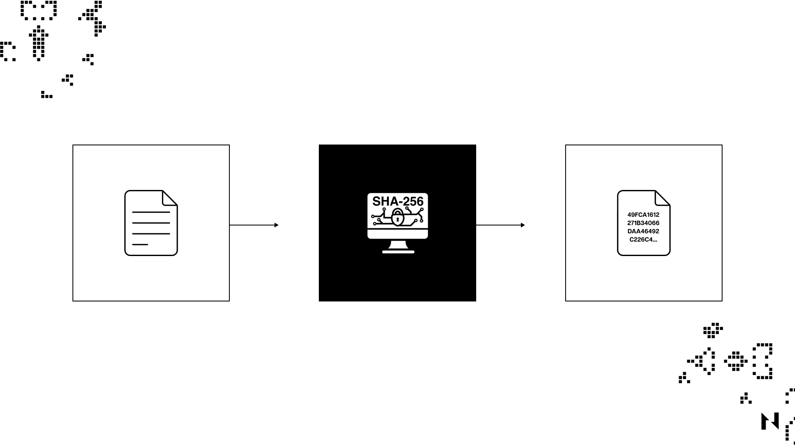
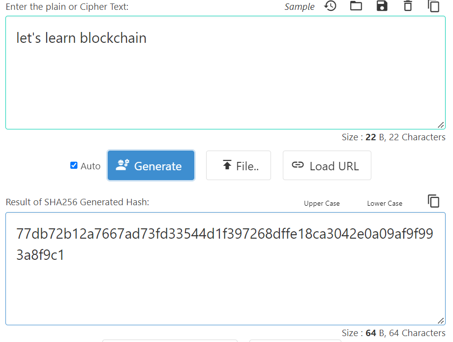
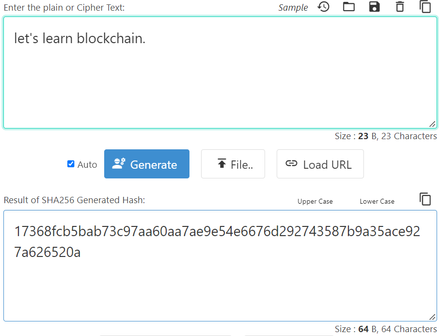
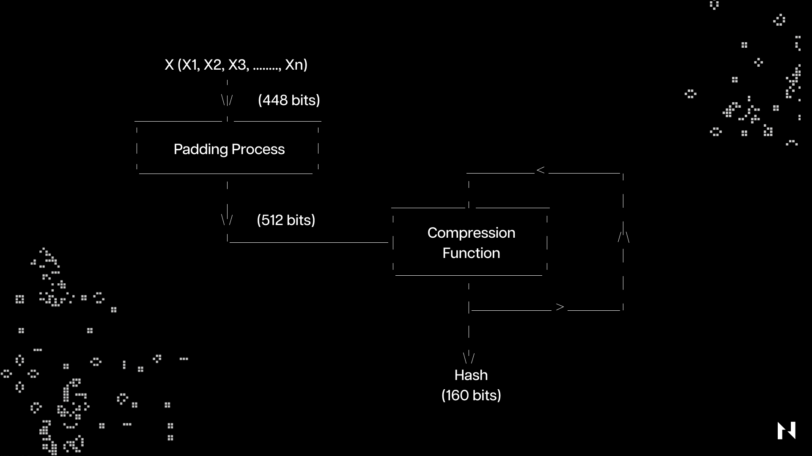

## 什么是哈希函数？

哈希函数是一种数学函数，它接受任意长度的输入，并将其转换为固定长度的字符串。它们是密码学中的主要加密工具，被许多日常数字系统使用，包括消息传递、银行应用程序和加密货币。

理解哈希函数的关键是它们是单向函数，这意味着它们的输入不能与输出反向解析，这使它们成为非常简单但可靠的加密工具。

比如以下示例：

如上例所示，通过哈希函数运行“let’s learn blockchain”输入会得到以下输出：77db72b12a7667ad73fd33544d1f397268dffe18ca3042e0a09af9f993a8f9c1. 

然而，在输入中添加一个点，并通过哈希函数重新运行它，将完全改变输出：17368fcb5bab73c97aa60aa7ae9e54e6676d292743587b9a35ace927a626520a.

此示例是展示哈希函数作为加密机制的强大功能的最佳方式。即使是输入中最细微的变化也会完全改变输出，这意味着（几乎）不可能仅通过分析输出来进行反向解析并找出原始输入。

## 哈希函数为什么有用？

哈希函数在比特币和工作量证明挖矿中起着至关重要的作用。它们通过确保每个块包含基于块内容的唯一，不可更改的哈希值来确保区块链的完整性。

在比特币挖矿中，矿工们竞相寻找一个小于网络设定目标值的哈希值。这是通过将区块头的数据与 nonce（随机数）结合起来，然后通过哈希函数 (SHA-256) 运行结果数据来完成的。这个哈希函数的输出是一个固定长度的字符串，其中的数字和字母与块的内容是唯一的。矿工必须尝试许多不同的随机数，直到找到一个哈希值小于目标值的随机数。一旦矿工找到合适的哈希值，他们就会将其作为工作证明广播到网络上，并获得新铸造的比特币作为奖励。

哈希函数还用于将区块链中的块链接在一起。每个块都包含前一个区块链头数据的哈希值，这创建了一个以防篡改方式链接在一起的区块链。任何更改一个块中数据的尝试都将导致不同的哈希值，该哈希值将被网络检测到并被视为无效。

总的来说，哈希函数对于比特币网络和工作量证明挖矿的安全性和完整性至关重要。它们确保每个块包含唯一且不可更改的数据，并能够创建构成区块链基础的防篡改区块链。

## 最常见的哈希算法有哪些？

虽然有许多不同类型的哈希算法，每种都具有独特的特性，供当今个人和企业使用，但最流行的包括 Message Digest 5 (MD5)、安全哈希算法 1 (SHA-1)、安全哈希算法 2 (SHA- 2) 和安全哈希算法 3 (SHA-3)。

### Message Digest 5 (MD5)

Message Digest 5 (MD5) 是一种加密哈希函数，无论输入消息的大小如何，它都会生成 128 位的固定大小输出。它由 Ronald Rivest 于 1991 年开发，广泛用于数字签名应用程序以及验证文件的完整性。

MD5 接受任意长度的输入消息并将其分成固定的块。然后通过一系列轮次处理每个块，每一轮使用不同的数学函数来转换输入块。在每一轮中，MD5 对输入块进行四种基本运算：加法、按位逻辑运算、循环移位和模块化加法。这些操作旨在以不可逆的方式打乱输入块，并产生输入消息唯一的固定大小输出。

MD5 被认为是一种相对快速和高效的哈希函数，但它也有几个弱点，使其容易受到攻击。例如，可以创建产生相同 MD5 输出的不同输入消息（称为“冲突”），这使得攻击者更容易创建看起来与合法文件具有相同完整性的恶意文件。由于存在漏洞，不再建议将 MD5 用于需要强加密安全性的新应用程序。相反，建议使用更安全的哈希函数，如 SHA-256 或 SHA-3。

### Secure Hash Algorithm 1 (SHA-1)

Secure Hash Algorithm 1 (SHA-1) 是一种哈希函数，它采用随机长度输入并生成称为消息摘要的 160 位（20 字节）哈希值，通常表示为 40 个十六进制数字。美国[国家安全局](https://en.wikipedia.org/wiki/National_Security_Agency)于 1995 年设计了该算法，但此后哈希函数已被破坏并被更安全的协议所取代。

SHA-1 通过将输入分成 “n” 个部分来转换用户数据；每个大小为 448 位，然后加上64位填充，总共 512 位。这 512 位通过压缩函数发送，该函数输出最终的 160 位哈希值。

### Secure Hash Algorithm (SHA-2)

Secure Hash Algorithm (SHA-2) 是一系列加密哈希函数，包括 SHA-224、SHA-256、SHA-384 和 SHA-512。与 SHA-1 一样，SHA-2 由美国国家安全局 (NSA) 设计的，被广泛用于各种安全协议和应用中。

SHA-2 使用与 SHA-1 相同的基本结构，但具有更长的输入和输出块大小，这使得它更安全，可以抵御暴力攻击。SHA-224 和 SHA-256 有 32 位字节，而 SHA-384 和 SHA-512 有 64 位字节。

SHA-2 的工作原理是将输入消息分成固定大小的块，然后使用一系列数学运算处理每个块。每个块的处理涉及到一系列逻辑函数，如 AND、OR、XOR，以及模块化加法和位元旋转操作。

SHA-2 算法的核心是压缩函数，它采用消息块和一组称为消息调度的变量，并更新变量以产生新的哈希值。重复此压缩函数，直到处理完所有消息块，此时生成最终哈希值。

SHA-2 被广泛认为是一种安全且强大的加密哈希函数，并用于各种应用程序，例如区块链中的数字签名 (SHA-256)、SSL/TLS 和文件完整性检查。然而，许多安全研究人员认为，世界迟早会从 SHA-256 迁移到 SHA-512，以确保更高的安全性。

### Secure Hash Algorithm 3 (SHA-3)

Secure Hash Algorithm 3 (SHA-3) 是加密哈希函数安全哈希算法系列的最新迭代，由美国国家标准与技术研究院 (NIST) 于 2015 年发布。它基于一种称为 Keccak 算法的新设计，该算法是从公开竞争中选出的，旨在开发一种新的哈希标准来取代 SHA-2。

与其前身一样，SHA-3 接受任意长度的输入消息，并生成 224、256、384 或 512 位的固定长度输出或哈希。SHA-3 使用海绵结构，这意味着输入消息被吸收到算法的状态中，然后压缩状态以产生输出哈希。

海绵构造基于置换函数，即输入位到输出位的双射映射。置换函数与输入消息一起重复应用于状态，直到吸收了整个消息。然后压缩剩余状态以产生输出哈希。

SHA-3 相对于 SHA-2 的主要优势之一是它可以抵抗长度扩展攻击，攻击者可以在不知道原始输入的情况下将附加数据附加到哈希中。 SHA-3 还具有比 SHA-2 更简单的设计，这让它更容易在硬件和软件上实现。

总体而言，SHA-3 被认为是一种安全高效的加密哈希函数，推荐用于数字签名、密钥派生和数据完整性等应用。出于这个原因，SHA-3 家族的一个流行的哈希函数，称为 keccak-256，被用于当今几个已建立的区块链，包括以太坊。Nervos 的 Layer 1 区块链，即 [Common Knowledge Base (CKB)](https://medium.com/nervosnetwork/nervos-ckb-in-a-nutshell-7a4ac8f99e0e)，使用了一种新颖的、受 SHA-3 启发的哈希算法，称为 [Eaglesong](https://medium.com/nervosnetwork/the-proof-of-work-function-of-nervos-ckb-3cc8364464d9)。

## 与哈希函数相关的潜在漏洞

虽然哈希函数通常是安全的并且在密码学中广泛使用，但它们并不是万无一失的。即，与它们相关的一些潜在漏洞包括：

* **冲突攻击：**当攻击者可以生成产生相同哈希输出的两个输入时，就会发生这种类型的攻击。这可能允许攻击者用一个输入替换另一个输入，从而可能导致安全漏洞。
* **长度扩展攻击：**在这种类型的攻击中，攻击者可以在不知道原始消息内容的情况下，将附加数据附加到消息末尾。这可能让攻击者可以创建具有有效哈希的假消息，使其看起来好像消息是合法的。
* **原像攻击：**当攻击者可以找到生成特定哈希输出的输入时，就会发生原像攻击。这可能允许攻击者创建一条哈希到已知值的消息，从而可能导致安全漏洞。
* **生日攻击：**在生日攻击中，攻击者利用生日悖论找到哈希值相同的两条消息。这种类型的攻击对具有较小输出大小的哈希函数特别有效，例如 MD5。
* **侧信道攻击：**这些攻击不直接针对哈希函数，而是利用哈希函数使用的实现或环境中的弱点。侧信道攻击包括定时、功率分析或电磁攻击。

值得注意的是，这些漏洞中的许多都与较旧或较弱的哈希函数有关，例如 MD5 或 SHA-1。更现代的哈希函数，例如 SHA-256 或 SHA-3，在设计时就考虑到了这些攻击向量，并且通常被认为是牢不可破的。

