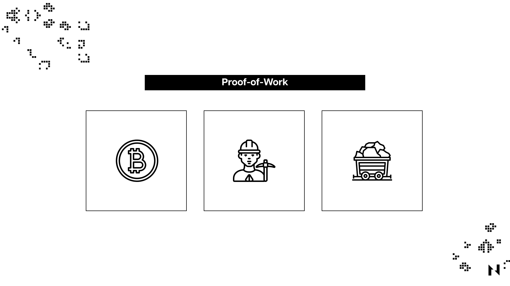

Proof-of-Work (PoW) is a consensus mechanism employed by blockchain networks, most notably Bitcoin, to validate transactions and create new blocks. It requires participants, called miners, to solve complex mathematical problems, thereby expanding computational resources. The first miner to solve the problem earns the right to add the new block to the blockchain and receives a reward, ensuring the network's security and integrity.

## Proof-of-Work in a Nutshell

### **The Mining Process**

To comprehend the intricacies of Proof-of-Work, one must delve into the mining process. When transactions occur within the Bitcoin network, they are bundled into a memory pool (mempool). Miners then select a set of transactions from the mempool and attempt to form a new block. To do so, they must solve a cryptographic puzzle, which demands substantial computational Proof-of-Work.

The puzzle, based on the SHA-256 hashing algorithm, involves discovering a unique value known as a nonce. The miner combines this nonce with the block's data, generating a hash that meets the network's difficulty target. The difficulty target is a dynamic value that adjusts every 2016 blocks (roughly every two weeks) to maintain a consistent block creation time of approximately 10 minutes.

### **The Race for the Solution**

The search for the nonce is a trial-and-error process, making it highly competitive. Miners continuously hash various nonce values until they find one that meets the protocol's pre-set difficulty target. The first miner to find the correct nonce gets to mine a new block that will be added to the blockchain and is rewarded with newly minted bitcoins and transaction fees. These rewards incentivize miners to devote substantial computational resources to the task.

### **Adjusting the Mining Difficulty Target**

As mentioned, the network's mining difficulty target adjusts every 2016 blocks, ensuring that block creation remains stable over time. If the computational Proof-of-Work in the network increases, the difficulty target decreases, making it harder to find the correct nonce. Conversely, if the computational Proof-of-Work decreases, the difficulty target increases, making it easier to solve the puzzle. This self-regulating mechanism preserves the network's stability and security.

## Why Bitcoin Uses Proof-of-Work

### **Achieving Decentralization and Consensus**

Proof-of-Work is integral to Bitcoin's decentralized nature. As a trustless, permissionless network, Bitcoin relies on Proof-of-Work to establish consensus among participants without the need for a central authority. The mining process, as facilitated by Proof-of-Work, democratizes the creation and validation of new blocks, ensuring that no single entity can manipulate the blockchain.

### **Preventing Double Spending and Ensuring Security**

The Proof-of-Work mechanism effectively prevents double spending, a fraudulent act where someone attempts to use the same digital currency more than once. The significant computational Proof-of-Work required to solve the Proof-of-Work puzzle makes it nearly impossible for a malicious actor to rewrite the blockchain, as doing so would necessitate controlling more than 50% of the network's total mining Proof-of-Work.

Furthermore, Proof-of-Work helps maintain the network's security by making it economically infeasible to attack the system. The considerable energy and hardware costs associated with mining make it more lucrative for miners to contribute positively to the network rather than engage in malicious activities.

### **Why Not Other Consensus Mechanisms?**

While alternative consensus mechanisms, such as Proof-of-Stake (PoS), have emerged in recent years, they come with their own set of trade-offs. Proof-of-Stake systems, for instance, tend to centralize control by granting more influence to those with larger token holdings. Additionally, Proof-of-Stake-based blockchains may lack the robust security features that Proof-of-Work offers, as the latter demands substantial energy expenditure to maintain network integrity.

In other words, Proof-of-Work is the most battle tested consensus mechanism that provides superior security, decentralization, and censorship and capture-resistance. For these reasons, Nervos’ Layer 1 blockchain, [Common Knowledge Base (CKB)](https://medium.com/nervosnetwork/nervos-ckb-in-a-nutshell-7a4ac8f99e0e), uses Proof-of-Work.
